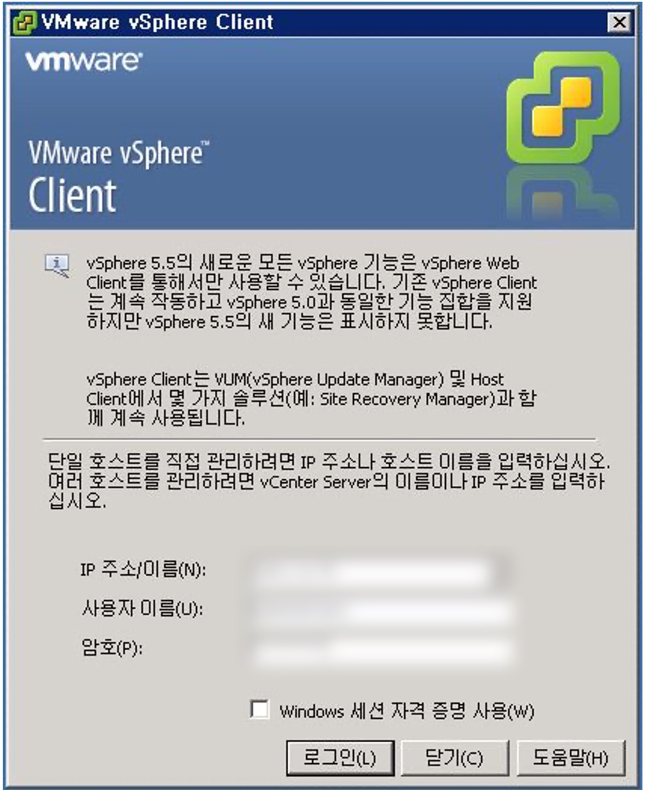
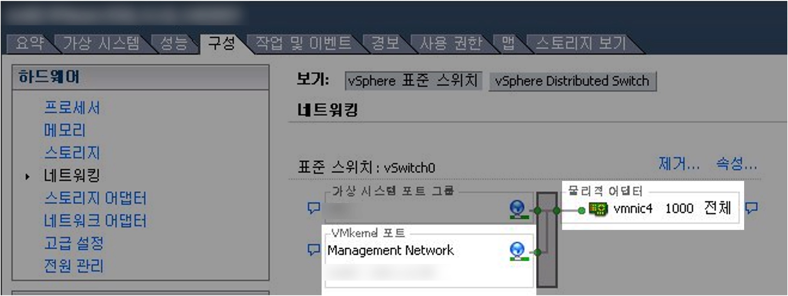
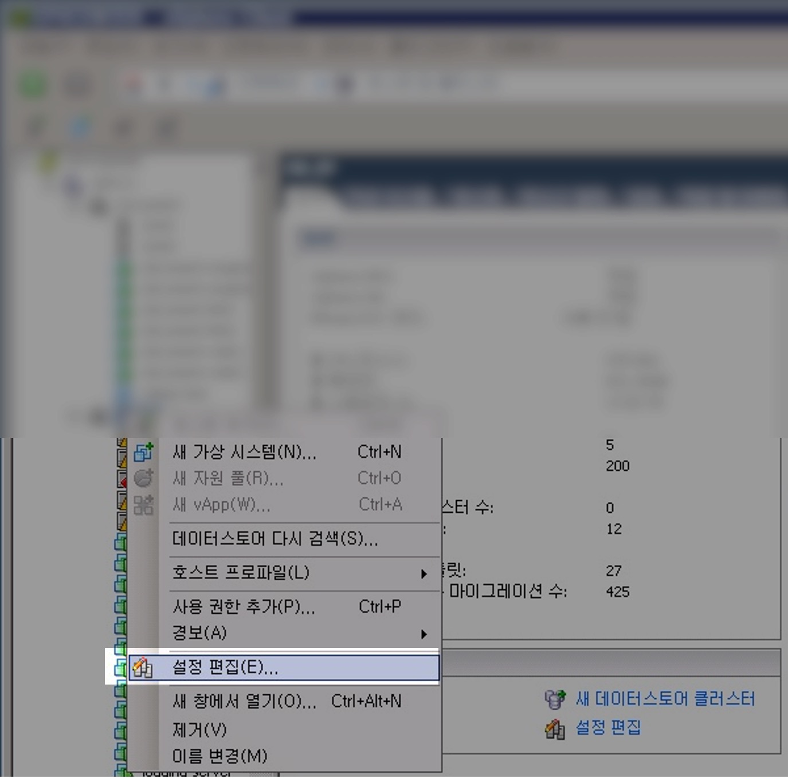
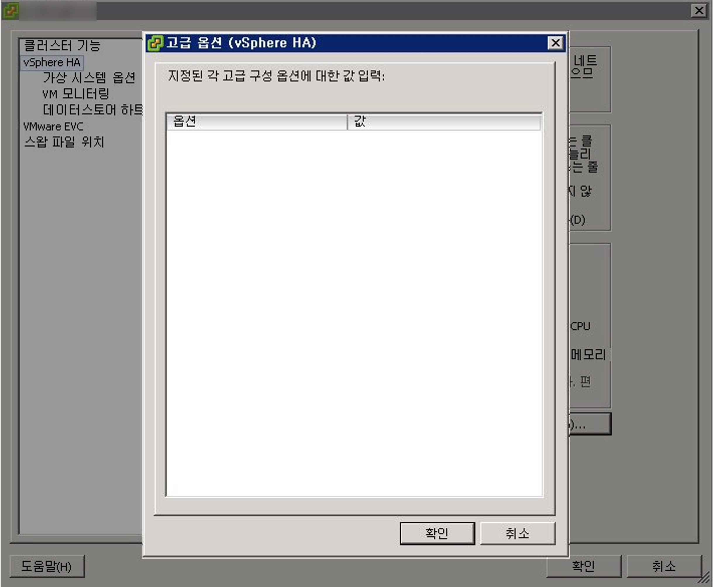
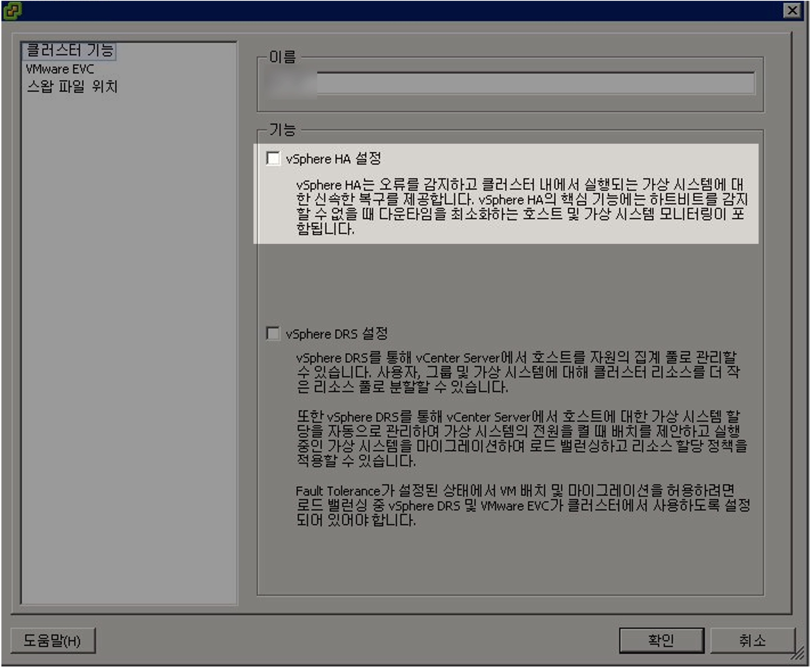
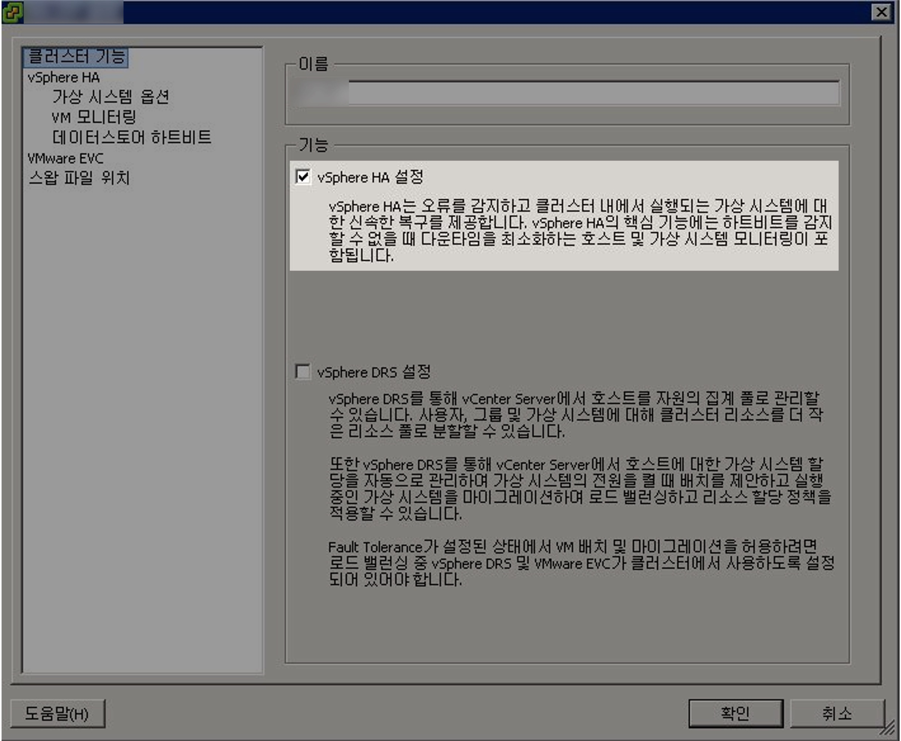

## 개요

vSphere HA 구성시 발생하는 네트워크 이중화 관련 알람을 강제로 끌 수 있습니다.

&nbsp;

## 환경

- **vSphere** : vSphere Client 5.5
- **호스트 클러스터** : vSphere HA를 사용하여 클러스터 구성된 상태입니다.

&nbsp;

## 배경지식

### ESXi 5.5의 기술지원 상태

ESXi 5.5와 vSphere 5.5는 기술지원 및 유지보수가 완전히 종료된 버전의 제품으로, 프로덕션 환경에서 해당 제품을 사용하는 건 매우 위험합니다.

- **End of General Support** (EOS) : 2018년 9월 19일에 종료됨
- **Technical Guidance** (EOL) : 2020년 9월 19일에 종료됨
- **관련문서** : [End of General Support for vSphere 5.5 (51491)](https://kb.vmware.com/s/article/51491)

&nbsp;

## 문제점

여러 대의 호스트로 구성된 클러스터에서 vSphere HA를 구성한 후, 느낌표 아이콘과 함께 네트워크 이중화 관련 알람이 발생했습니다.

- **한글 메세지** : 현재 이 호스트에 관리 네트워크 이중화가 없음
- **영문 메세지** : `Host <xxx> currently has no management network redundancy`

&nbsp;

## 해결방안

### 1. 근본적 해결방법

VMware에서는 vSphere HA 구성시 호스트의 네트워크 이중화를 권장합니다.

`Host <xxx> currently has no management network redundancy` 알람을 없애는 근본적인 방법으로는 실제 호스트 서버의 네트워크를 이중화해서 안정적 구성을 완성하면 됩니다.

&nbsp;

### 2. 대안

네트워크 이중화를 즉시할 수 없는 상태라고 하면, 대책방안으로 vSphere HA의 고급 파라미터를 설정해 네트워크 이중화 알람을 끌 수 있습니다.

&nbsp;

이 가이드에서는 2. 대안 방법에 대해서 설명합니다.

&nbsp;

## 상세 절차

### VMware vSphere Client 로그인

vSphere Client 프로그램에 로그인합니다.

현재 시나리오에서는 개별 호스트로 접속하는 것이 아닌 전체 호스트를 관리하는 vCenter로 접속합니다.

&nbsp;

### 호스트 상태 확인

vSphere HA 설정후 네트워크 이중화 구성된 상태가 아니기 때문에 호스트 전체에 경보가 발생한 상태입니다.

호스트 아이콘 옆에 노란색 느낌표 표지판이 네트워크 이중화 알람이 발생했음을 의미합니다.

&nbsp;

호스트 → 구성 → 하드웨어 → 네트워킹 메뉴로 들어갑니다.

실제로 `Management Network`가 연결된 물리적 어댑터(호스트 서버의 물리 포트)가 `vmnic4` 1개 뿐인 구성인 점을 확인할 수 있습니다.  

만약 `Management Network`에 물리적 어댑터가 2개 연결되어 있을 경우, 네트워크 이중화 조건을 충족했기 때문에 네트워크 이중화 알람은 발생하지 않습니다.  

&nbsp;

### 설정 편집

클러스터 아이콘 우클릭 → 설정 편집(E)... 을 클릭합니다.

&nbsp;

### vSphere HA 고급 옵션

호스트의 설정 편집 창입니다.

파라미터 설정을 위해 vSphere HA 메뉴 → 고급 옵션(O)... 버튼을 클릭합니다.

&nbsp;

### 파라미터 설정

고급 옵션(vSphere HA)에는 호스트 서버에 파라미터 값을 설정해 세부 설정을 적용하고 운영할 수 있습니다.

기본적으로는 입력된 파라미터가 없습니다.

&nbsp;

네트워크 이중화 구성 알람을 끄기 위해 아래 값을 입력합니다.

> 옵션과 값은 대소문자를 구분하므로 입력값이 아래와 완전히 일치해야 합니다.

- **옵션** : `das.ignoreRedundantNetWarning`
- **값** : `true`

파라미터 입력 → 확인

&nbsp;

### vSphere HA 재구성

새로 설정한 `das.ignoreRedundantNetWarning` 파라미터를 vSphere HA 클러스터에 적용을 위해 vSphere HA 구성을 해제했다가 재구성합니다.

클러스터 기능 메뉴 → vSphere HA 설정 체크해제 → 확인  

&nbsp;

vSphere Client 프로그램 하단의 최근 작업 리스트에 vSphere 구성 해제 작업이 진행중인 걸 확인할 수 있습니다.

&nbsp;

vSphere HA를 다시 구성합니다.

클러스터 기능 메뉴 → vSphere HA 설정 체크 → 확인  

&nbsp;

### 알람 해제 확인

vSphere HA 구성이 끝나면 새롭게 설정한 파라미터가 클러스터에 적용됩니다.  
`das.ignoreRedundantNetWarning` 파라미터가 적용되면 네트워크 이중화 구성 알람이 사라집니다.

위 사진처럼 vSphere HA 클러스터를 구성하는 호스트 전체에 노란색 느낌표 아이콘이 사라진 걸 확인할 수 있습니다.

&nbsp;

## 결론

네트워크 이중화 알람을 무시하도록 설정하는 것은 근본적인 해결 방법은 아니므로 반드시 대안alternative으로만 사용합니다.

개발사인 VMware은 물리적 네트워크 이중화 구성을 강력하게 권장하고 있습니다.

&nbsp;

## 참고자료

[VMware의 Knowledge Base 공식문서 1004700](https://kb.vmware.com/s/article/1004700)  
Network redundancy message when configuring vSphere High Availability in vCenter Server (1004700)
