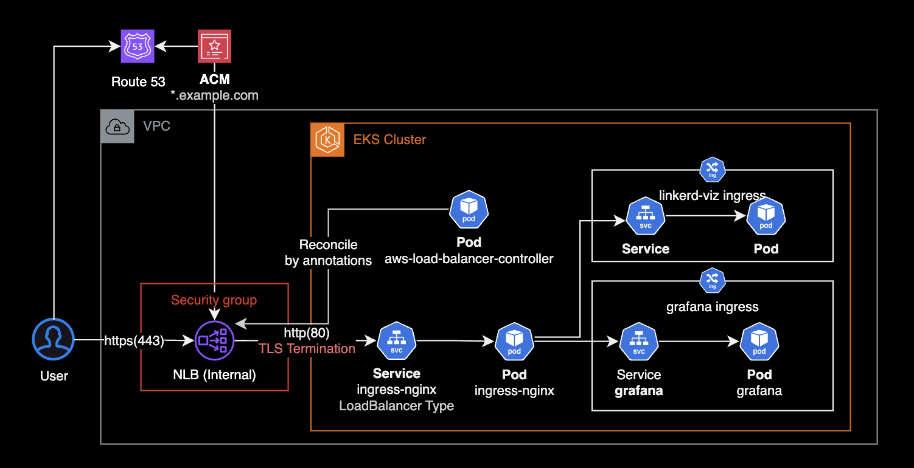
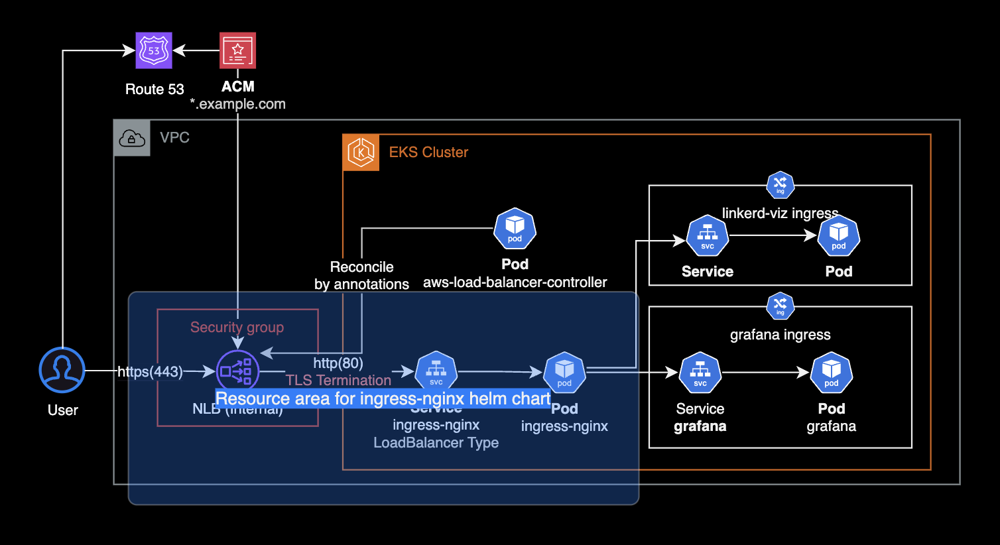
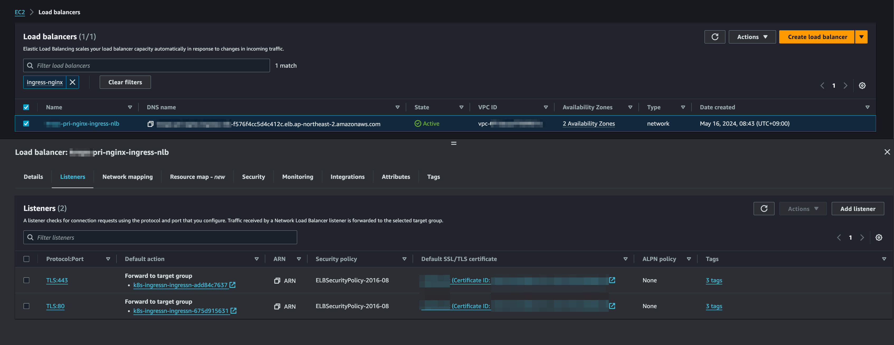
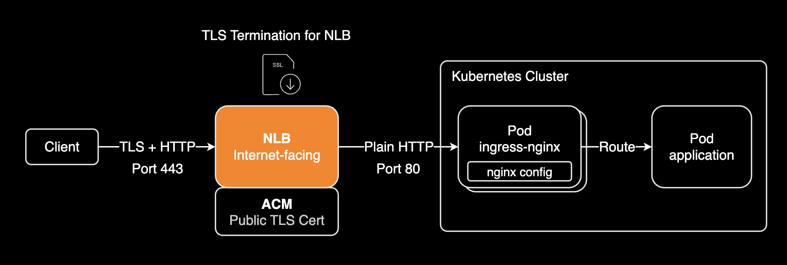
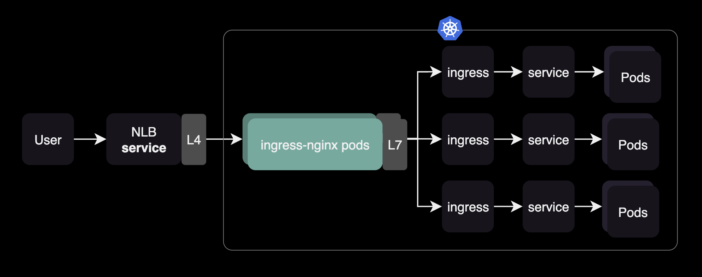
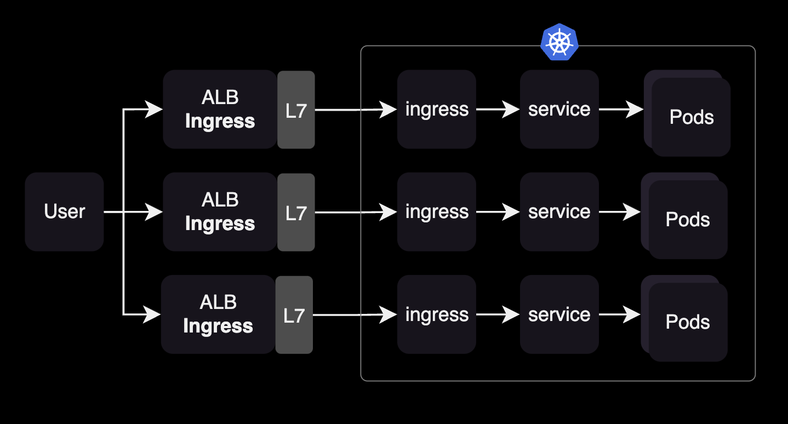

## 개요

ingress-nginx controller와 Internal NLB + ACM 조합해서 네트워크 구성하기.

이 가이드는 쿠버네티스 클러스터와 Ingress 리소스를 관리하는 DevOps Engineer 또는 SRE를 위한 네트워크 구성 가이드입니다.

&nbsp;

## 환경

외부 사용자의 요청을 NLB로 받아 클러스터 내부의 ingress-nginx controller로 전달하는 네트워크 구성입니다.



클러스터 내부에서 Ingress nginx controller 파드는 내부 NLB로 전달된 트래픽을 받아 클러스터 내부의 서비스로 전달합니다. 이 때, Ingress 리소스에 설정된 라우팅 규칙에 따라 트래픽이 뒷단의 파드로 전달됩니다.

&nbsp;

## 구성하기

### ingress-nginx chart

`ingress-nginx` 차트에서 service를 생성합니다.

```yaml
# ingress-nginx/values.yaml
controller:
  ...
  service:
    # -- Enable controller services or not. This does not influence the creation of either the admission webhook or the metrics service.
    enabled: true
    external:
      # -- Enable the external controller service or not. Useful for internal-only deployments.
      enabled: true
    # -- Annotations to be added to the external controller service. See `controller.service.internal.annotations` for annotations to be added to the internal controller service.
    annotations:
      service.beta.kubernetes.io/aws-load-balancer-name: <INTERNAL_NLB_NAME>
      service.beta.kubernetes.io/aws-load-balancer-scheme: internal
      service.beta.kubernetes.io/aws-load-balancer-nlb-target-type: ip
      service.beta.kubernetes.io/aws-load-balancer-cross-zone-load-balancing-enabled: "true"
      service.beta.kubernetes.io/aws-load-balancer-ssl-cert: "arn:aws:acm:ap-northeast-2:<ACCOUNT_ID>:certificate/<ACM_ID>"
      service.beta.kubernetes.io/aws-load-balancer-security-groups: sg-013f5ee1423faf2ca
      service.beta.kubernetes.io/aws-load-balancer-attributes: deletion_protection.enabled=true
```

&nbsp;

`ingress-nginx` 파드에 고가용성 및 파드 오토스케일링을 적용하기 위해 다음과 HPA<sup>Horizontal Pod Autoscaler</sup>를 설정합니다.

```yaml
# ingress-nginx/values.yaml
controller:
  # Mutually exclusive with keda autoscaling
  autoscaling:
    enabled: true
    annotations: {}
    minReplicas: 2
    maxReplicas: 11
    targetCPUUtilizationPercentage: 50
    targetMemoryUtilizationPercentage: 50
    behavior: {}
```

CPU 사용률이 50% 또는 메모리 사용률이 50%를 기준으로 HPA에 의해 파드 스케일 인/아웃이 진행됩니다.

&nbsp;

`nginx` IngressClass를 클러스터의 디폴트 ingressClass로 지정하려면 `controller.ingressClassResource.default` 값을 `true`로 설정합니다.

```yaml
# ingress-nginx/values.yaml
controller:
  ...
  ingressClassResource:
    # -- Name of the IngressClass
    name: nginx
    # -- Create the IngressClass or not
    enabled: true
    # -- If true, Ingresses without `ingressClassName` get assigned to this IngressClass on creation.
    # Ingress creation gets rejected if there are multiple default IngressClasses.
    # Ref: https://kubernetes.io/docs/concepts/services-networking/ingress/#default-ingress-class
    default: true
```

&nbsp;

`nginx` IngressClass는 `ingress-nginx` 컨트롤러 차트에 포함되어 있습니다. 차트를 설치하면 `nginx` ingressClass가 같이 생성됩니다.

```bash
$ kubectl get ingressclass
NAME    CONTROLLER             PARAMETERS   AGE
alb     ingress.k8s.aws/alb    <none>       5d19h
nginx   k8s.io/ingress-nginx   <none>       5d19h
```

&nbsp;

`ingress-nginx` 컨트롤러를 통해 특정 Ingress를 제어하고 싶은 경우에는 ingressClassName을 `nginx`로 지정할 수 있습니다.

아래는 `Ingress` 리소스에 `ingressClass`로 `nginx`를 지정하는 예시입니다.

```yaml
apiVersion: networking.k8s.io/v1
kind: Ingress
...
spec:
  ingressClassName: nginx
```

&nbsp;

`ingress-nginx` 헬름 차트를 설치하면 `LoadBalancer` 타입의 Service 리소스가 생성됩니다.

`ingress-nginx` 차트에 의해 배포, 관리되는 인프라 리소스 영역은 다음과 같습니다.



&nbsp;

사전에 헬름 차트를 통해 [AWS Load Balancer Controller](https://github.com/kubernetes-sigs/aws-load-balancer-controller/)가 위 서비스 리소스에 설정된 annotation을 확인한 후, 그에 맞게 설정이 적용된 Network Load Balancer를 생성합니다.



ingress-nginx 차트에서 NLB는 loadBalancer 타입의 service 리소스를 통해 생성되며, 자세한 상세 설정은 AWS LBC에 의해 제어되는 구조입니다.

&nbsp;

### TLS Termination 설정

NLB에 TLS Termination 설정을 적용합니다.



[NLB에서 TLS Termination](https://aws.amazon.com/ko/blogs/korea/new-tls-termination-for-network-load-balancers/)은 클라이언트로부터 들어오는 HTTPS 트래픽(443포트)을 받아서 암호화를 해제한 후, 내부 서비스로는 일반 HTTP(80포트) 트래픽으로 전달하는 방식입니다. 이렇게 구성하면 내부 서비스들은 복잡한 인증서 관리나 암호화 처리를 신경 쓸 필요 없이 HTTP 통신만 처리하면 되므로, 시스템 구성이 단순해지고 성능 부담도 줄일 수 있습니다.

앞단의 NLB에서 TLS Termination이 적용되지 않으면 ingress-nginx 뒷단의 서비스들로 접근시 400 Bad Request 에러, 즉 `The plain HTTP request was sent to HTTPS port` 에러가 발생할 수 있습니다. 자세한 사항은 [400 Bad Request "Play HTTP request was sent to HTTPS port" using ingress-nginx behind AWS Network Load Balancer #5206](https://github.com/kubernetes/ingress-nginx/issues/5206#issuecomment-668224462) 이슈에서 확인할 수 있습니다.

트래픽이 NLB의 443 포트 리스너로 들어오면 TLS를 종료하고 ingress-nginx Pod의 80 포트로 전달하도록 `loadBalancer` 서비스 설정을 변경합니다.

```diff
controller:
  ...
  service:
    ...
    ports:
      # -- Port the external HTTP listener is published with.
      http: 80
      # -- Port the external HTTPS listener is published with.
      https: 443
    targetPorts:
      # -- Port of the ingress controller the external HTTP listener is mapped to.
      http: http
      # -- Port of the ingress controller the external HTTPS listener is mapped to.
-     https: https
+     https: http
```

위 `service` 리소스의 설정을 변경하고 헬름 차트를 재배포하게 되면 AWS Load Balancer Controller는 NLB의 443 포트 리스너 설정을 변경합니다.

더 자세한 사항은 [Stack overflow 논의](https://stackoverflow.com/questions/70733110/kubernetes-ingress-controller-400-bad-request-plain-http-request-sent-to-http)를 확인합니다.

&nbsp;

### Grafana ingress 구성

`ingress-nginx` 파드가 트래픽을 받은 후, Grafana 파드로 연결하기 위해 Grafana Ingress 리소스를 생성합니다.

이 때, Grafana Ingress를 `ingress-nginx` 컨트롤러와 연결하기 위해 `ingressClassName`과 `kubernetes.io/ingress.class` 어노테이션을 추가합니다.

```yaml
# kube-proemtheus-stack/values.yaml
grafana:
  ingress:
    ## If true, Grafana Ingress will be created
    ##
    enabled: true

    ## IngressClassName for Grafana Ingress.
    ## Should be provided if Ingress is enable.
    ##
    ingressClassName: nginx

    ## Annotations for Grafana Ingress
    ##
    annotations:
      nginx.ingress.kubernetes.io/rewrite-target: /
      nginx.ingress.kubernetes.io/ssl-redirect: "false"
      kubernetes.io/ingress.class: nginx
```

ingress-nginx 컨트롤러가 설치된 환경에서 `ingressClassName: nginx`로 설정하면, Grafana Ingress 리소스는 NGINX Ingress 컨트롤러에 의해 처리됩니다. 이는 NGINX 컨트롤러가 Grafana에 대한 HTTP(S) 요청을 관리하고 라우팅함을 의미합니다.

&nbsp;

Ingress 리소스에서 `kubernetes.io/ingress.class` annotation은 [Kubernetes v1.18부터 deprecation](https://kubernetes.io/blog/2020/04/02/improvements-to-the-ingress-api-in-kubernetes-1.18/#deprecating-the-ingress-class-annotation) 되었습니다. 대신 `spec.ingressClassName`을 사용합니다.

```diff
apiVersion: networking.k8s.io/v1
kind: Ingress
metadata:
  annotations:
-   kubernetes.io/ingress.class: nginx
  name: kube-prometheus-stack-grafana
  namespace: monitoring
spec:
+ ingressClassName: nginx
```

&nbsp;

위 `kube-prometheus-stack`의 차트 설정에 의해 생성된 grafana ingress 리소스 설정은 다음과 같습니다.

```yaml
apiVersion: networking.k8s.io/v1
kind: Ingress
metadata:
  annotations:
    meta.helm.sh/release-name: kube-prometheus-stack
    meta.helm.sh/release-namespace: monitoring
    nginx.ingress.kubernetes.io/rewrite-target: /
    nginx.ingress.kubernetes.io/ssl-redirect: "false"
  labels:
    app.kubernetes.io/instance: kube-prometheus-stack
    app.kubernetes.io/managed-by: Helm
    app.kubernetes.io/name: grafana
    app.kubernetes.io/version: 10.4.1
    helm.sh/chart: grafana-7.3.9
  name: kube-prometheus-stack-grafana
  namespace: monitoring
spec:
  ingressClassName: nginx
  rules:
  - host: grafana.example.com
    http:
      paths:
      - backend:
          service:
            name: kube-prometheus-stack-grafana
            port:
              number: 80
        path: /
        pathType: Prefix
status:
  loadBalancer:
    ingress:
    - hostname: <REDACTED>
```

&nbsp;

## 결론

`ingress-nginx` 컨트롤러를 도입했을 때 가장 큰 기대효과는 여러 네임스페이스의 여러 개의 ingress 리소스를 `nginx` 파드를 통해 쉽게 라우팅 제어할 수 있습니다.



&nbsp;

ingress-nginx-controller와 같은 Ingress controller를 사용하지 않으면 Kubernetes 클러스터에서 네임스페이스마다 Ingress 리소스와 ALB (Application Load Balancer)를 각각 설정해야 할 필요가 생깁니다. 이는 네트워크 인프라 관리의 복잡성과 비용을 증가시킬 수 있습니다.



&nbsp;

## 참고자료

AWS Network Load Balancer:

- [Network Load Balancer, 이제 보안 그룹 지원](https://aws.amazon.com/ko/about-aws/whats-new/2023/08/network-load-balancer-supports-security-groups/)  
- [AWS Load Balancer Controller의 NLB 설정](https://kubernetes-sigs.github.io/aws-load-balancer-controller/v2.7/guide/service/nlb/)
- [Network Load Balancer용 TLS Termination 기능 출시 (서울 리전 포함)](https://aws.amazon.com/ko/blogs/korea/new-tls-termination-for-network-load-balancers/)

Kubernetes Ingress:

- [Deprecating the Ingress Class Annotation](https://kubernetes.io/blog/2020/04/02/improvements-to-the-ingress-api-in-kubernetes-1.18/#deprecating-the-ingress-class-annotation)
