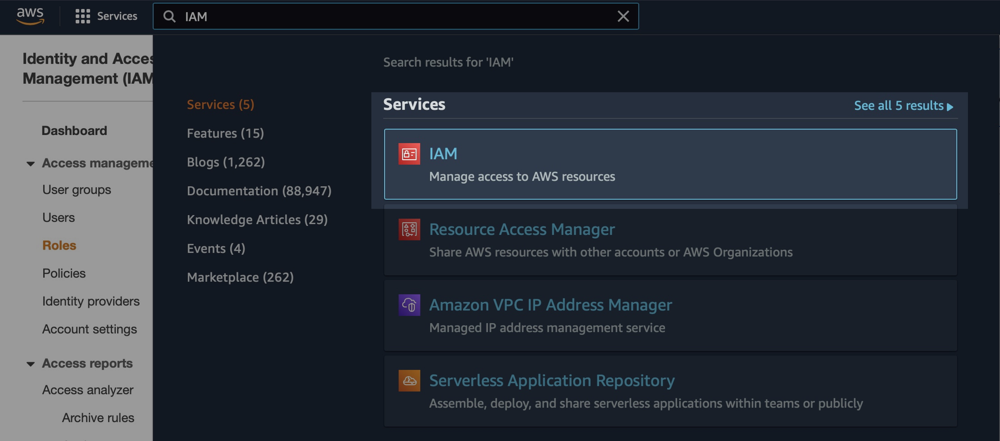
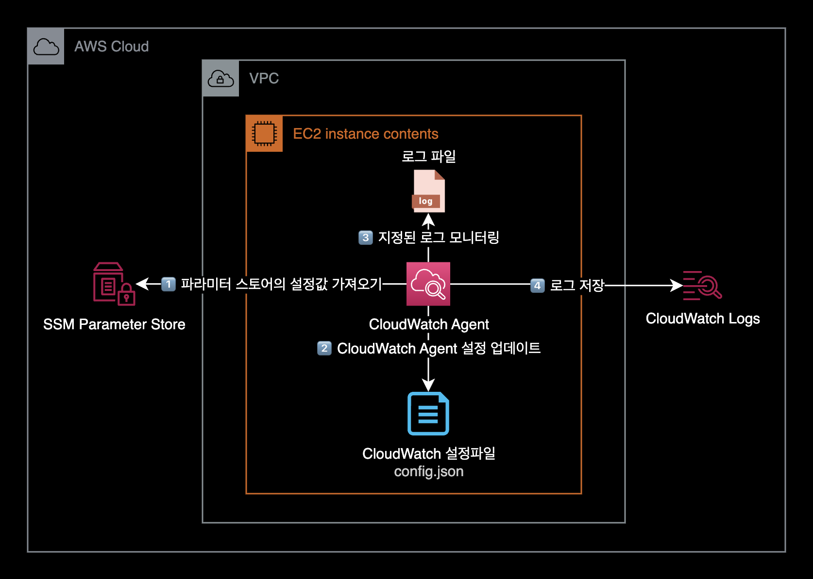

## 개요

EC2 Instance에 CloudWatch Agent를 설치하고 모니터링, 로그 수집, System Manager의 parameter store에 CloudAgent 설정파일을 저장하는 방법을 소개합니다.

&nbsp;

## 환경

### 시스템 구성도

EC2 인스턴스가 CloudWatch Logs로 로그를 보내는 시스템 구성은 다음과 같습니다.


동작방식은 EC2 인스턴스가 OS에 설치된 CloudWatch Agent와 Instance Profile의 권한을 사용해 CloudWatch Logs로 로그를 보냅니다.

&nbsp;

### EC2 Instance

- **Type** : t2.micro (x86_64)
- **OS** : Amazon Linux release 2 (Karoo)
- **Shell** : bash
- **ID** : ec2-user

&nbsp;

## 준비사항

- EC2 Instance가 생성된 상태

&nbsp;

## 설정방법

### IAM 설정

생성한 EC2 Instance에 CloudWatch Agent를 사용하기 위한 IAM 권한을 부여합니다.



&nbsp;

EC2 Instance에 붙힐 Role을 새로 만듭니다.

- **Role 이름** : AWSCloudWatchRoleForEC2


&nbsp;

모니터링할 대상(EC2 Instance)에 CloudWatch Agent 관련 권한 2개가 부여되어 있어야 모니터링이 가능합니다.  


**Role에 추가가 필요한 IAM Policy 2개**  
Parameter store에 CloudWatch agent 설정상태를 저장하기 위해 IAM 권한이 필요합니다.

- CloudWatchAgentServerPolicy
- CloudWatchAgentAdminPolicy : `ssm:PutParameter` Action 때문에 필요합니다.

이 모든 구성을 끝내고 가장 중요한 작업은 EC2 인스턴스에 우리가 구성한 IAM Role을 붙이는(권한을 부여하는) 것입니다.

&nbsp;

### 테스트용 Apache(httpd) 설치

CloudWatch Agent를 설치할 EC2 인스턴스에 SSH 또는 SSM Session Manager를 사용해 원격 로그인합니다.

CloudWatch Log 수집을 테스트하기 위한 목적으로 EC2 인스턴스에 Apache<sup>httpd</sup>를 설치합니다.

```bash
Last login: Thu Jan 13 13:11:39 2022 from 117.111.22.231

       __|  __|_  )
       _|  (     /   Amazon Linux 2 AMI
      ___|\___|___|

https://aws.amazon.com/amazon-linux-2/
[ec2-user@ip-xxx-xx-xx-xxx ~]$
```

&nbsp;

```bash
$ sudo su
$ id
uid=0(root) gid=0(root) groups=0(root)
```

ec2-user에서 root 계정으로 변경합니다.  

Apache 설치 작업 과정에서는 root 권한을 얻는게 중요합니다.  

&nbsp;

패키지 관리자 `yum`을 사용해서 `httpd` 패키지를 설치합니다.  

```bash
$ yum install -y httpd
...
Installed:
  httpd.x86_64 0:2.4.51-1.amzn2

Dependency Installed:
  apr.x86_64 0:1.7.0-9.amzn2
  apr-util.x86_64 0:1.6.1-5.amzn2.0.2
  apr-util-bdb.x86_64 0:1.6.1-5.amzn2.0.2
  generic-logos-httpd.noarch 0:18.0.0-4.amzn2
  httpd-filesystem.noarch 0:2.4.51-1.amzn2
  httpd-tools.x86_64 0:2.4.51-1.amzn2
  mailcap.noarch 0:2.1.41-2.amzn2
  mod_http2.x86_64 0:1.15.19-1.amzn2.0.1

Complete!
```

정상적으로 httpd 패키지를 설치했습니다.  

&nbsp;

```bash
$ yum list installed httpd
Loaded plugins: extras_suggestions, langpacks, priorities, update-motd
Installed Packages
httpd.x86_64                                                     2.4.51-1.amzn2                                                     @amzn2-core
```

현재 인스턴스에 `httpd 2.4.51` 버전이 설치된 상태입니다.

&nbsp;

테스트하기 위한 기본 메인페이지를 생성합니다.

```bash
$ echo "Hello world from $(hostname -f)" > /var/www/html/index.html
```

&nbsp;

httpd 데몬을 실행한 후 상태를 확인합니다.

```bash
$ systemctl start httpd
$ systemctl status httpd
```

```bash
$ exit
$ whoami
ec2-user
```

httpd 메인 페이지 생성 및 데몬 실행이 끝난 후에는 `exit` 명령어로 ec2-user 계정으로 다시 돌아옵니다.

&nbsp;

### CloudWatch Agent 설치

EC2 인스턴스에 CloudWatch Agent 설치하는 방법에는 크게 2가지가 있습니다.

- 직접 다운로드 후 설치
- 패키지 관리자 yum을 이용한 설치

이 가이드에서는 2가지 방법 모두 알려드리겠습니다.

&nbsp;

#### 방법 1: 직접 설치

AWS에서 제공하는 CloudWatch Agent의 설치파일용 S3 경로를 통해 직접 패키지 파일을 받아온 후 `rpm`으로 설치하는 방법입니다.

되도록이면 이후 소개드릴 방법2가 더 간단하므로 방법2를 추천합니다.

```bash
$ wget https://s3.amazonaws.com/amazoncloudwatch-agent/amazon_linux/amd64/latest/amazon-cloudwatch-agent.rpm
--2022-01-13 13:22:09--  https://s3.amazonaws.com/amazoncloudwatch-agent/amazon_linux/amd64/latest/amazon-cloudwatch-agent.rpm
Resolving s3.amazonaws.com (s3.amazonaws.com)... 52.216.104.13
Connecting to s3.amazonaws.com (s3.amazonaws.com)|52.216.104.13|:443... connected.
HTTP request sent, awaiting response... 200 OK
Length: 46891760 (45M) [application/octet-stream]
Saving to: ‘amazon-cloudwatch-agent.rpm’

100%[======================================>] 46,891,760  3.79MB/s   in 14s

2022-01-13 13:22:24 (3.23 MB/s) - ‘amazon-cloudwatch-agent.rpm’ saved [46891760/46891760]
```

&nbsp;

45MB 크기의 CloudWatch 패키지 파일을 다운로드 받았습니다.

```bash
$ ls -lh
total 45M
-rw-rw-r-- 1 ec2-user ec2-user 45M Aug  5 01:07 amazon-cloudwatch-agent.rpm
```

&nbsp;

rpm 패키지 파일을 설치합니다.

```bash
$ sudo rpm -U ./amazon-cloudwatch-agent.rpm
create group cwagent, result: 0
create user cwagent, result: 0
```

&nbsp;

#### 방법 2: yum 설치

방법 2는 방법 1보다 더 간단하므로 이 방법을 통해 설치하는 걸 권장합니다.

패키지 관리자인 `yum`을 사용해서 CloudWatch Agent 설치파일을 다운로드 받는 동시에 설치합니다.

```bash
$ sudo yum install amazon-cloudwatch-agent -y
```

```bash
Loaded plugins: extras_suggestions, langpacks, priorities, update-motd
amzn2-core                                                                          | 3.7 kB  00:00:00
amzn2extra-docker                                                                   | 3.0 kB  00:00:00
amzn2extra-kernel-5.10                                                              | 3.0 kB  00:00:00
amzn2extra-redis6                                                                   | 3.0 kB  00:00:00
nginx                                                                               | 2.9 kB  00:00:00
...

Dependencies Resolved

===========================================================================================================
 Package                         Arch           Version                           Repository          Size
===========================================================================================================
Installing:
 amazon-cloudwatch-agent         x86_64         1.247354.0b251981-1.amzn2         amzn2-core          45 M

Transaction Summary
===========================================================================================================
Install  1 Package

...
Running transaction
create group cwagent, result: 0
create user cwagent, result: 0
create user aoc, result: 6
  Installing : amazon-cloudwatch-agent-1.247354.0b251981-1.amzn2.x86_64                                1/1
  Verifying  : amazon-cloudwatch-agent-1.247354.0b251981-1.amzn2.x86_64                                1/1

Installed:
  amazon-cloudwatch-agent.x86_64 0:1.247354.0b251981-1.amzn2

Complete!
```

명령어 한 줄로 CloudWatch Agent 설치를 완료했습니다.

&nbsp;

CloudWatch Agent 설치 마법사를 이용하면 간단하게 CloudWatch Agent를 초기 설정할 수 있습니다.

```bash
$ sudo /opt/aws/amazon-cloudwatch-agent/bin/amazon-cloudwatch-agent-config-wizard
=============================================================
= Welcome to the AWS CloudWatch Agent Configuration Manager =
=============================================================
On which OS are you planning to use the agent?
1. linux
2. windows
3. darwin
default choice: [1]:
1
...
```

보통 기본값일 경우, Enter 키를 입력해서 다음 단계로 계속 넘어갑니다.

CloudWatch Agent 초기 설정 단계를 넘기다보면 로그 모니터링 쪽 설정 단계가 나옵니다.

&nbsp;

### 로그 모니터링 설정

CloudWatch Agent가 `/var/log/httpd/access_log` 와 `/var/log/httpd/error_log`를 수집하도록 설정합니다.

&nbsp;

#### access_log 수집 설정

access_log의 절대경로는 `/var/log/httpd/access_log` 이다.  

로그 파일의 절대경로<sup>Log file path</sup>를 입력할 때 오타에 주의합니다.

```bash
...
Do you want to monitor any log files?
1. yes
2. no
default choice: [1]:
1
Log file path:
/var/log/httpd/access_log
Log group name:
default choice: [access_log]

Log stream name:
default choice: [{instance_id}]
```

&nbsp;

#### error_log 수집 설정

error_log의 절대경로는 `/var/log/httpd/error_log` 입니다.

```bash
...
Do you want to specify any additional log files to monitor?
1. yes
2. no
default choice: [1]:
1
Log file path:
/var/log/httpd/error_log
Log group name:
default choice: [error_log]

Log stream name:
default choice: [{instance_id}]

Do you want to specify any additional log files to monitor?
1. yes
2. no
default choice: [1]:
2
Saved config file to /opt/aws/amazon-cloudwatch-agent/bin/config.json successfully.
```

마지막에는 CloudWatch Agent의 설정파일 경로를 알려줍니다.

&nbsp;

```bash
Please check the above content of the config.
The config file is also located at /opt/aws/amazon-cloudwatch-agent/bin/config.json.
Edit it manually if needed.
```

CloudAgent 설정파일의 경로인 `/opt/aws/amazon-cloudwatch-agent/bin/config.json` 를 확인하라고 안내하고 있습니다.

&nbsp;

실제로 해당 경로에 위치한 CloudWatch Agent 설정파일을 확인합니다.

```bash
$ cat /opt/aws/amazon-cloudwatch-agent/bin/config.json
{
    "agent": {
        "metrics_collection_interval": 60,
        "run_as_user": "root"
    },
    "logs": {
        "logs_collected": {
            "files": {
                "collect_list": [
                    {
                        "file_path": "/var/log/httpd/access_log",
                        "log_group_name": "access_log",
                        "log_stream_name": "{instance_id}"
                    },
                    {
                        "file_path": "/var/log/httpd/error_log",
                        "log_group_name": "error_log",
                        "log_stream_name": "{instance_id}"
                    }
                ]
            }
        }
    },
    "metrics": {
        "append_dimensions": {
            "AutoScalingGroupName": "${aws:AutoScalingGroupName}",
            "ImageId": "${aws:ImageId}",
            "InstanceId": "${aws:InstanceId}",
            "InstanceType": "${aws:InstanceType}"
        },
        "metrics_collected": {
            "collectd": {
                "metrics_aggregation_interval": 60
            },
            "disk": {
                "measurement": [
                    "used_percent"
                ],
                "metrics_collection_interval": 60,
                "resources": [
                    "*"
                ]
            },
            "mem": {
                "measurement": [
                    "mem_used_percent"
                ],
                "metrics_collection_interval": 60
            },
            "statsd": {
                "metrics_aggregation_interval": 60,
                "metrics_collection_interval": 10,
                "service_address": ":8125"
            }
        }
    }
}
```

**CloudWatch Agent의 설치 목적**  
핵심 목적은 EC2 인스턴스에 CloudWatch Agent를 설치하면, 더 많은 지표를 수집할 수 있습니다.

- **메모리 사용률**
- **디스크 사용률** : 각 파일시스템별 사용률

&nbsp;

### CloudWatch Agent 실행

`ssm:AmazonCloudWatch-linux` 는 Parameter Store의 기본<sup>default</sup> 이름입니다.  
ssm은 AWS System Manager의 줄임말입니다.

&nbsp;

#### 명령어 설명

```bash
$ sudo /opt/aws/amazon-cloudwatch-agent/bin/amazon-cloudwatch-agent-ctl \
    -a fetch-config \
    -m ec2 \
    -c ssm:AmazonCloudWatch-linux \
    -s
```

- `-a fetch-config` : 에이전트가 최신 버전의 CloudWatch 에이전트 구성 파일을 로드합니다.
- `-c ssm:AmazonCloudWatch-linux` : CloudAgent 구성 파일은 AWS System Manager<sup>ssm</sup>의 AmazonCloudWatch-linux 라는 이름의 파라미터 스토어에서 가져옵니다.
- `-s` : 에이전트 설정이 끝난 후 CloudWatch 에이전트를 재시작합니다.

&nbsp;

#### 명령어 실행결과

```bash
$ sudo /opt/aws/amazon-cloudwatch-agent/bin/amazon-cloudwatch-agent-ctl \
    -a fetch-config \
    -m ec2 \
    -c ssm:AmazonCloudWatch-linux \
    -s
```

```bash
****** processing amazon-cloudwatch-agent ******
/opt/aws/amazon-cloudwatch-agent/bin/config-downloader --output-dir /opt/aws/amazon-cloudwatch-agent/etc/amazon-cloudwatch-agent.d --download-source ssm:AmazonCloudWatch-linux --mode ec2 --config /opt/aws/amazon-cloudwatch-agent/etc/common-config.toml --multi-config default
Region: ap-northeast-2
credsConfig: map[]
Successfully fetched the config and saved in /opt/aws/amazon-cloudwatch-agent/etc/amazon-cloudwatch-agent.d/ssm_AmazonCloudWatch-linux.tmp
Start configuration validation...
/opt/aws/amazon-cloudwatch-agent/bin/config-translator --input /opt/aws/amazon-cloudwatch-agent/etc/amazon-cloudwatch-agent.json --input-dir /opt/aws/amazon-cloudwatch-agent/etc/amazon-cloudwatch-agent.d --output /opt/aws/amazon-cloudwatch-agent/etc/amazon-cloudwatch-agent.toml --mode ec2 --config /opt/aws/amazon-cloudwatch-agent/etc/common-config.toml --multi-config default
2022/01/13 03:16:55 Reading json config file path: /opt/aws/amazon-cloudwatch-agent/etc/amazon-cloudwatch-agent.d/ssm_AmazonCloudWatch-linux.tmp ...
Valid Json input schema.
I! Detecting run_as_user...
No csm configuration found.
Configuration validation first phase succeeded
/opt/aws/amazon-cloudwatch-agent/bin/amazon-cloudwatch-agent -schematest -config /opt/aws/amazon-cloudwatch-agent/etc/amazon-cloudwatch-agent.toml
Configuration validation second phase failed
======== Error Log ========
2022-01-13T03:16:55Z E! [telegraf] Error running agent: Error parsing /opt/aws/amazon-cloudwatch-agent/etc/amazon-cloudwatch-agent.toml, open /usr/share/collectd/types.db: no such file or directory
```

에러 로그가 출력되면서 CloudWatch Agent 실행이 실패했습니다.

&nbsp;

에러 로그 내용을 좀 더 살펴봅니다.

```bash
======== Error Log ========
2022-01-13T03:16:55Z E! [telegraf] Error running agent: Error parsing /opt/aws/amazon-cloudwatch-agent/etc/amazon-cloudwatch-agent.toml, open /usr/share/collectd/types.db: no such file or directory
```

마지막 라인에서 `/usr/share/collectd/types.db: no such file or directory` 에러가 발생했습니다.  
에러 로그의 내용처럼 `types.db` 파일이 `/usr/share/collectd/`에 실제로 존재하는 지 체크할 필요가 있습니다.

&nbsp;

```bash
$ ls -l /usr/share/collectd/types.db
ls: cannot access /usr/share/collectd/types.db: No such file or directory
```

확인해보니 해당 경로에 `types.db` 파일이 존재하지 않아서 발생하는 에러입니다.

&nbsp;

이 문제를 해결하기 위해 `/usr/share/collectd/` 경로에 `types.db` 파일을 새로 생성합니다.

```bash
$ sudo mkdir -p /usr/share/collectd/
```

- `-p` : 중간에 디렉토리가 없으면 해당 상위 디렉토리도 같이 생성하는 옵션

&nbsp;

```bash
$ sudo touch /usr/share/collectd/types.db
```

`types.db` 파일도 생성합니다.

&nbsp;

`types.db` 파일을 생성한 후 CloudWatch Agent를 다시 실행합니다.

```bash
$ sudo /opt/aws/amazon-cloudwatch-agent/bin/amazon-cloudwatch-agent-ctl \
    -a fetch-config \
    -m ec2 \
    -c ssm:AmazonCloudWatch-linux \
    -s
```

```bash
****** processing amazon-cloudwatch-agent ******
/opt/aws/amazon-cloudwatch-agent/bin/config-downloader --output-dir /opt/aws/amazon-cloudwatch-agent/etc/amazon-cloudwatch-agent.d --download-source ssm:AmazonCloudWatch-linux --mode ec2 --config /opt/aws/amazon-cloudwatch-agent/etc/common-config.toml --multi-config default
Region: ap-northeast-2
credsConfig: map[]
Successfully fetched the config and saved in /opt/aws/amazon-cloudwatch-agent/etc/amazon-cloudwatch-agent.d/ssm_AmazonCloudWatch-linux.tmp
Start configuration validation...
/opt/aws/amazon-cloudwatch-agent/bin/config-translator --input /opt/aws/amazon-cloudwatch-agent/etc/amazon-cloudwatch-agent.json --input-dir /opt/aws/amazon-cloudwatch-agent/etc/amazon-cloudwatch-agent.d --output /opt/aws/amazon-cloudwatch-agent/etc/amazon-cloudwatch-agent.toml --mode ec2 --config /opt/aws/amazon-cloudwatch-agent/etc/common-config.toml --multi-config default
2022/01/13 03:19:19 Reading json config file path: /opt/aws/amazon-cloudwatch-agent/etc/amazon-cloudwatch-agent.d/ssm_AmazonCloudWatch-linux.tmp ...
Valid Json input schema.
I! Detecting run_as_user...
No csm configuration found.
Configuration validation first phase succeeded
/opt/aws/amazon-cloudwatch-agent/bin/amazon-cloudwatch-agent -schematest -config /opt/aws/amazon-cloudwatch-agent/etc/amazon-cloudwatch-agent.toml
Configuration validation second phase succeeded
Configuration validation succeeded
amazon-cloudwatch-agent has already been stopped
Created symlink from /etc/systemd/system/multi-user.target.wants/amazon-cloudwatch-agent.service to /etc/systemd/system/amazon-cloudwatch-agent.service.
Redirecting to /bin/systemctl restart amazon-cloudwatch-agent.service
```

`types.db` 파일을 생성한 뒤부터 정상적으로 CloudWatch Agent가 실행됩니다.

&nbsp;

현재 CloudWatch Agent 상태를 확인합니다.

```bash
$ sudo /opt/aws/amazon-cloudwatch-agent/bin/amazon-cloudwatch-agent-ctl \
    -a status \
    -m ec2
```

```bash
{
  "status": "running",
  "starttime": "2022-01-13T13:34:11+0000",
  "configstatus": "configured",
  "cwoc_status": "stopped",
  "cwoc_starttime": "",
  "cwoc_configstatus": "not configured",
  "version": "1.247349.0b251399"
}
```

AWS CloudWatch Agent가 정상적으로 실행중(`running`)이며, 에이전트가 설정된 상태(`configured`)입니다.

&nbsp;

### 로그 수집 결과 확인

이제 AWS Console로 이동합니다. CloudWatch → Logs → Log group 메뉴로 접속합니다.


EC2 인스턴스에 설치된 CloudWatch Agent가 로컬 로그파일인 `access_log`와 `error_log`를 CloudWatch Logs로 성공적으로 보냈습니다.

&nbsp;

OS상의 로그와 동일한 내용으로 로그가 잘 전송된 걸 확인할 수 있습니다.


&nbsp;

결과적으로 EC2 인스턴스는 다음과 같은 동작순서로 CloudWatch Logs에 로그를 보내게 됩니다.



&nbsp;

이상으로 CloudWatch Agent 설치 및 구성 가이드를 마칩니다.

&nbsp;

## 더 나아가서

### cloudwatch-agent-cli 치트시트

<details>
<summary>명령어 모음</summary>

EC2에 설치된 CloudWatch Agent를 관리할 때 자주 사용하는 명령어들은 정리해놓았습니다.

```bash
# CloudWatch Agent 설치 마법사 실행
$ sudo /opt/aws/amazon-cloudwatch-agent/bin/amazon-cloudwatch-agent-config-wizard
```

&nbsp;

```bash
# CloudWatch Agent 상태 확인 1 (CLI)
$ sudo /opt/aws/amazon-cloudwatch-agent/bin/amazon-cloudwatch-agent-ctl \
    -m ec2 \
    -a status
```

&nbsp;

```bash
# CloudWatch Agent 상태 확인 2 (systemctl)
$ systemctl status amazon-cloudwatch-agent
```

&nbsp;

```bash
# CloudWatch Agent 시작
$ sudo /opt/aws/amazon-cloudwatch-agent/bin/amazon-cloudwatch-agent-ctl \
    -m ec2 \
    -a fetch-config \
    -c ssm:AmazonCloudWatch-linux \
    -s
```

`-c ssm:<SSM_PARAMETER_STORE_NAME>` 옵션에서 `<SSM_PARAMETER_SOTRE_NAME>` 값은 자신의 환경에 맞게 바꿔서 실행합니다.

&nbsp;

```bash
# CloudWatch Agent 중지
$ sudo /opt/aws/amazon-cloudwatch-agent/bin/amazon-cloudwatch-agent-ctl \
    -m ec2 \
    -a stop
```

</details>

&nbsp;

## 결론

이 포스팅은 CloudWatch Agent의 **수동** 설치를 다룹니다.

수동 설치 방식은 Cloud Native의 핵심 가치인 자동화<sup>Automation</sup>와는 거리가 좀 있습니다.

만약 CloudWatch Agent를 설치해야할 EC2 인스턴스가 200대라면, 200대 각각 들어가서 CloudWatch Agent를 설치하는건 비효율적이고(사람을 갈아넣으면 뭐든 가능하겠지만) 인적 실수<sup>Human fault</sup>를 유발할 확률이 높은 방식입니다.

조만간 자동설치 관련해서 직접 글을 쓸 예정입니다.

CloudWatch Agent 자동 설치 방법이 궁금하다면 OpsNow Techblog의 [CloudWatch 에이전트를 손쉽게 설치하는 방법 – OpsNow Tech Blog](https://blog.opsnow.com/29) 포스팅을 참고하면 좋습니다.
