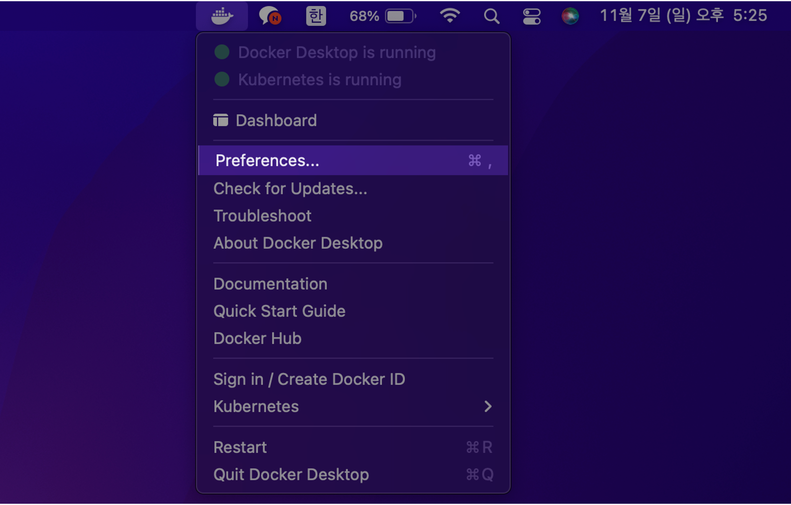
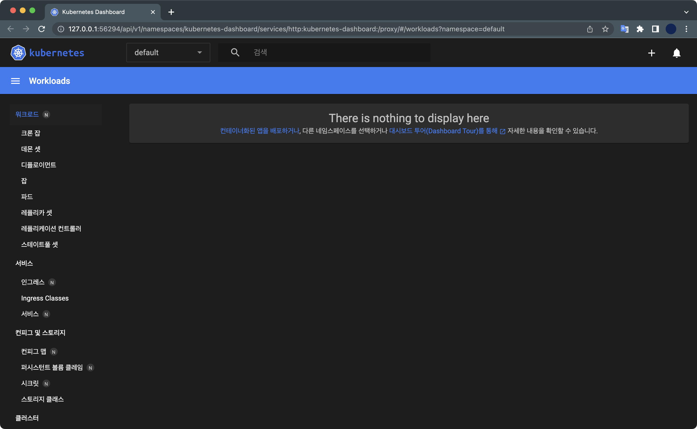
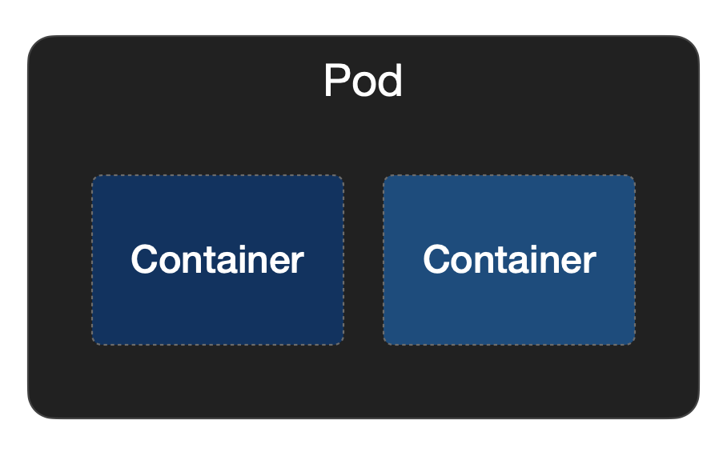
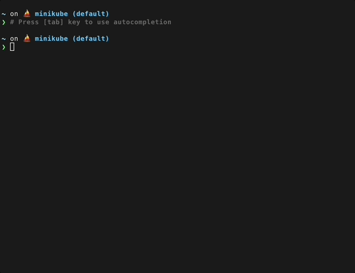

## 개요

M1 CPU를 사용하는 macOS에서 `minikube`를 설치해 kubernetes 실습 환경을 구축합니다.

이 방식은 하이퍼바이저로 Virtual Box나 Vagrant를 사용하지 않고, docker에 minikube를 올리는 방식입니다.

&nbsp;

## 환경

- **Hardware** : MacBook Pro (16", M1 Pro, 2021)
- **OS** : macOS Monterey 12.4
- **Shell** : zsh + oh-my-zsh
- **패키지 관리자** : Homebrew 3.3.2
- **설치대상**
  - **Docker Desktop v4.10.1**
  - **minikube v1.25.2**

&nbsp;

## 본문

### 1. Docker 설치

#### 설치

minikube를 사용하기 위해서는 로컬 머신에 docker desktop을 먼저 설치해야합니다.  
macOS용 패키지 관리자인 Homebrew를 이용해 `docker`를 쉽게 설치할 수 있습니다.

```bash
$ brew install --cask docker
==> Downloading https://desktop.docker.com/mac/main/arm64/69879/Docker.dmg
Already downloaded: /Users/ive/Library/Caches/Homebrew/downloads/b5774f18ca8a6d3936c5174f91b93cb1a1a407daa784fe63d9b6300180c7b1ed--Docker.dmg
==> Installing Cask docker
==> Moving App 'Docker.app' to '/Applications/Docker.app'
==> Linking Binary 'docker-compose.bash-completion' to '/opt/homebrew/etc/bash_c
==> Linking Binary 'docker.zsh-completion' to '/opt/homebrew/share/zsh/site-func
==> Linking Binary 'docker.fish-completion' to '/opt/homebrew/share/fish/vendor_
==> Linking Binary 'docker-compose.fish-completion' to '/opt/homebrew/share/fish
==> Linking Binary 'docker-compose.zsh-completion' to '/opt/homebrew/share/zsh/s
==> Linking Binary 'docker.bash-completion' to '/opt/homebrew/etc/bash_completio
🍺  docker was successfully installed!
```

docker 최초 설치시 오래걸리니 인내심을 갖고 기다립니다.

&nbsp;

```bash
$ brew list --cask
docker                                   iterm2
```

cask 목록에 docker가 설치된 걸 확인할 수 있습니다.

&nbsp;

런치패드에도 Docker 아이콘이 생성되었습니다.


&nbsp;

#### 쿠버네티스 기능 활성화

이제 도커 데스크탑에서 쿠버네티스 기능을 활성화합니다.  
minikube 클러스터를 도커 환경에서 생성하고 운영하기 위한 목적입니다.

상단바 → Docker Desktop 아이콘 → Preferences



Containers / Apps → Enable Kubernetes 체크 → Apply & Restart


쿠버네티스 기능 활성화를 설정하는 과정에서 문제가 발생할 경우, [Docker 공식문서](https://docs.docker.com/desktop/kubernetes/#enable-kubernetes)를 참고하세요.

&nbsp;

### 2. minikube 설치

docker desktop 설치가 완료된 후 minikube를 설치합니다.

```bash
$ brew install minikube
...
==> Summary
🍺  /opt/homebrew/Cellar/minikube/1.25.2: 9 files, 70.3MB
==> Running `brew cleanup minikube`...
Disable this behaviour by setting HOMEBREW_NO_INSTALL_CLEANUP.
Hide these hints with HOMEBREW_NO_ENV_HINTS (see `man brew`).
```

minikube v1.25.2 버전이 설치 완료되었습니다.

&nbsp;

```bash
$ minikube version
minikube version: v1.25.2
commit: 362d5fdc0a3dbee389b3d3f1034e8023e72bd3a7
```

버전 확인 명령어가 잘 실행되는지 확인합니다.

&nbsp;

### 3. 쿠버네티스 클러스터 생성

로컬에 1대의 노드로 구성된 쿠버네티스 클러스터를 생성합니다.

```bash
$ minikube start \
  --cni='calico' \
  --driver='docker' \
  --nodes=1 \
  --kubernetes-version='stable'
```

**명령어 옵션 설명**  
`--cni` : 컨테이너 네트워크 인터페이스를 지정합니다.  
`--driver` : 쿠버네티스 클러스터를 구동할 하이퍼바이저를 지정합니다.  
`--nodes` : 생성할 쿠버네티스 노드 수량. 기본값은 1대입니다.  
`--kubernetes-version` : 생성되는 노드의 쿠버네티스 버전을 지정합니다.  

&nbsp;

minikube 클러스터가 정상적으로 생성된 경우, 다음과 같은 아웃풋이 출력됩니다.

```bash
😄  Darwin 12.4 (arm64) 의 minikube v1.25.2
✨  유저 환경 설정 정보에 기반하여 docker 드라이버를 사용하는 중
👍  minikube 클러스터의 minikube 컨트롤 플레인 노드를 시작하는 중
🚜  베이스 이미지를 다운받는 중 ...
🔥  Creating docker container (CPUs=2, Memory=7903MB) ...
🐳  쿠버네티스 v1.23.3 을 Docker 20.10.12 런타임으로 설치하는 중
    ▪ kubelet.housekeeping-interval=5m
    ▪ 인증서 및 키를 생성하는 중 ...
    ▪ 컨트롤 플레인이 부팅...
    ▪ RBAC 규칙을 구성하는 중 ...
🔗  Configuring Calico (Container Networking Interface) ...
🔎  Kubernetes 구성 요소를 확인...
    ▪ Using image gcr.io/k8s-minikube/storage-provisioner:v5
🌟  애드온 활성화 : storage-provisioner, default-storageclass
🏄  끝났습니다! kubectl이 "minikube" 클러스터와 "default" 네임스페이스를 기본적으로 사용하도록 구성되었습니다.
```

쿠버네티스 클러스터가 생성된 걸 확인할 수 있습니다.

&nbsp;

쿠버네티스 노드의 상태를 확인할 수 있습니다.

```bash
$ minikube status
minikube
type: Control Plane
host: Running
kubelet: Running
apiserver: Running
kubeconfig: Configured
```

&nbsp;

Profile로 환경을 나눠서 여러개의 minikube 클러스터를 동시에 사용할 수도 있습니다.  
Profile 이름을 지정하지 않을 경우 기본 Profile인 `minikube`가 생성됩니다.

```bash
$ minikube profile list
|----------|-----------|---------|--------------|------|---------|---------|-------|--------|
| Profile  | VM Driver | Runtime |      IP      | Port | Version | Status  | Nodes | Active |
|----------|-----------|---------|--------------|------|---------|---------|-------|--------|
| minikube | docker    | docker  | 192.168.49.2 | 8443 | v1.24.1 | Running |     1 | *      |
|----------|-----------|---------|--------------|------|---------|---------|-------|--------|
```

&nbsp;

### 4. minikube 상태 확인

**docker 확인**  
도커 컨테이너로 실행되는 minikube 노드를 확인합니다.

```bash
$ docker ps
CONTAINER ID   IMAGE                                 COMMAND                  CREATED          STATUS          PORTS                                                                                                                        NAMES
a4eda4df4ff2   gcr.io/k8s-minikube/kicbase:v0.0.32   "/usr/local/bin/entr…"   28 seconds ago   Up 27 seconds   0.0.0.0:56021->22/tcp, 0.0.0.0:56022->2376/tcp, 0.0.0.0:56026->5000/tcp, 0.0.0.0:56027->8443/tcp, 0.0.0.0:56023->32443/tcp   minikube
```

여기서 결국 minikube 클러스터를 구성하는 노드의 실체는 도커 컨테이너라는 사실을 알 수 있습니다.

&nbsp;

**minikube dashboard 확인**  
`minikube`를 설치하면 기본적으로 dashboard가 비활성화되어 있습니다.

```bash
$ minikube addons list
|-----------------------------|----------|--------------|--------------------------------|
|         ADDON NAME          | PROFILE  |    STATUS    |           MAINTAINER           |
|-----------------------------|----------|--------------|--------------------------------|
| ambassador                  | minikube | disabled     | third-party (ambassador)       |
| auto-pause                  | minikube | disabled     | google                         |
| csi-hostpath-driver         | minikube | disabled     | kubernetes                     |
| dashboard                   | minikube | disabled     | kubernetes                     |
| default-storageclass        | minikube | enabled ✅   | kubernetes                     |
| efk                         | minikube | disabled     | third-party (elastic)          |
| freshpod                    | minikube | disabled     | google                         |
| gcp-auth                    | minikube | disabled     | google                         |
| gvisor                      | minikube | disabled     | google                         |
| helm-tiller                 | minikube | disabled     | third-party (helm)             |
| ingress                     | minikube | disabled     | unknown (third-party)          |
| ingress-dns                 | minikube | disabled     | google                         |
| istio                       | minikube | disabled     | third-party (istio)            |
| istio-provisioner           | minikube | disabled     | third-party (istio)            |
| kong                        | minikube | disabled     | third-party (Kong HQ)          |
| kubevirt                    | minikube | disabled     | third-party (kubevirt)         |
| logviewer                   | minikube | disabled     | unknown (third-party)          |
| metallb                     | minikube | disabled     | third-party (metallb)          |
| metrics-server              | minikube | disabled     | kubernetes                     |
| nvidia-driver-installer     | minikube | disabled     | google                         |
| nvidia-gpu-device-plugin    | minikube | disabled     | third-party (nvidia)           |
| olm                         | minikube | disabled     | third-party (operator          |
|                             |          |              | framework)                     |
| pod-security-policy         | minikube | disabled     | unknown (third-party)          |
| portainer                   | minikube | disabled     | portainer.io                   |
| registry                    | minikube | disabled     | google                         |
| registry-aliases            | minikube | disabled     | unknown (third-party)          |
| registry-creds              | minikube | disabled     | third-party (upmc enterprises) |
| storage-provisioner         | minikube | enabled ✅   | google                         |
| storage-provisioner-gluster | minikube | disabled     | unknown (third-party)          |
| volumesnapshots             | minikube | disabled     | kubernetes                     |
|-----------------------------|----------|--------------|--------------------------------|
```

&nbsp;

기본 비활성화 되어 있는 kubernetes dashboard 애드온을 활성화 합니다.

```bash
$ minikube dashboard
🔌  대시보드를 활성화하는 중 ...
    ▪ Using image kubernetesui/dashboard:v2.3.1
    ▪ Using image kubernetesui/metrics-scraper:v1.0.7
🤔  Verifying dashboard health ...
🚀  프록시를 시작하는 중 ...
🤔  Verifying proxy health ...
🎉  Opening http://127.0.0.1:62073/api/v1/namespaces/kubernetes-dashboard/services/http:kubernetes-dashboard:/proxy/ in your default browser...
```

&nbsp;

자동으로 브라우저 창이 열리면서 Kubernetes dashboard로 이동됩니다.  
아직 아무것도 배포하지 않은 초기화 상태의 클러스터라 표시할 내용이 없습니다.



&nbsp;

쿠버네티스 노드 정보를 확인합니다.

```bash
$ kubectl get node -o wide
NAME       STATUS   ROLES           AGE     VERSION   INTERNAL-IP    EXTERNAL-IP   OS-IMAGE             KERNEL-VERSION      CONTAINER-RUNTIME
minikube   Ready    control-plane   8m36s   v1.24.1   192.168.49.2   <none>        Ubuntu 20.04.4 LTS   5.10.104-linuxkit   docker://20.10.17
```

control-plane 노드 1대가 실행중입니다. 해당 노드의 쿠버네티스 버전은 `v1.24.1`이고 CRI는 dockershim(`docker://20.10.17`)을 사용중입니다.  
노드가 1대일 경우 `control-plane` 역할과 `worker node` 역할을 같이 수행하게 됩니다.

&nbsp;

### 5. 테스트 pod 생성

**파드**  
파드<sup>Pod</sup>는 쿠버네티스에서 가장 최소한의 오브젝트 단위입니다.  
1개의 파드는 최소 1개 이상의 컨테이너<sup>Container</sup>로 구성됩니다.



&nbsp;

**YAML 작성**  
현재 경로에 `sample-pod.yaml` 파일을 생성합니다.

```bash
$ cat << EOF > ./sample-pod.yaml
apiVersion: v1
kind: Pod
metadata:
  name: myapp-pod
  labels:
    app: myapp
spec:
  containers:
  - name: myapp-container
    image: busybox
    command: ['sh', '-c', 'echo Hello Kubernetes! && sleep 3600']
EOF
```

`sample-pod.yaml`은 1개의 파드를 배포하는 매니페스트입니다.  
파드에 들어있는 `busybox` 컨테이너는 `Hello Kubernetes!` 메세지를 출력하고 3600초 후 종료되도록 동작합니다.

&nbsp;

작성한 매니페스트를 사용해서 파드를 배포합니다.

```bash
$ kubectl apply -f sample-pod.yaml
pod/myapp-pod created
```

&nbsp;

### 6. 파드 동작 확인

파드 상태를 확인합니다.

```baah
$ kubectl get pod -o wide
NAME                      READY   STATUS    RESTARTS        AGE   IP            NODE       NOMINATED NODE   READINESS GATES
myapp-pod                 1/1     Running   0               67s   172.17.0.11   minikube   <none>           <none>
```

`myapp-pod`가 정상 동작중인 걸 확인할 수 있습니다.

&nbsp;

파드의 로그를 확인합니다.

```bash
$ kubectl logs pod/myapp-pod
Hello Kubernetes!
```

yaml 파일에 작성한대로 `myapp-pod`가 `Hello Kubernetes!`를 출력했습니다.

&nbsp;

## 실습환경 정리

### 방법 1. 클러스터 종료

쿠버네티스 클러스터를 종료합니다.  
**중요**: 클러스터 삭제가 아니라 종료이기 때문에 생성한 클러스터와 리소스는 보존됩니다.  
언제든지 `minikube start` 명령어로 클러스터를 재시작하면 모든 리소스는 다시 복구됩니다.

&nbsp;

#### 리소스 삭제하기

모든 pod를 삭제합니다.

```bash
$ kubectl delete pod --all
pod "myapp-pod" deleted
```

`myapp-pod`가 삭제되었습니다.

&nbsp;

```bash
$ kubectl get pod -o wide
No resources found in default namespace.
```

파드를 삭제한 후 아무런 pod도 조회되지 않습니다.  
모든 파드가 정상적으로 삭제되었습니다.

&nbsp;

#### 클러스터 종료

minikube 클러스터를 종료합니다.  
클러스터를 종료한다고 해서 배포했던 리소스들이 삭제되지 않고 다시 시작했을 때 그대로 보존됩니다.

```bash
$ minikube stop
✋  Stopping node "minikube"  ...
🛑  Powering off "minikube" via SSH ...
🛑  1 node stopped.
```

다음에 minikube 클러스터를 다시 시작하고 싶다면 `minikube start` 명령어를 실행하면 됩니다.

&nbsp;

````bash
$ minikube status
minikube
type: Control Plane
host: Stopped
kubelet: Stopped
apiserver: Stopped
kubeconfig: Stopped
````

minikube 클러스터가 중지된 상태<sup>`Stopped`</sup>입니다.

&nbsp;

### 방법 2. 클러스터 삭제

`minikube` 클러스터와 그 안에 생성된 모든 리소스를 제거합니다.

&nbsp;

#### 클러스터 삭제

삭제하기 전에 프로파일을 확인합니다.

```bash
$ minikube profile list
|----------|-----------|---------|--------------|------|---------|---------|-------|
| Profile  | VM Driver | Runtime |      IP      | Port | Version | Status  | Nodes |
|----------|-----------|---------|--------------|------|---------|---------|-------|
| minikube | docker    | docker  | 192.168.49.2 | 8443 | v1.23.3 | Running |     1 |
|----------|-----------|---------|--------------|------|---------|---------|-------|
```

&nbsp;

디폴트 프로파일인 `minikube`의 클러스터를 삭제합니다.

```bash
$ minikube delete
🔥  docker 의 "minikube" 를 삭제하는 중 ...
🔥  Deleting container "minikube" ...
🔥  /Users/steve/.minikube/machines/minikube 제거 중 ...
💀  "minikube" 클러스터 관련 정보가 모두 삭제되었습니다
```

&nbsp;

#### 결과 확인

클러스터 삭제가 완료된 후 아래 명령어로 프로파일 목록을 확인합니다.

```bash
$ minikube profile list

🤹  Exiting due to MK_USAGE_NO_PROFILE: No minikube profile was found.
💡  권장:

    You can create one using 'minikube start'.

```

`minikube` 프로파일이 삭제되어 조회되지 않는 걸 확인할 수 있습니다.

&nbsp;

`kubectl` 명령어로 쿠버네티스 노드를 확인해도 결과는 마찬가지입니다.

```bash
$ kubectl get node
The connection to the server localhost:8080 was refused - did you specify the right host or port?
```

&nbsp;

모든 실습환경이 정리되었습니다.

&nbsp;

## 더 나아가서

### 멀티노드 구성하기

싱글 노드가 아닌 여러 대의 노드로 구성된 클러스터에서 실습해보고 싶다면 아래 글도 읽어보는 걸 추천합니다.

[minikube 멀티노드 구성](/blog/k8s/multinode-in-minikube/)

&nbsp;

### 자동완성 설정

minikube 명령어의 자동완성 기능을 영구적으로 설정하는 방법입니다.  
쉘 설정파일에 minikube 자동완성 기능을 디폴트로 사용하도록 설정 내용을 추가합니다.

사용자가 사용하는 쉘 종류에 따라서 설정 방법이 약간씩 다릅니다.

```bash
# for zsh users
$ cat << EOF >> ~/.zshrc
# minikube autocompletion
source <(minikube completion zsh)
EOF
```

```bash
# for bash users
$ cat << EOF >> ~/.bashrc
# minikube autocompletion
source <(minikube completion bash)
EOF
```

&nbsp;

새로 추가한 `minikube completion` 설정 내용을 바로 적용하기 위해서 아래 명령어를 실행합니다.

```bash
# for zsh users
$ source ~/.zshrc
```

```bash
# for bash users
$ source ~/.bashrc
```

또는 현재 사용중인 터미널을 닫았다가 열어도 적용됩니다.

&nbsp;

이제 `minikube` 명령어를 사용할 때 <kbd>tab</kbd>키를 이용해서 어떤 명령어와 옵션이 있는지 실시간으로 확인할 수 있습니다.


