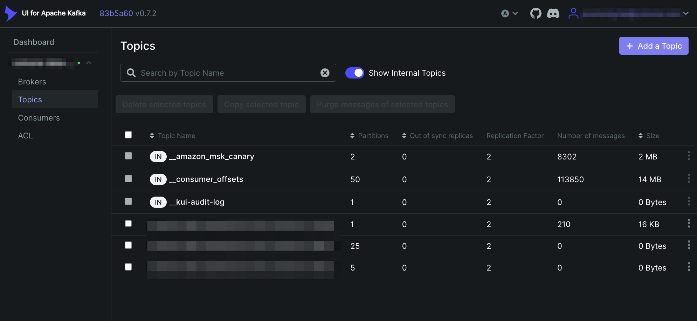
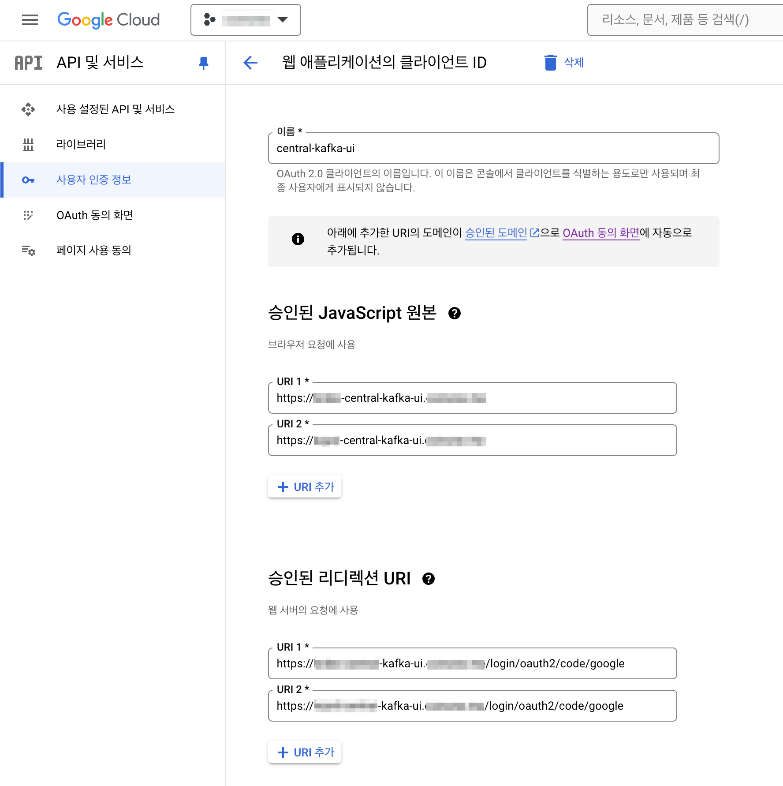
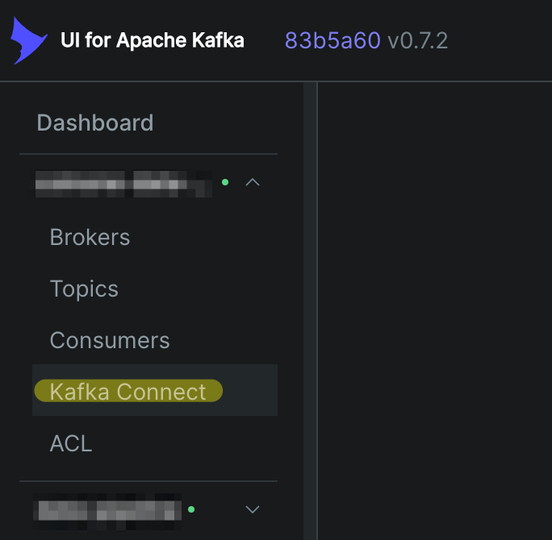

## 개요

[Kafka UI](https://github.com/provectus/kafka-ui)에 대한 운영 가이드입니다.

쿠버네티스 클러스터에 배포된 kafka-ui를 운영, 관리하는 DevOps Engineer를 대상으로 작성되었습니다.

&nbsp;

## 배경지식

### Kafka UI

UI for Apache Kafka는 MSK 클러스터 등의 Apache Kafka 관리를 위한 오픈 소스 웹 UI입니다.

Kafka UI는 Kubernetes 클러스터에 설치를 지원하며, [헬름차트](https://github.com/provectus/kafka-ui-charts)를 통해 쉽게 배포할 수 있습니다.

&nbsp;

## 환경

- **EKS v1.28** <sup>amd64</sup>
- **Kafka UI v0.7.2** : [공식 헬름차트](https://github.com/provectus/kafka-ui-charts)로 배포됨

&nbsp;

## 설정 가이드

kafka-ui에 대한 모든 설정은 ConfigMap으로 관리할 수 있습니다.

`kafka-ui` 공식 헬름차트에서는 `yamlApplicationConfig` 값에 관리대상 클러스터 설정, Audit Logging, RBAC, OAuth 연동 등을 모두 설정할 수 있습니다.

&nbsp;

### Audit logging

Kafka 토픽에 대한 변경, 삭제, 조회 이력을 남기는 것은 보안 측면에서 매우 중요합니다. kafka-ui를 사용하면 kafka-ui 자체 내에서 수행되는 모든 작업을 kafka 클러스터에 기록할 수 있습니다. kafka 주제 및/또는 콘솔에 토픽에 대한 Audit logging을 수행할 수 있습니다.



실제 Audit logging은 일반적인 토픽처럼 (시스템 관리자가 지정한) Kafka의 시스템 관리용 토픽에 메세지 형태로 기록됩니다.

&nbsp;

kafka-ui 차트의 감사로그 설정입니다.

```yaml
# charts/kafka-ui/values.yaml
yamlApplicationConfig:
  kafka:
    clusters:
      - name: dev-event-cluster
        properties:
          security:
            protocol: SSL
        bootstrapServers: <YOUR_BROKER1_ENDPOINT>:9094,<YOUR_BROKER2_ENDPOINT>:9094
        zookeeper: <YOUR_ZOOKEPER1_ENDPOINT>:2182,<YOUR_ZOOKEPER1_ENDPOINT>:2182,<YOUR_ZOOKEPER1_ENDPOINT>:2182
        audit:
          topicAuditEnabled: true
          consoleAuditEnabled: true
          topic: '__kui-audit-log' # default name
          auditTopicProperties: # any kafka topic properties in format of a map
            retention.ms: 43200000
          auditTopicsPartitions: 1 # how many partitions, default is 1
          level: all # either ALL or ALTER_ONLY (default). ALL will log all read operations.
```

위 kafka-ui 설정은 `__kui-audit-log`라는 Internal Topic을 자동 생성하고, 해당 토픽에 Topic 관련 감사로그를 메세지 형태로 쌓습니다. `retention.ms` 값을 통해 감사로그의 보관기간도 정할 수 있습니다.

자세한 Audit logging 설정 방법은 [Audit log](https://docs.kafka-ui.provectus.io/configuration/audit-log) 페이지를 참고합니다.

&nbsp;

### OAuth 연동

kafka-ui 헬름 차트에 OAuth가 연동되지 않은 설정입니다.

```yaml
# charts/kafka-ui/values.yaml
yamlApplicationConfig:
  spring:
    security:
      oauth2:
  auth:
    ## Authentication disabled
    type: disabled
```

`yamlApplicationConfig.auth.type` 값에서 `type: disabled`로 설정된 경우, 로그인 인증 없이 모든 사용자가 kafka-ui 웹에 접근이 가능합니다.

&nbsp;

GCP에서 Google OAuth를 생성합니다. OAuth에 Redirect URI를 설정할 때는 `http://<YOUR_KAFKA_UI_DOMAIN>/login/oauth2/code/google`와 같은 형태여야 합니다.

아래는 설정 완료된 Google OAuth 정보입니다.



&nbsp;

그 다음 아래와 같이 발급된 Client ID와 Client Secret을 입력합니다.

```yaml
# charts/kafka-ui/values.yaml
yamlApplicationConfig:
  spring:
    security:
      oauth2:
  auth:
    ## OAuth2 Google
    # The redirect-uri set in the OAuth Client must be
    # http://<YOUR_KAFKA_UI_DOMAIN>/login/oauth2/code/google.
    type: OAUTH2
    oauth2:
      client:
        google:
          provider: google
          clientId: <YOUR_OAUTH_CLIENT_ID>
          clientSecret: <YOUR_OAUTH_CLIENT_SECRET>
          user-name-attribute: email
          custom-params:
            type: google
            allowedDomain: yourcompany.com
```

위 `allowedDomain` 설정의 경우, `yourcompany.com` 이메일을 사용하는 사용자에 한하여 Kafka UI에 Google 인증을 통한 로그인을 할 수 있게 됩니다.

자세한 설정방법은 Kafka UI 공식문서의 [Authentication](https://docs.kafka-ui.provectus.io/configuration/authentication/oauth2) 페이지를 참고합니다.

&nbsp;

### RBAC

Google 인증과 같은 OAuth가 연동된 상태에서, Kafka UI에서의 팀별 또는 직군별 역할기반 접근제어<sup>RBAC</sup>까지 적용하면 아주 좋은 모범사례라 할 수 있습니다.

```yaml
# charts/kafka-ui/values.yaml
yamlApplicationConfig:
  kafka:
    clusters:
      - dev-event-cluster
      - prd-event-cluster
  auth:
    # ... truncated ...
  rbac:
    roles:
      # Permissions for adminsitrators
      - name: "admins"
        subjects:
          - provider: oauth_google
            type: user
            value: "alice@example.com"
          - provider: oauth_google
            type: user
            value: "bob@example.com"
        clusters:
          - dev-kafka-cluster
          - prd-kafka-cluster
        permissions:
          - resource: applicationconfig
            actions: all
          - resource: clusterconfig
            actions: all
          - resource: topic
            value: ".*"
            actions: all
          - resource: consumer
            value: ".*"
            actions: all
          - resource: schema
            value: ".*"
            actions: all
          - resource: connect
            value: ".*"
            actions: all
          - resource: ksql
            actions: all
          - resource: acl
            actions: [ view ]
      # Permissions for data-engineers
      - name: "data-engineers"
        subjects:
          - provider: oauth_google
            type: user
            value: "charlie@example.com"
          - provider: oauth_google
            type: user
            value: "dorah@example.com"
        clusters:
          - dev-kafka-cluster
          - prd-kafka-cluster
        permissions:
          - resource: clusterconfig
            actions: [ view ]
          - resource: topic
            value: ".*"
            actions: [ view, messages_read ]
          - resource: consumer
            value: ".*"
            actions: [ view ]
          - resource: schema
            value: ".*"
            actions: [ view ]
          - resource: connect
            value: ".*"
            actions: [ view ]
          - resource: acl
            actions: [ view ]
```

&nbsp;

### kafka connector

`kafka-connect-ui` 없이 `kafka-ui` 만으로도 kafka connector를 관리할 수 있습니다.

```yaml
# charts/kafka-ui/values.yaml
yamlApplicationConfig:
  kafka:
    clusters:
      - name: dev-example-cluster
        properties:
          security:
            protocol: SSL
        bootstrapServers: b-1.<REDACTED>.<REDACTED>.c3.kafka.ap-northeast-2.amazonaws.com:9094,b-2.<REDACTED>.<REDACTED>.c3.kafka.ap-northeast-2.amazonaws.com:9094
        zookeeper: z-1.<REDACTED>.<REDACTED>.c3.kafka.ap-northeast-2.amazonaws.com:2182,z-3.<REDACTED>.<REDACTED>.c3.kafka.ap-northeast-2.amazonaws.com:2182,z-2.<REDACTED>.<REDACTED>.c3.kafka.ap-northeast-2.amazonaws.com:2182
        audit:
          topicAuditEnabled: true
          consoleAuditEnabled: true
          topic: '__kui-audit-log' # default name
          auditTopicProperties: # any kafka topic properties in format of a map
            retention.ms: 43200000
          auditTopicsPartitions: 1 # how many partitions, default is 1
          level: all # either ALL or ALTER_ONLY (default). ALL will log all read operations.
        kafkaConnect:
          - name: sink-connector-1
            address: http://<SERVICE_NAME>.<NAMESPACE>:8083
          - name: sink-connector-2
            address: http://<SERVICE_NAME>.<NAMESPACE>:8083
```

&nbsp;

`yamlApplicationConfig`에 `kafkaConnect` 설정을 추가하게 되면 다음과 같이 좌측 탭에서 'Kafka Connect' 메뉴가 새롭게 나타납니다.



&nbsp;

EOD.
