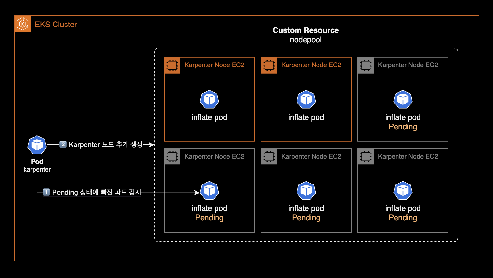



&nbsp;

## 개요


클러스터 운영자를 위한 Karpenter 운영 가이드입니다.

이 글은 DevOps Engineer 혹은 SRE를 대상으로 작성되었으며 Karpenter에 대한 운영 방법과 몇 가지 팁이 포함되어 있습니다.

&nbsp;

## 환경

- **Karpenter 버전** : [v0.35.4](https://github.com/aws/karpenter-provider-aws/releases/tag/v0.35.4)
- **설치 방식** : [Helm chart](https://github.com/aws/karpenter-provider-aws/tree/release-v0.35.4/charts/karpenter)

&nbsp;

## 설치 가이드

Karpenter 설치에는 크게 2가지 방법이 있습니다.

1. EKS Terraform Module에 포함된 Karpenter 서브모듈을 사용하는 방법
2. Helm chart로 설치하는 방법

Karpenter 공식문서의 [Getting Started](https://karpenter.sh/v0.35/getting-started/) 페이지에는 테라폼 모듈을 사용한 설치 방법은 언급되어 있지 않으며, 헬름 차트를 이용한 설치만 설명하고 있습니다.

&nbsp;

제가 2023년 9월에 작성한 [Karpenter v0.27 설치 가이드](/blog/k8s/karpenter)는 현재 Deprecated 된 게시글이므로 참고 정도만 해주세요.

&nbsp;

## 운영 가이드

&nbsp;

### 카펜터 노드 수동으로 늘리기

Karpenter 노드는 ASG<sup>Auto Scaling Group</sup>를 사용하지 않는 특성으로 인해 Cluster Autoscaler와 다르게 각 노드그룹의 최소(Min), 현재(Desired), 최대(Max) 인스턴스 개수를 지정할 수 없습니다. 이것이 Karpenter와 Cluster Autoscaler의 가장 큰 차이점입니다.

TBD

&nbsp;

---

&nbsp;

### Karpenter 커스텀 리소스 관리

Karpenter 팀은 Karpenter 커스텀 리소스용 헬름 차트를 공식적으로 제공하지 않으며 사용자가 직접 작성하여 사용하길 권장하고 있습니다. 저 역시 Karpenter를 도입하기 전에 관련 차트를 찾아보았지만, 많은 옵션이 없어 결국 직접 차트를 만들게 되었습니다.

Kubernetes에서는 직접적으로 YAML을 사용하여 클러스터의 리소스를 설치하고 관리하는 것을 권장하지 않는 전형적인 안티 패턴으로 여겨집니다. 따라서, YAML 파일을 직접 작성하는 대신, 저는 [karpenter-nodepool](https://github.com/younsl/charts/tree/main/charts/karpenter-nodepool) 헬름 차트를 사용해 GitOps 방식으로 설치 및 관리하는 방식을 추천합니다.



이는 제가 직접 개발한 차트로, Karpenter Node 프로비저닝에 필요한 nodepool과 ec2nodeclass 리소스를 포함하고 있습니다.

&nbsp;

---

&nbsp;

### 노드 중단 예외처리

[Node-Level Controls](https://karpenter.sh/v0.35/concepts/disruption/#node-level-controls)

특정 카펜터 노드에 `karpenter.sh/do-not-disrupt: "true"` 주석을 설정하여 Karpenter가 특정 노드를 자발적으로 중단하지 못하도록 차단할 수 있습니다. 예외처리 Annotation이 붙은 노드는 Karpenter Controller가 수행하는 [중단<sup>Disruption</sup>](https://karpenter.sh/docs/concepts/disruption/) 작업에서 제외되므로 어떠한 경우에도 내려가지 않습니다.

&nbsp;

특정 카펜터 노드를 중단(Disruption)으로부터 예외처리 적용 또는 해제 방법은 다음과 같습니다.

먼저 예외처리할 노드를 식별합니다.

```bash
# Karpenter가 EC2 생성할 때 만드는 nodeclam 리소스 조회
kubectl get nodeclaim -o wide
```

```bash
NAME            TYPE         ZONE              NODE                                                READY   AGE     CAPACITY    NODEPOOL   NODECLASS
default-mfnll   m6i.xlarge   ap-northeast-2a   ip-10-xxx-xxx-x.ap-northeast-2.compute.internal     True    4h55m   on-demand   default    default
default-mlhqr   m6i.xlarge   ap-northeast-2c   ip-10-xxx-xxx-xxx.ap-northeast-2.compute.internal   True    4h57m   on-demand   default    default
default-x2wcj   m6i.xlarge   ap-northeast-2a   ip-10-xxx-xxx-xxx.ap-northeast-2.compute.internal   True    5h3m    on-demand   default    default
```

&nbsp;

nodeclaim을 확인했으니 실제 `node` 리소스를 조회합니다.

```bash
# 전체 워커노드 조회
kubectl get node -o wide
```

&nbsp;

예외처리용 Annotation을 해당 노드에 추가합니다.

Annotation 추가시 `kubectl annotate node <NODE_NAME>` 또는 `kubectl edit node <NODE_NAME>` 명령어 중 편한 방법을 사용하면 됩니다.

```bash
# Disruption 대상에서 제외
kubectl annotate node ip-10-xxx-xxx-xxx.ap-northeast-2.compute.internal karpenter.sh/do-not-disrupt="true"

# Disruption 대상에 포함
kubectl annotate node ip-10-xxx-xxx-xxx.ap-northeast-2.compute.internal karpenter.sh/do-not-disrupt-

```

&nbsp;

`kubectl get node <NODE_NAME> -o yaml` 명령어로 Node 리소스의 설정을 확인해보면 `karpenter.sh/do-not-disrupt: "true"`가 새로 추가된 걸 확인할 수 있습니다.

```bash
apiVersion: v1
kind: Node
metadata:
  annotations:
    karpenter.sh/do-not-disrupt: "true"
```

&nbsp;

이후 해당 Karpenter 노드에 발생한 Event 정보를 확인합니다.

```bash
kubectl describe node <NODE_NAME>
```

&nbsp;

결과값 마지막에 위치한 Events 항목을 확인합니다.

```bash
...
Events:
  Type    Reason             Age                      From       Message
  ----    ------             ----                     ----       -------
  Normal  DisruptionBlocked  4m59s (x111 over 3h45m)  karpenter  Cannot disrupt Node: Disruption is blocked with the "karpenter.sh/do-not-disrupt" annotation
```

`"karpenter.sh/do-not-disrupt"` annotation에 의해 해당 노드는 중단 작업에서 제외된 걸 확인할 수 있습니다.

&nbsp;

## 참고자료

**EKS docs**  
[Karpenter Best Practices](https://aws.github.io/aws-eks-best-practices/karpenter/)

**Karpenter docs**  
[Karpenter v0.35 공식문서](https://karpenter.sh/v0.35/)
