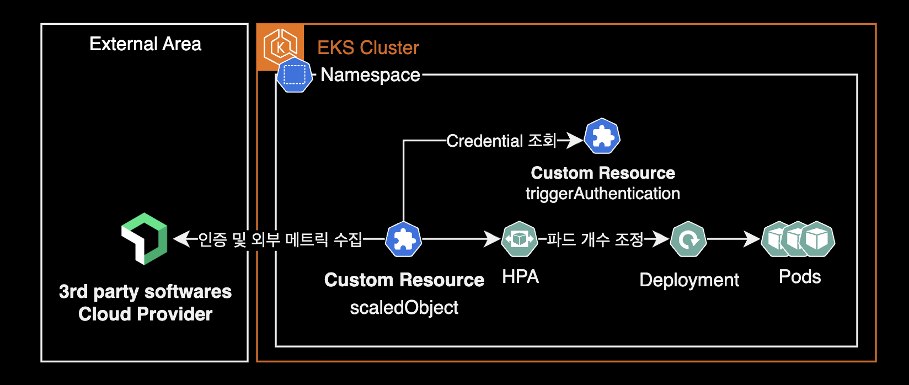
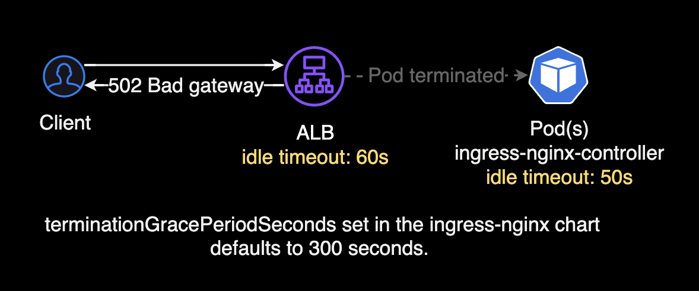
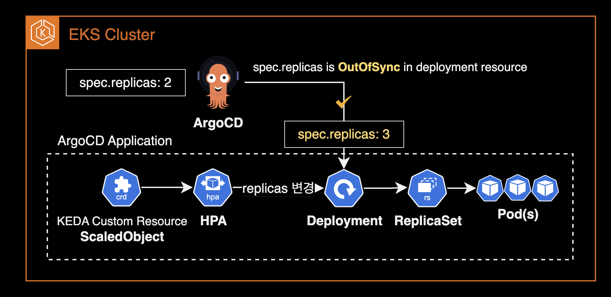
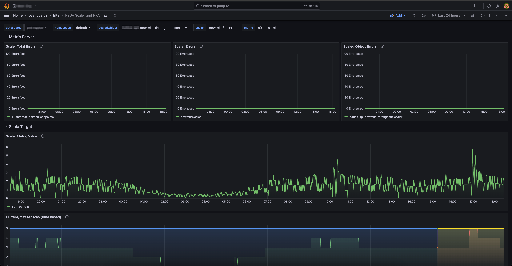



&nbsp;

## 개요

KEDA 설치 및 운영 가이드입니다.

쿠버네티스 클러스터를 운영하는 DevOps Engineer를 대상으로 작성된 문서입니다.

&nbsp;

## 배경지식

### KEDA


[KEDA](https://keda.sh)는 Kubernetes Event-driven Autoscaling의 줄임말로, Kubernetes에서 애플리케이션의 이벤트 기반 자동 스케일링을 가능하게 하는 확장 프레임워크입니다.

이는 클라우드 네이티브 애플리케이션이 리소스 사용량에 따라 탄력적으로 스케일 업과 스케일 다운을 할 수 있도록 지원합니다. KEDA는 다양한 이벤트 소스(예: 메시지 큐, 데이터베이스, 파일 시스템 등)로부터 발생하는 이벤트를 감지하고, 이에 기반하여 파드(Pod)의 수를 자동으로 조절합니다. 이를 통해 애플리케이션은 실시간 트래픽 변화에 더 민감하게 반응하면서도, 불필요한 리소스 사용을 최소화할 수 있습니다.


&nbsp;

Kubernetes는 컨테이너화된 애플리케이션의 배포, 스케일링 및 관리를 자동화하는 오픈 소스 시스템입니다. 기본적으로 Kubernetes는 CPU와 메모리 사용량 같은 메트릭스를 기반으로 한 자동 스케일링을 지원합니다. 그러나, 이러한 메트릭스만으로는 이벤트 기반의 애플리케이션 스케일링 요구사항을 충분히 해결하기 어려울 수 있습니다. KEDA는 이 문제를 해결하기 위해 등장했습니다. KEDA를 사용하면, 애플리케이션이 이벤트의 발생 빈도나 양에 따라 동적으로 스케일링할 수 있게 됩니다. 이는 특히 이벤트 기반 아키텍처를 사용하는 마이크로서비스 애플리케이션에 유용합니다.

&nbsp;

## 환경

- **EKS** v1.26 (amd64)
- **KEDA** v2.12.1 (App Version)

&nbsp;

## KEDA 설치

KEDA Operator를 helm 차트 방식으로 설치하는 일련의 과정을 소개합니다.

&nbsp;

### 버전 호환성 표

클러스터 버전에 호환되는 KEDA 버전을 맞춰야 합니다.
KEDA 공식문서의 [**Kubernetes Comptability**](https://keda.sh/docs/2.13/operate/cluster/#kubernetes-compatibility) 페이지를 참고해서 KEDA 버전별로 지원되는 k8s 버전을 확인하고, 설치할 클러스터와 버전 문제가 없는지를 미리 확인합니다.

| KEDA    | Kubernetes    |
|---------|---------------|
| `v2.14` | v1.27 - v1.29 |
| `v2.13` | v1.27 - v1.29 |
| `v2.12` | v1.26 - v1.28 |
| `v2.11` | v1.25 - v1.27 |
| `v2.10` | v1.24 - v1.26 |
| `v2.9`  | v1.23 - v1.25 |
| `v2.8`  | v1.17 - v1.25 |
| `v2.7`  | v1.17 - v1.25 |

&nbsp;

### 차트 다운로드

이 가이드에서는 `helm repo add` 명령어 방식이 아닌 로컬에 KEDA 헬름 차트를 다운로드 받은 후, `values.yaml` 설정을 수정한 후 설치하는 과정으로 진행합니다.

Github Cloud에 올라와 있는 [keda](https://github.com/kedacore/charts/tree/main/keda) 공식 헬름차트를 로컬에 다운로드 받습니다.

```bash
git clone https://github.com/kedacore/charts.git
cd charts/keda/
```

&nbsp;

### 차트 values 설정

`values.yaml`을 수정합니다.

&nbsp;

#### 파드 고가용성 구성

고가용성<sup>High Availability</sup>을 위해 `operator.replicaCount`를 기본값 `1`에서 `2`로 수정합니다. KEDA Operator 파드가 2개로 배포됩니다.

```diff
# values.yaml
...
operator:
  # -- Name of the KEDA operator
  name: keda-operator
  # -- ReplicaSets for this Deployment you want to retain (Default: 10)
- revisionHistoryLimit: 10
+ revisionHistoryLimit: 2
  # -- Capability to configure the number of replicas for KEDA operator.
  # While you can run more replicas of our operator, only one operator instance will be the leader and serving traffic.
  # You can run multiple replicas, but they will not improve the performance of KEDA, it could only reduce downtime during a failover.
  # Learn more in [our documentation](https://keda.sh/docs/latest/operate/cluster/#high-availability).
- replicaCount: 1
+ replicaCount: 2
...
```

&nbsp;

#### Prometheus를 위한 메트릭 수집용 포트 구성

metricServer 파드와 keda operator 파드 모두 prometheus에서 메트릭 수집해갈 수 있도록 `enabled: true`로 설정합니다.

```diff
# values.yaml
...
prometheus:
  metricServer:
    # -- Enable metric server Prometheus metrics expose
-   enabled: false
+   enabled: true
  ...
  operator:
-   enabled: false
+   enabled: true
```

추후에 Grafana 대시보드로 KEDA 모니터링 환경을 제공하려면 위 설정을 활성화해야 합니다.

&nbsp;

`prometheus.metricServer.enabled`와 `prometheus.operaotr.enabled` 설정을 활성화(`true`)한 상태로 KEDA를 배포하게 되면 아래와 같이 서비스 리소스의 `8080/TCP` 포트로 메트릭 수집용 포트가 추가로 뜨게 됩니다.

```bash
kubectl get service -n keda -o wide
```

```bash
NAME                              TYPE        CLUSTER-IP      EXTERNAL-IP   PORT(S)             AGE    SELECTOR
keda-admission-webhooks           ClusterIP   172.20.xx.xx    <none>        443/TCP             129d   app=keda-admission-webhooks
keda-operator                     ClusterIP   172.20.xxx.xx   <none>        9666/TCP,8080/TCP   129d   app=keda-operator
keda-operator-metrics-apiserver   ClusterIP   172.20.xx.xxx   <none>        443/TCP,8080/TCP    129d   app=keda-operator-metrics-apiserver
```

&nbsp;

### 헬름 차트 설치

KEDA 헬름 차트를 클러스터에 설치합니다.

```bash
helm upgrade \
  --install \
  --create-namespace \
  --namespace keda \
  keda . \
  --values values.yaml \
  --wait
```

&nbsp;

KEDA 차트에 포함된 리소스 배포 상태를 확인합니다.

```bash
kubectl get all -n keda
```

```bash
NAME                                                  READY   STATUS    RESTARTS   AGE
pod/keda-admission-webhooks-55ddc5c576-6frpg          1/1     Running   0          31d
pod/keda-operator-6997d9df7b-9xkjv                    1/1     Running   0          8d
pod/keda-operator-6997d9df7b-sfjmz                    1/1     Running   0          3d8h
pod/keda-operator-metrics-apiserver-bd4dd4d6d-kmsmt   1/1     Running   0          7d11h

NAME                                      TYPE        CLUSTER-IP      EXTERNAL-IP   PORT(S)             AGE
service/keda-admission-webhooks           ClusterIP   172.20.66.26    <none>        443/TCP             129d
service/keda-operator                     ClusterIP   172.20.179.75   <none>        9666/TCP,8080/TCP   129d
service/keda-operator-metrics-apiserver   ClusterIP   172.20.47.148   <none>        443/TCP,8080/TCP    129d

NAME                                              READY   UP-TO-DATE   AVAILABLE   AGE
deployment.apps/keda-admission-webhooks           1/1     1            1           129d
deployment.apps/keda-operator                     2/2     2            2           129d
deployment.apps/keda-operator-metrics-apiserver   1/1     1            1           129d

NAME                                                         DESIRED   CURRENT   READY   AGE
replicaset.apps/keda-admission-webhooks-55ddc5c576           1         1         1       31d
replicaset.apps/keda-admission-webhooks-59978445df           0         0         0       129d
replicaset.apps/keda-operator-56d494855d                     0         0         0       31d
replicaset.apps/keda-operator-6857fbc758                     0         0         0       129d
replicaset.apps/keda-operator-6997d9df7b                     2         2         2       9d
replicaset.apps/keda-operator-metrics-apiserver-6b4fff47cb   0         0         0       31d
replicaset.apps/keda-operator-metrics-apiserver-765945cb4f   0         0         0       129d
replicaset.apps/keda-operator-metrics-apiserver-bd4dd4d6d    1         1         1       9d
```

&nbsp;

### KEDA 커스텀 리소스 확인

KEDA에서 사용하는 커스텀 리소스를 확인합니다.

```bash
kubectl api-resources --api-group keda.sh
```

```bash
NAME                            SHORTNAMES               APIVERSION         NAMESPACED   KIND
clustertriggerauthentications   cta,clustertriggerauth   keda.sh/v1alpha1   false        ClusterTriggerAuthentication
scaledjobs                      sj                       keda.sh/v1alpha1   true         ScaledJob
scaledobjects                   so                       keda.sh/v1alpha1   true         ScaledObject
triggerauthentications          ta,triggerauth           keda.sh/v1alpha1   true         TriggerAuthentication
```

KEDA(Kubernetes Event-Driven Autoscaling)는 Kubernetes에서 이벤트 기반의 자동 스케일링을 가능하게 하는 프로젝트로, 다양한 이벤트 소스에 반응하여 워크로드의 스케일을 동적으로 조정합니다. KEDA는 커스텀 리소스 정의<sup>Custom Resource Definitions, CRDs</sup>를 사용하여 Kubernetes 클러스터 내에서 이러한 기능을 구현합니다. 여기서 언급한 두 가지 주요 커스텀 리소스는 다음과 같습니다.

&nbsp;

#### ScaledObject

ScaledObject는 KEDA가 이벤트 소스로부터 워크로드(주로 Kubernetes Deployments, Jobs)의 스케일을 어떻게 조정할지 정의하는 커스텀 리소스입니다. 이를 통해 워크로드가 이벤트의 발생 빈도에 따라 자동으로 스케일 업/다운 할 수 있습니다.

ScaledObject를 사용하여, 예를 들어, Kafka 토픽에 메시지가 쌓일 때마다 관련된 처리를 담당하는 Deployment의 파드 인스턴스 수를 늘릴 수 있습니다. 메시지 큐가 비워지면, 스케일이 다운되어 자원을 절약할 수 있습니다.

ScaledObject에는 이벤트 소스, 대상 리소스(스케일 대상), 스케일링 정책(최소/최대 스케일, 트리거 세부 정보 등) 등을 지정할 수 있는 필드가 포함되어 있습니다.

&nbsp;

#### TriggerAuthentication

TriggerAuthentication은 KEDA가 이벤트 소스에 안전하게 연결하기 위해 필요한 인증 정보를 정의하는 커스텀 리소스입니다. 이는 특정 스케일링 작업에 필요한 인증 메커니즘(예: API 키, 토큰, 시크릿 등)을 안전하게 저장하고 관리하는 방법을 제공합니다.

예를 들어, Azure Service Bus나 AWS SQS와 같은 클라우드 서비스를 이벤트 소스로 사용하는 경우, 이 서비스들에 접근하기 위해 필요한 인증 정보를 TriggerAuthentication 리소스에 저장할 수 있습니다. 이렇게 하면, 해당 인증 정보를 사용하여 KEDA가 해당 이벤트 소스를 모니터링하고 워크로드의 스케일을 조정할 수 있습니다.



TriggerAuthentication 리소스는 Kubernetes Secret, Hashicorp Vault, AWS Secrets Manager를 포함해 다양한 인증 방법을 지원하며, 이에 필요한 인증 정보(시크릿 참조, 토큰, API 키 등)를 안전하게 저장합니다.

&nbsp;

이 두 커스텀 리소스를 통해 KEDA는 Kubernetes에서의 이벤트 기반 스케일링을 매우 유연하고 효과적으로 구현할 수 있습니다.

&nbsp;

## 어플리케이션 차트에 KEDA 추가

KEDA 차트를 설치했으면 어플리케이션에 파드 오토 스케일링 적용이 준비 완료된 것입니다.

&nbsp;

### scaledObject 리소스 템플릿 추가

기존 어플리케이션 차트에 `keda` 디렉토리를 만들고, 아래 2개의 KEDA 관련 커스텀 리소스에 대한 템플릿 파일 2개를 추가합니다.

- `scaledobject.yaml` : scaledObject 리소스에 의해 HPA가 구현됩니다.
- `triggerauthentication.yaml` : Newrelic이나 Datadog 등 서드파티와 연동할 때 Account ID, API Key, Region 등의 정보를 AWS Secrets Manager나 Vault로부터 참조하는 인증 관련 리소스입니다.

`scaledobject.yaml`과 `triggerauthentication.yaml`이 추가된 어플리케이션 차트의 디렉토리 구조는 다음과 같습니다.

```diff
  example-app
  ├── Chart.yaml
  ├── templates
  │   ├── NOTES.txt
  │   ├── _helpers.tpl
  │   ├── configmap.yaml
  │   ├── deployment.yaml
+ │   ├── keda
+ │   │   ├── scaledobject.yaml
+ │   │   └── triggerauthentication.yaml
  │   └── service.yaml
  ├── values_dev.yaml
  ├── values_prod.yaml
  └── values_qa.yaml
```

&nbsp;

`scaledobject.yaml` 파일은 scaledObject 리소스를 생성하는 헬름 템플릿 파일입니다.

```go
{{- if .Values.keda.enabled -}}
{{- range .Values.keda.scaledObject }}
---
apiVersion: keda.sh/v1alpha1
kind: ScaledObject
metadata:
  {{- if .fullnameOverride }}
  name: {{ .fullnameOverride }}
  {{- else }}
  name: {{ include "example-app.fullname" $ }}-{{ .name }}
  {{- end }}
  labels:
    {{- include "example-app.labels" $ | nindent 4 }}
  {{- with .annotations }}
  annotations:
    {{- toYaml . | nindent 4 }}
  {{- end }}
spec:
  {{- with .scaleTargetRef }}
  scaleTargetRef:
    apiVersion: {{ .apiVersion | default "apps/v1" }}
    kind: {{ .kind | default "Deployment" }}
    name: {{ .name }}
  {{- end }}
  pollingInterval:  {{ .pollingInterval | default 30 }}
  cooldownPeriod:   {{ .cooldownPeriod | default 300 }}
  idleReplicaCount: {{ .idleReplicaCount }}
  minReplicaCount:  {{ .minReplicaCount }}
  maxReplicaCount:  {{ .maxReplicaCount }}
  {{- if .fallback }}
  {{- with .fallback }}
  fallback:
    {{- toYaml . | nindent 4 }}
  {{- end }}
  {{- end }}
  {{- if .advanced }}
  {{- with .advanced }}
  advanced:
    {{- toYaml . | nindent 4 }}
  {{- end }}
  {{- end }}
  {{- with .triggers }}
  triggers:
    {{- toYaml . | nindent 4 }}
  {{- end }}
{{- end }}
{{- end }}
```

위 `scaledObject.yaml` 템플릿은 제가 직접 커스텀한 것이며, [delivery-hero의 샘플 scaledObject 템플릿](https://github.com/deliveryhero/helm-charts/blob/master/stable/k8s-resources/templates/scaledObject.yaml)을 참조하여 만들었습니다.

&nbsp;

`triggerauthentication` 리소스를 생성하는 `triggerauthentication.yaml` 템플릿 파일입니다.

```go
{{- if .Values.keda.enabled -}}
{{- with .Values.keda.triggerauthentication }}
apiVersion: keda.sh/v1alpha1
kind: TriggerAuthentication
metadata:
  name: {{ .name }}
  labels:
    {{- include "example-app.labels" $ | nindent 4 }}
spec:
  {{- if .secretTargetRef }}
  secretTargetRef:
    {{- toYaml .secretTargetRef | nindent 4 }}
  {{- end }}
{{- end }}
{{- end }}
```

&nbsp;

어플리케이션 헬름 차트를 설치할 때, `values.yaml`에 선언되어 KEDA 설정 값들이 `scaledobject.yaml` 파일쪽으로 넘어가며 scaledObject 커스텀 리소스를 생성하게 됩니다.

아래는 `values_dev.yaml`의 KEDA 관련 설정값들입니다.

```yaml
# values_dev.yaml
nameOverride: example-app
fullnameOverride: example-app
...
keda:
  enabled: true
  scaledObject:
    - name: newrelic-throughput-scaler
      annotations: {}
      scaleTargetRef:                           # [1]
        name: example-app
      pollingInterval: 120                      # [2]
      cooldownPeriod: 300                       # [3]
      idleReplicaCount: 0                       # [4]
      minReplicaCount: 1                        # [5]
      maxReplicaCount: 5                        # [6]
      fallback:
        failureThreshold: 2                     # [7]
        replicas: 3                             # [8]
      triggers:
        - type: new-relic
          metadata:
            noDataError: 'true'                 # [9]
            nrql: >-                            # [10]
              SELECT rate(count(*), 10 SECOND)
              FROM Transaction
              WHERE appName='dev-example-app'
              SINCE 1 MINUTE AGO
            threshold: '70'                     # [11]
          authenticationRef:                    # [12]
            name: example-app-ta
      advanced:
        restoreToOriginalReplicaCount: true     # [13]
  triggerauthentication:
    name: example-app-ta
    secretTargetRef:
      - key: apiKey
        name: keda-new-relic-secret
        parameter: queryKey
      - key: account
        name: keda-new-relic-secret
        parameter: account
      - key: region
        name: keda-new-relic-secret
        parameter: region
```

위 `values.yaml`의 KEDA 설정은 Newrelic이라고 하는 서드파티 모니터링 솔루션의 트랜잭션 수 메트릭을 가져와 그 값을 계산하여 파드 오토스케일링을 적용한 예시 설정입니다.

1. `scaleTargetRef`: `.spec.scaleTargetRef` 섹션은 autoscaling 대상 리소스에 대한 참조를 보유합니다. `deployment`, `statefulset` 그 외에 custom resource들이 있습니다.
2. `pollingInterval`: KEDA가 메트릭을 확인하는 주기(초)를 설정합니다.
3. `cooldownPeriod`: 마지막 스케일 후 다음 스케일링 전까지 대기해야 하는 시간(초)입니다.
4. `idleReplicaCount`: 유휴 상태에서 유지할 복제본 수입니다.
5. `minReplicaCount`: 최소로 유지할 복제본 수를 지정합니다.
6. `maxReplicaCount`: 최대 복제본 수를 설정합니다.
7. `failureThreshold`: 스케일링이 실패로 간주되기 전까지 허용되는 실패 횟수입니다.
8. `replicas`: 스케일링 실패 시 설정할 복제본 수입니다.
9. `noDataError`: 데이터가 없을 경우 이를 오류로 처리할지 여부를 지정합니다.
10. `nrql`: New Relic에서 사용할 쿼리<sup>NRQL</sup>입니다.
11. `threshold`: 스케일링을 트리거하는 임계값입니다.
12. `authenticationRef`: 외부 인증 리소스인 `triggerAuthentication`을 참조하는 설정입니다. authenticationRef는 지정된 트리거(new-relic 트리거)가 외부 시스템(New Relic)과의 상호작용에 필요한 인증 정보를 가져올 수 있도록 합니다.
13. `restoreToOriginalReplicaCount`: KEDA에 의해 컨트롤되는 스케일링이 종료될 경우, 원래의 복제본 수인 `spec.replicas`로 복원할지 여부를 설정합니다.

`keda.scaledObject.triggers` 값에는 여러 개의 트리거를 넣을 수가 있는데 위 설정의 경우 Newrelic 스케일러만 적용한 상태입니다. KEDA는 다양한 서드파티 모니터링 솔루션 및 클라우드 서비스들과의 연동을 지원합니다. 이러한 트리거를 KEDA에서는 스케일러라고 부르며, 전체 스케일러 목록은 [KEDA 공식문서](https://keda.sh/docs/2.13/scalers/)에서 확인할 수 있습니다.

&nbsp;

#### Threshold 계산식

HPA 스케일링은 다음 방정식을 따릅니다.

```bash
desiredReplicas = ceil[currentReplicas * ( currentMetricValue / desiredMetricValue )]
```

이때, KEDA에 설정된 `threshold`는 HPA에서 `targetAverageValue` 또는 `targetAverageUtilization`로 간주되는 임계값입니다.

이 임계값을 기준으로 현재 메트릭 값과 비교해 필요한 Pod 수를 조정합니다. 만약 `targetAverageValue`나 `targetAverageUtilization`이 설정되어 있으면, `currentMetricValue`는 HPA에서 확장 대상이 되는 모든 Pod에서 메트릭 값의 평균을 계산하여 구합니다.

예를 들어, 현재 Pod의 수가 3개이고 NRQL 쿼리를 통해 반환된 메트릭 값이 90이며, 각 Pod당 목표 메트릭 값이 30인 상황에서, 계산식은 다음과 같습니다:

```bash
desiredReplicas = ceil(3 * (90 / 30))
                = ceil(3 * 3)
                = ceil(9)
                = 9
```

따라서 Pod는 9개로 확장됩니다.

반대로, 현재 Pod 수가 6개이고 NRQL 쿼리로 반환된 메트릭 값이 20인 경우, 계산식은 다음과 같이 됩니다:

```bash
desiredReplicas = ceil(6 * (20 / 30))
                = ceil(6 * 0.67)
                = ceil(4.02)
                = 5
```

결과적으로 Pod 수는 6개에서 5개로 축소됩니다.

자세한 사항은 [HPA Algorithm detail](https://kubernetes.io/docs/tasks/run-application/horizontal-pod-autoscale/#algorithm-details) 문서와 [#3035](https://github.com/kedacore/keda/discussions/3035)를 참고합니다.

&nbsp;

만약 `keda.enabled: false`로 설정하게 되면 scaledObject와 HPA가 생성되지 않고 deployment만 운영하는 형태로 어플리케이션이 배포될 것입니다.

```yaml
# values_dev.yaml
nameOverride: example-app
fullnameOverride: example-app
...
keda:
  enabled: false
```

&nbsp;

어플리케이션 헬름 차트가 배포되면 scaledObject와 horizontalPodAutoscaler도 같이 생성됩니다. KEDA는 scaledObject 리소스의 설정을 기반으로 HPA 리소스를 생성(구현)합니다.

```bash
kubectl get scaledobject,hpa -n default
```

```bash
NAME                                                          SCALETARGETKIND      SCALETARGETNAME   MIN   MAX   TRIGGERS    AUTHENTICATION   READY   ACTIVE   FALLBACK   PAUSED    AGE
scaledobject.keda.sh/example-app-newrelic-throughput-scaler   apps/v1.Deployment   example-app       1     5     new-relic   example-app-ta   True    True     False      Unknown   50d

NAME                                                                                  REFERENCE                TARGETS          MINPODS   MAXPODS   REPLICAS   AGE
horizontalpodautoscaler.autoscaling/keda-hpa-example-app-newrelic-throughput-scaler   Deployment/example-app   1666m/50 (avg)   1         5         1          31d
```

- scaledObject가 생성되면 `pollingInterval`이 지난 후 스케일링이 시작됩니다. 예를 들어 `pollingInterval: 120`인 경우, scaledObject가 생성된 시점으로부터 120초가 지난 이후 메트릭을 읽어들이고, 파드 스케일 인/아웃이 결정됩니다.
- scaledObject가 어플리케이션과 배포되면 KEDA Operator가 HPA를 생성(구현)됩니다. scaledObject 리소스의 `Ready`와 `Active` 상태가 모두 `True`로 전환되면 정상적으로 KEDA와 연동된 것입니다.
- KEDA의 `cooldownPeriod`는 파드 개수를 n에서 0으로 축소할 때만 적용됩니다. 즉, `cooldownPeriod`는 `idleReplicaCount: 0`과 반드시 조합해서 사용해야만 동작합니다. 파드 개수를 n to 1, 1 to n으로 조정하는 경우는 HPA가 핸들링합니다.

&nbsp;

scaledObject는 지정된 스케일러를 통해 메트릭을 주기적으로 수집하며 기준에 맞게 HorizontalPodAutoscaler의 Replicas 개수를 제어하게 됩니다.


&nbsp;

### 우아한 종료(Graceful Shutdown) 처리

KEDA와 HPA를 Deployment에 붙이게 되면 파드의 개수 변경에 의해 특정 파드 종료가 발생할 수 있습니다. 파드 오토스케일링 상황에서 파드의 확장<sup>Scale out</sup>은 대부분 큰 문제가 없지만, 축소<sup>Scale in</sup>될 때에는 클라이언트의 Connection 소실이 발생할 가능성이 있습니다.

이 문제를 해결하려면 어플리케이션의 안전한 커넥션 핸들링 코드 포함도 필요합니다만 쿠버네티스(인프라) 영역에서 파드가 종료될 때 커넥션을 완전하게 처리하기 위한 우아한 종료(Graceful Shutdown) 처리를 적용할 수 있습니다.

쿠버네티스 네이티브한 설정을 사용할 경우 크게 파드의 2가지 `spec` 설정을 사용해서 안정적으로 파드를 종료할 수 있습니다.

- tGPS<sup>terminationGracePeriodSeconds</sup>
- preStop

&nbsp;

#### 우아한 종료 관련 설정

##### preStop 훅

HPA에 의해 파드 축소가 발생할 경우, 애플리케이션이 일찍 종료되지 않도록 커맨드 부분에 애플리케이션에서 가장 길게 실행되는 프로세스의 완료가 보장되는 최대 시간보다 길게 유휴시간을 갖도록 설정합니다.

아래 `preStop` 설정의 경우 파드가 종료될 때 preStop 훅에 의해 50초 동안 대기하게 됩니다.

```yaml
---
apiVersion: v1
kind: Pod
metadata:
  name: example-pod-on-graceful-shutdown
spec:
  containers:
  - name: api-container
    lifecycle:
      preStop:
        exec:
          command:
            - sleep
            - "50"
```

자세한 사항은 쿠버네티스 공식문서의 [preStop 작성방법](https://kubernetes.io/docs/tasks/configure-pod-container/attach-handler-lifecycle-event/#define-poststart-and-prestop-handlers)을 참고합니다.

&nbsp;

##### tGPS

`spec.terminationGracePeriodSeconds` 값

만약 애플리케이션에서 설정한 Graceful Shutdown 시간 또는 preStop 훅에서 설정한 유휴시간이 30초 이상일 경우, `spec.terminationGracePeriodSeconds` 설정의 기본값 `30`초로 인해 preStop이 끝나기 전에 먼저 `30`초 만에 SIGKILL 신호로 즉시 종료됩니다.

```yaml
---
apiVersion: v1
kind: Pod
metadata:
  name: example-pod-on-graceful-shutdown
spec:
  terminationGracePeriodSeconds: 55
```

`preStop`에서 50초의 유휴기간을 설정했다면, preStop 이후 애플리케이션이 SIGTERM 신호로 애플리케이션이 종료되는 시간까지 고려해서 `spec.terminationGracePeriodSeconds`을 세팅해야 파드가 안전하게 종료됩니다.

&nbsp;

예를 들어, 애플리케이션이 완전히 종료되는데 걸리는 시간이 5초라면 `preStop`에서 유휴기간을 50초로 설정, `spec.terminationGracePeriodSeconds` 옵션을 50초보다 긴 55초로 설정하는 등의 전략을 사용할 수 있습니다. 여러 가지 값들을 설정해 보고 파드를 종료하는 테스트를 통해 최적화하는 것이 좋습니다.


```bash
terminationGracePeriodSeconds > preStop 실행 시간 + 어플리케이션 종료 시간
```

&nbsp;

##### (Optional) ALB Idle timeout

AWS ALB는 idle timeout 시간이 기본적으로 60초로 설정됩니다. 그러므로 EKS 클러스터 앞단의 로드밸런서로 ALB<sup>Application Load Balancer</sup>를 사용한다면 tGPS<sup>terminationGracePeriodSeconds</sup>을 `60`초 이상으로 설정해야 502 Bad Gateway 에러를 피할 수 있습니다.


[ELB 공식문서](https://docs.aws.amazon.com/ko_kr/elasticloadbalancing/latest/application/application-load-balancers.html#connection-idle-timeout)에서도 애플리케이션의 유휴 제한 시간을 로드 밸런서에 구성된 유휴 제한 시간보다 크게 설정하는 것이 좋다고 가이드하고 있습니다.

```bash
terminationGracePeriodSeconds > ALB Idle timeout
```

외부 트래픽 인입이 없는 In-cluster 서비스는 클러스터 내에서만 트래픽을 처리하므로, ALB와 같은 외부 로드 밸런서는 관여하지 않습니다.

즉 In-cluster 서비스는 tGPS<sup>terminationGracePeriodSeconds</sup>가 서비스 간 통신에 영향을 주는 유일한 타임아웃 관련 요소이며, 외부 트래픽과 관련된 ALB idle timeout과 같은 설정은 고려할 필요가 없습니다.

&nbsp;

### ArgoCD

#### 파드 개수 변경에 의한 OutOfSync 발생시 해결방법

**문제점**  
KEDA(+ HPA)를 deployment에 붙이게 되면 파드 오토스케일링이 되어 파드 개수가 유동적으로 조절됩니다. 해당 Deployment가 ArgoCD에 의해 배포된 경우, ArgoCD는 deployment의 상태값이 일치하지 않은 걸로 인지하게 되어 해당 Application의 현재 Sync 상태<sup>Current Sync Status</sup>를 Synced가 아닌 OutOfSync로 표시합니다.



이는 실제 Application의 문제를 일으키지는 않지만 클러스터 관리자나 ArgoCD 사용자가 볼 때 문제가 생긴 거라고 잘못 판단할 수 있는 오해의 소지가 있기 때문에 이를 예외처리하여 정상 상태로 표시시킬 필요가 있습니다.

&nbsp;

**해결방법**  
ArgoCD로 배포된 어플리케이션에서 deployment 리소스의 `/spec/replicas` 값의 비교를 하지 않도록 무시 처리해야만 합니다.

&nbsp;

**코드 예제**  
ArgoCD Application 스펙에 아래와 같이 `ignoreDiffernces`를 추가합니다.  
아래 예제 애플리케이션은 `example-app` 어플리케이션에 포함된 모든 Deployment 리소스에 대해 `spec.replicas` 값의 차이점을 무시하도록 설정합니다.

```diff
# argocd application CRD
apiVersion: argoproj.io/v1alpha1
kind: Application
metadata:
  name: example-app
  ...
spec:
  ...
+ ignoreDifferences:
+ - group: apps
+   kind: Deployment
+   jsonPointers:
+     - /spec/replicas
```

자세한 해결방법은 ArgoCD 공식문서의 [Diffing Customization](https://argo-cd.readthedocs.io/en/release-1.8/user-guide/diffing/#application-level-configuration) 페이지를 참고합니다.

&nbsp;

## KEDA 운영 가이드

### stabilizationWindowSeconds

`stabilizationWindowSeconds`는 KEDA(Kubernetes Event-driven Autoscaling)에서 사용되는 설정 항목으로, HPA(Horizontal Pod Autoscaler)의 동작을 조정하는 데 중요한 역할을 합니다.

`stabilizationWindowSeconds`는 스케일 다운 동작이 너무 빈번하게 일어나는 것을 방지하기 위해 사용됩니다. 이 값은 HPA가 현재의 파드 수<sup>replicas</sup>를 줄이기 전에 기다리는 시간을 초(second) 단위로 지정합니다.

```yaml
keda:
  enabled: true
  scaledObject:
    - name: newrelic-throughput-scaler
      # ... truncated ...
      advanced:
        restoreToOriginalReplicaCount: true
        horizontalPodAutoscalerConfig:
          behavior:
            scaleDown:
              stabilizationWindowSeconds: 600
```

위 설정처럼 `stabilizationWindowSeconds`가 `600`초로 설정되어 있으면, KEDA는 마지막 스케일 다운이 발생한 이후 600초 동안 새로운 메트릭 데이터를 수집하면서 스케일 다운이 필요한지 여부를 평가합니다. 이 평가 기간 동안 메트릭이 변동하더라도, 600초가 지나기 전에는 스케일 다운이 발생하지 않습니다.

즉, 설정된 시간 동안(이 경우 600초) 안정적으로 메트릭을 관찰한 후에만 스케일 다운이 실행되며, 이를 통해 불필요한 스케일 다운으로 인한 서비스 불안정성을 줄일 수 있습니다.

&nbsp;

`scaledObject`에 선언한 `stabilizationWindowSeconds` 설정은 HPA 리소스에 아래와 같이 적용됩니다.

```yaml
apiVersion: autoscaling/v2
kind: HorizontalPodAutoscaler
# ... truncated ...
spec:
  behavior:
    scaleDown:
      policies:
      - periodSeconds: 15
        type: Percent
        value: 100
      selectPolicy: Max
      stabilizationWindowSeconds: 600
```

위 HPA의 `scaleDown` 설정은 15초마다<sup>periodSeconds</sup> 파드 스케일 다운 여부를 평가하며, 한 번에 최대 100%까지 줄일 수 있습니다. 다만, 600초 동안<sup>stabilizationWindowSeconds</sup> 메트릭 변화를 안정적으로 관찰한 후에만 스케일 다운이 실행됩니다.

&nbsp;

### 모니터링

사전에 미리 만들어진 [Grafana 대시보드](https://github.com/kedacore/keda/blob/main/config/grafana/keda-dashboard.json)를 사용하여 KEDA 측정항목 어댑터에서 노출된 메트릭 정보를 시각화할 수 있습니다.



대시보드에는 두 개의 섹션이 있습니다.

- KEDA의 메트릭 서버 시각화
- KEDA가 스케일링한 복제본의 스케일 대상 및 변경 사항 시각화

&nbsp;



Changes in replicas 패널에서는 파드 개수 유지, 스케일 인/아웃이 발생한 타이밍들을 모아 색깔별로 표시해 보여줍니다.

**연두색**이 파드 개수 유지된 시간, 스케일 아웃이 **붉은색**, 스케일 인이 발생한 시간대는 **핑크색**으로 표시됩니다.

&nbsp;

### ArgoCD 등록시 OutOfSync 문제 해결

KEDA v2.12.x 버전 차트를 argocd의 application으로 등록하게 되면 OutOfSync 표시가 되는 버그가 있습니다.


```bash
$ kubectl get application keda -n argocd -o wide
NAME   SYNC STATUS   HEALTH STATUS   REVISION
keda   OutOfSync     Healthy         fbe3c161f63b4ba10ae852064e4713a8cdbb75fe
```

이 문제는 결과적으로 KEDA의 특정 버전에서만 발생하는 버그입니다. [KEDA 메인테이너의 답변](https://github.com/kedacore/keda/issues/4732#issuecomment-1908775894)에 의하면 KEDA v2.13 버전 이상부터 해결되었습니다.

&nbsp;

제 경우 KEDA 버전을 `v2.12.x`에서 `v2.14.x`로 업그레이드한 이후 APIService 리소스 상태가 `Synced`로 바뀌면서 증상이 해결되었습니다.

```bash
kubectl get application keda -n argocd -o yaml
```

```yaml
  ...
  resources:
  - group: apiregistration.k8s.io
    health:
      message: 'Passed: all checks passed'
      status: Healthy
    kind: APIService
    name: v1beta1.external.metrics.k8s.io
    status: Synced
    version: v1
  ...
  summary:
    images:
    - ghcr.io/kedacore/keda-admission-webhooks:2.14.0
    - ghcr.io/kedacore/keda-metrics-apiserver:2.14.0
    - ghcr.io/kedacore/keda:2.14.0
```

&nbsp;

만약 쿠버네티스 클러스터와 KEDA 간의 버전 호환성 제약사항 때문에 KEDA를 업그레이드 하지 못하는 경우, 대안으로 ArgoCD Application 레벨에서 예외처리하는 방법이 있습니다.

ArgoCD Application 스펙에 아래와 같이 `APIService`에 대한 변경사항을 무시하도록 예외처리 설정 `ignoreDifferences`를 추가합니다.

```yaml
apiVersion: argoproj.io/v1alpha1
kind: Application
...
spec:
  # Relates to https://github.com/kedacore/keda/issues/4732
  ignoreDifferences:
    - group: apiregistration.k8s.io
      kind: APIService
      name: v1beta1.external.metrics.k8s.io
      jsonPointers:
        - /spec/insecureSkipTLSVerify
```

위 설정에 의해 ArgoCD는 `v1beta1.external.metrics.k8s.io` 리소스의 `/spec/insecureSkipTLSVerify` 값 차이점을 항상 무시합니다.

자세한 사항은 ArgoCD 공식문서 [Diffing Customization](https://argo-cd.readthedocs.io/en/stable/user-guide/diffing/#application-level-configuration) 페이지를 참고합니다.

&nbsp;

요약하면 KEDA의 APIService 리소스에서 발생하는 `OutOfSync` 표시 문제를 해결하는 방법은 크게 2가지입니다.

1. **KEDA v2.13 이상으로 버전 업그레이드해서 해결하기** (권장)
2. **ArgoCD에서 설정 차이를 무시하도록 설정하기** : 자세한 해결방법은 [#4732](https://github.com/kedacore/keda/issues/4732#issuecomment-2082067738)를 참고합니다.

&nbsp;

## 참고자료

**KEDA**  
[KEDA 홈페이지](https://keda.sh/)  
[KEDA scaledOjbect spec](https://keda.sh/docs/2.13/concepts/scaling-deployments/)  
[KEDA charts](https://github.com/kedacore/charts)

**Graceful Shutdown**  
[Kubernetes Graceful Shutdown](https://www.allssu.com/blog/kubernetes-graceful-shutdown/)
