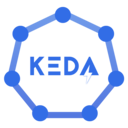
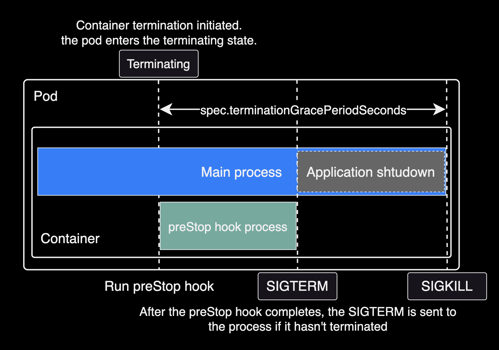



&nbsp;

## 개요

KEDA 설치 및 운영 가이드입니다.

쿠버네티스 클러스터를 운영하는 DevOps Engineer를 대상으로 작성된 문서입니다.

&nbsp;

## 배경지식

### KEDA



[KEDA](https://keda.sh)는 Kubernetes Event-driven Autoscaling의 줄임말로, Kubernetes에서 애플리케이션의 이벤트 기반 자동 스케일링을 가능하게 하는 확장 프레임워크입니다.

이는 클라우드 네이티브 애플리케이션이 리소스 사용량에 따라 탄력적으로 스케일 업과 스케일 다운을 할 수 있도록 지원합니다. KEDA는 다양한 이벤트 소스(예: 메시지 큐, 데이터베이스, 파일 시스템 등)로부터 발생하는 이벤트를 감지하고, 이에 기반하여 파드(Pod)의 수를 자동으로 조절합니다. 이를 통해 애플리케이션은 실시간 트래픽 변화에 더 민감하게 반응하면서도, 불필요한 리소스 사용을 최소화할 수 있습니다.


&nbsp;

Kubernetes는 컨테이너화된 애플리케이션의 배포, 스케일링 및 관리를 자동화하는 오픈 소스 시스템입니다. 기본적으로 Kubernetes는 CPU와 메모리 사용량 같은 메트릭스를 기반으로 한 자동 스케일링을 지원합니다. 그러나, 이러한 메트릭스만으로는 이벤트 기반의 애플리케이션 스케일링 요구사항을 충분히 해결하기 어려울 수 있습니다. KEDA는 이 문제를 해결하기 위해 등장했습니다. KEDA를 사용하면, 애플리케이션이 이벤트의 발생 빈도나 양에 따라 동적으로 스케일링할 수 있게 됩니다. 이는 특히 이벤트 기반 아키텍처를 사용하는 마이크로서비스 애플리케이션에 유용합니다.

&nbsp;

## 환경

- **EKS** v1.26 (amd64)
- **KEDA** v2.12.1 (App Version)

&nbsp;

## KEDA 설치

KEDA Operator를 helm 차트 방식으로 설치합니다.

&nbsp;

이 가이드에서는 로컬에 차트를 다운로드 받은 후, `values.yaml` 설정을 수정한 후 설치하는 과정으로 진행합니다.

&nbsp;

### 차트 다운로드

Github Cloud에 올라와 있는 [keda](https://github.com/kedacore/charts/tree/main/keda) 공식 헬름차트를 로컬에 다운로드 받습니다.

```bash
git clone https://github.com/kedacore/charts.git
cd charts/keda/
```

&nbsp;

`values.yaml`을 수정합니다.

### 차트 values 설정

#### 파드 고가용성 구성

고가용성을 위해 `operator.replicaCount`를 기본값 `1`에서 `2`로 수정합니다. operator 파드가 2개로 배포됩니다.

```diff
# values.yaml
...
operator:
  # -- Name of the KEDA operator
  name: keda-operator
  # -- ReplicaSets for this Deployment you want to retain (Default: 10)
- revisionHistoryLimit: 10
+ revisionHistoryLimit: 2
  # -- Capability to configure the number of replicas for KEDA operator.
  # While you can run more replicas of our operator, only one operator instance will be the leader and serving traffic.
  # You can run multiple replicas, but they will not improve the performance of KEDA, it could only reduce downtime during a failover.
  # Learn more in [our documentation](https://keda.sh/docs/latest/operate/cluster/#high-availability).
- replicaCount: 1
+ replicaCount: 2
...
```

&nbsp;

#### Prometheus를 위한 메트릭 수집용 포트 구성

metricServer 파드와 keda operator 파드 모두 prometheus에서 메트릭 수집해갈 수 있도록 `enabled: true`로 설정합니다.

```diff
# values.yaml
...
prometheus:
  metricServer:
    # -- Enable metric server Prometheus metrics expose
-   enabled: false
+   enabled: true
  ...
  operator:
-   enabled: false
+   enabled: true
```

추후에 Grafana 대시보드로 KEDA 모니터링 환경을 제공하려면 위 설정을 활성화해야 합니다.

&nbsp;

`prometheus.metricServer.enabled`와 `prometheus.operaotr.enabled` 설정을 활성화(`true`)한 상태로 KEDA를 배포하게 되면 아래와 같이 서비스 리소스의 `8080/TCP` 포트로 메트릭 수집용 포트가 추가로 뜨게 됩니다.

```bash
$ kubectl get svc -n keda -o wide
NAME                              TYPE        CLUSTER-IP      EXTERNAL-IP   PORT(S)             AGE    SELECTOR
keda-admission-webhooks           ClusterIP   172.20.xx.xx    <none>        443/TCP             129d   app=keda-admission-webhooks
keda-operator                     ClusterIP   172.20.xxx.xx   <none>        9666/TCP,8080/TCP   129d   app=keda-operator
keda-operator-metrics-apiserver   ClusterIP   172.20.xx.xxx   <none>        443/TCP,8080/TCP    129d   app=keda-operator-metrics-apiserver
```

&nbsp;

KEDA 헬름 차트를 클러스터에 설치합니다.

```bash
helm upgrade \
  --install \
  --create-namespace \
  --namespace keda \
  keda . \
  --values values.yaml \
  --wait
```

&nbsp;

KEDA 차트에 포함된 리소스 배포 상태를 확인합니다.

```bash
kubectl get all -n keda
```

```bash
NAME                                                  READY   STATUS    RESTARTS   AGE
pod/keda-admission-webhooks-55ddc5c576-6frpg          1/1     Running   0          31d
pod/keda-operator-6997d9df7b-9xkjv                    1/1     Running   0          8d
pod/keda-operator-6997d9df7b-sfjmz                    1/1     Running   0          3d8h
pod/keda-operator-metrics-apiserver-bd4dd4d6d-kmsmt   1/1     Running   0          7d11h

NAME                                      TYPE        CLUSTER-IP      EXTERNAL-IP   PORT(S)             AGE
service/keda-admission-webhooks           ClusterIP   172.20.66.26    <none>        443/TCP             129d
service/keda-operator                     ClusterIP   172.20.179.75   <none>        9666/TCP,8080/TCP   129d
service/keda-operator-metrics-apiserver   ClusterIP   172.20.47.148   <none>        443/TCP,8080/TCP    129d

NAME                                              READY   UP-TO-DATE   AVAILABLE   AGE
deployment.apps/keda-admission-webhooks           1/1     1            1           129d
deployment.apps/keda-operator                     2/2     2            2           129d
deployment.apps/keda-operator-metrics-apiserver   1/1     1            1           129d

NAME                                                         DESIRED   CURRENT   READY   AGE
replicaset.apps/keda-admission-webhooks-55ddc5c576           1         1         1       31d
replicaset.apps/keda-admission-webhooks-59978445df           0         0         0       129d
replicaset.apps/keda-operator-56d494855d                     0         0         0       31d
replicaset.apps/keda-operator-6857fbc758                     0         0         0       129d
replicaset.apps/keda-operator-6997d9df7b                     2         2         2       9d
replicaset.apps/keda-operator-metrics-apiserver-6b4fff47cb   0         0         0       31d
replicaset.apps/keda-operator-metrics-apiserver-765945cb4f   0         0         0       129d
replicaset.apps/keda-operator-metrics-apiserver-bd4dd4d6d    1         1         1       9d
```

&nbsp;

## 어플리케이션 적용

KEDA 차트를 설치했으면 어플리케이션에 파드 오토 스케일링 적용이 준비 완료된 것입니다.

기존 어플리케이션 차트를 수정합니다.

예제 어플리케이션 차트의 구조는 다음과 같다고 가정합니다.

```diff
  example-app
  ├── Chart.yaml
  ├── templates
  │   ├── NOTES.txt
  │   ├── _helpers.tpl
  │   ├── configmap.yaml
  │   ├── deployment.yaml
+ │   ├── scaledobject.yaml
  │   └── service.yaml
  ├── values_dev.yaml
  ├── values_prod.yaml
  └── values_qa.yaml
```

&nbsp;

`scaledobject.yaml` 파일은 scaledObject의 헬름 템플릿 파일입니다.

```go
{{- if .Values.keda.enabled -}}
{{- range .Values.keda.scaledObject }}
---
apiVersion: keda.sh/v1alpha1
kind: ScaledObject
metadata:
  name: {{ if .fullnameOverride }}{{ .fullnameOverride }}{{ else }}{{ include "example-app.fullname" $ }}-{{ .name }}{{ end }}
  labels:
    {{- include "example-app.labels" $ | nindent 4 }}
spec:
  scaleTargetRef:
  {{- with .scaleTargetRef }}
    apiVersion: {{ .apiVersion | default "apps/v1" }}
    kind: {{ .kind | default "Deployment" }}
    name: {{ .name }}
  {{- end }}
  pollingInterval:  {{ .pollingInterval | default 30 }}
  cooldownPeriod:   {{ .cooldownPeriod | default 300 }}
  idleReplicaCount: {{ .idleReplicaCount }}
  minReplicaCount:  {{ .minReplicaCount }}
  maxReplicaCount:  {{ .maxReplicaCount }}
  {{- if .fallback }}
  fallback:
  {{- with .fallback }}
    {{- toYaml . | nindent 4 }}
  {{- end }}
  {{- end }}
  {{- if .advanced }}
  advanced:
  {{- with .advanced }}
    {{- toYaml . | nindent 4 }}
  {{- end }}
  {{- end }}
  triggers:
  {{- with .triggers }}
    {{- toYaml . | nindent 4 }}
  {{- end }}
{{- end }}
{{- end }}
```

위 `scaledObject.yaml` 템플릿은 제가 직접 커스텀한 것이며, [delivery-hero의 샘플 scaledObject 템플릿](https://github.com/deliveryhero/helm-charts/blob/master/stable/k8s-resources/templates/scaledObject.yaml)을 참조하여 만들었습니다.

&nbsp;

어플리케이션 헬름 차트를 설치할 때, `values.yaml`에 선언되어 KEDA 설정 값들이 `scaledObject.yaml` 파일쪽으로 넘어가며 scaledObject 커스텀 리소스를 생성하게 됩니다.

아래는 `values_dev.yaml`의 KEDA 관련 설정값들입니다.

```yaml
# values_dev.yaml
nameOverride: example-app
fullnameOverride: example-app
...
keda:
  enabled: true
  scaledObject:
    - name: newrelic-throughput-scaler
      scaleTargetRef:
        name: example-app
      pollingInterval: 120
      cooldownPeriod: 300
      idleReplicaCount: 0
      minReplicaCount: 1
      maxReplicaCount: 5
      fallback:
        failureThreshold: 2
        replicas: 3
      triggers:
        - type: new-relic
          authenticationRef:
            name: example-app-ta
          metadata:
            noDataError: 'true'
            nrql: >-
              SELECT rate(count(*), 10 SECOND)
              FROM Transaction
              WHERE appName='dev-example-app'
              SINCE 1 MINUTE AGO
            threshold: '70'
```

위 `values.yaml`의 KEDA 설정은 Newrelic이라고 하는 서드파티 모니터링 솔루션의 트랜잭션 수 메트릭을 가져와 그 값을 계산하여 파드 오토스케일링을 적용한 예시 설정입니다.

`keda.scaledObject.triggers` 값에는 여러 개의 트리거를 넣을 수가 있는데 위 설정의 경우 Newrelic 스케일러만 적용한 상태입니다. KEDA는 다양한 서드파티 모니터링 솔루션 및 클라우드 서비스들과의 연동을 지원합니다. 이러한 트리거를 KEDA에서는 스케일러라고 부르며, 전체 스케일러 목록은 [KEDA 공식문서](https://keda.sh/docs/2.13/scalers/)에서 확인할 수 있습니다.

&nbsp;

만약 `keda.enabled: false`로 설정하게 되면 scaledObject와 HPA가 생성되지 않고 deployment만 운영하는 형태로 어플리케이션이 배포될 것입니다.

```yaml
# values_dev.yaml
nameOverride: example-app
fullnameOverride: example-app
...
keda:
  enabled: false
```

&nbsp;

어플리케이션 헬름 차트가 배포되면 scaledObject와 HPA가 deployment에 붙어서 생성됩니다. KEDA는 scaledObject 리소스만 만들어지면 HPA도 같이 자동생성되도록 동작합니다.

```bash
kubectl get scaledobject,hpa -n default
```

```bash
NAME                                                          SCALETARGETKIND      SCALETARGETNAME   MIN   MAX   TRIGGERS    AUTHENTICATION   READY   ACTIVE   FALLBACK   PAUSED    AGE
scaledobject.keda.sh/example-app-newrelic-throughput-scaler   apps/v1.Deployment   example-app       1     5     new-relic   example-app-ta   True    True     False      Unknown   50d

NAME                                                                                  REFERENCE                TARGETS          MINPODS   MAXPODS   REPLICAS   AGE
horizontalpodautoscaler.autoscaling/keda-hpa-example-app-newrelic-throughput-scaler   Deployment/example-app   1666m/50 (avg)   1         5         1          31d
```

scaledObject는 지정된 스케일러를 통해 메트릭을 주기적으로 수집하며 기준에 맞게 HorizontalPodAutoscaler의 Replicas 개수를 제어하게 됩니다.


&nbsp;

### 우아한 종료(Graceful Shutdown) 처리

KEDA와 HPA를 Deployment에 붙이게 되면 파드의 개수 변경에 의해 특정 파드 종료가 발생할 수 있습니다. 파드 오토스케일링 상황에서 파드의 확장<sup>Scale out</sup>은 대부분 큰 문제가 없지만, 축소<sup>Scale in</sup>될 때에는 클라이언트의 Connection 소실이 발생할 가능성이 있습니다.

이 문제를 해결하려면 어플리케이션의 안전한 커넥션 핸들링 코드 포함도 필요합니다만 쿠버네티스(인프라) 영역에서 파드가 종료될 때 커넥션을 완전하게 처리하기 위한 우아한 종료(Graceful Shutdown) 처리를 적용할 수 있습니다.

쿠버네티스 네이티브한 설정을 사용할 경우 크게 파드의 2가지 `spec` 설정을 사용해서 안정적으로 파드를 종료할 수 있습니다.

&nbsp;

#### 우아한 종료 관련 설정

##### preStop 훅

HPA에 의해 파드 축소가 발생할 경우, 애플리케이션이 일찍 종료되지 않도록 커맨드 부분에 애플리케이션에서 가장 길게 실행되는 프로세스의 완료가 보장되는 최대 시간보다 길게 유휴시간을 갖도록 설정합니다.

아래 `preStop` 설정의 경우 파드가 종료될 때 preStop 훅에 의해 50초 동안 대기하게 됩니다.

```yaml
---
apiVersion: v1
kind: Pod
metadata:
  name: example-pod-on-graceful-shutdown
spec:
  containers:
  - name: api-container
    lifecycle:
      preStop:
        exec:
          command:
            - sleep
            - "50"
```

자세한 사항은 쿠버네티스 공식문서의 [preStop 작성방법](https://kubernetes.io/docs/tasks/configure-pod-container/attach-handler-lifecycle-event/#define-poststart-and-prestop-handlers)을 참고합니다.

&nbsp;

##### tGPS

`spec.terminationGracePeriodSeconds` 값

만약 애플리케이션에서 설정한 Graceful Shutdown 시간 또는 preStop 훅에서 설정한 유휴시간이 30초 이상일 경우, `spec.terminationGracePeriodSeconds` 설정의 기본값 `30`초로 인해 preStop이 끝나기 전에 먼저 `30`초 만에 SIGKILL 신호로 즉시 종료됩니다.

```yaml
---
apiVersion: v1
kind: Pod
metadata:
  name: example-pod-on-graceful-shutdown
spec:
  terminationGracePeriodSeconds: 55
```

`preStop`에서 50초의 유휴기간을 설정했다면, preStop 이후 애플리케이션이 SIGTERM 신호로 애플리케이션이 종료되는 시간까지 고려해서 `spec.terminationGracePeriodSeconds`을 세팅해야 파드가 안전하게 종료됩니다.

&nbsp;

예를 들어, 애플리케이션이 완전히 종료되는데 걸리는 시간이 5초라면 `preStop`에서 유휴기간을 50초로 설정, `spec.terminationGracePeriodSeconds` 옵션을 50초보다 긴 55초로 설정하는 등의 전략을 사용할 수 있습니다. 여러 가지 값들을 설정해 보고 파드를 종료하는 테스트를 통해 최적화하는 것이 좋습니다.

```bash
terminationGracePeriodSeconds ≥ preStop 실행 시간 + 어플리케이션 종료 시간
```

&nbsp;

## 모니터링

사전에 미리 만들어진 [Grafana 대시보드](https://github.com/kedacore/keda/blob/main/config/grafana/keda-dashboard.json)를 사용하여 KEDA 측정항목 어댑터에서 노출된 메트릭 정보를 시각화할 수 있습니다.


대시보드에는 두 개의 섹션이 있습니다.

- KEDA의 메트릭 서버 시각화
- KEDA가 스케일링한 복제본의 스케일 대상 및 변경 사항 시각화

&nbsp;



Changes in replicas 패널에서는 파드 개수 유지, 스케일 인/아웃이 발생한 타이밍들을 모아 색깔별로 표시해 보여줍니다.

**연두색**이 파드 개수 유지된 시간, 스케일 아웃이 **붉은색**, 스케일 인이 발생한 시간대는 **핑크색**으로 표시됩니다.

&nbsp;

## 참고자료

**KEDA**  
[KEDA 홈페이지](https://keda.sh/)  
[KEDA charts](https://github.com/kedacore/charts)

**Graceful Shutdown**  
[Kubernetes Graceful Shutdown](https://www.allssu.com/blog/kubernetes-graceful-shutdown/)
