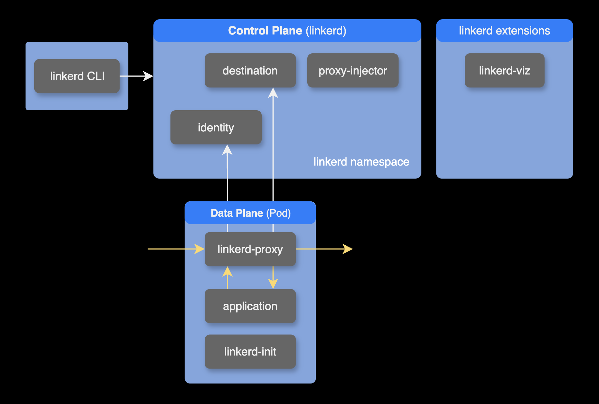



&nbsp;

## 개요

서비스 메시 툴인 Linkerd를 버전 업그레이드하는 가이드입니다.

&nbsp;

## 환경

### 쿠버네티스 클러스터

- **EKS v1.30** (amd64 기반)
- **AMI**: Amazon Linux 2023

&nbsp;

### 설치된 서비스 메시

- **linkerd**: linkerd는 서비스 메시 컨트롤 플레인입니다. `edge-24.5.3` → `edge-24.7.5`로 업그레이드
- **linkerd-viz**: linkerd-viz는 네트워크 트래픽과 서비스 성능을 시각적으로 보여주는 대시보드입니다. 쉽게 말해, linkerd-viz를 사용하면 서비스 간의 연결과 성능을 한눈에 보고 문제를 쉽게 찾을 수 있습니다. 이것도 동일하게 `edge-24.5.3` → `edge-24.7.5`로 업그레이드

&nbsp;

## 업그레이드 가이드

Linkerd에서 업그레이드해야 할 네 가지 구성 요소는 다음과 같습니다.



1. **CLI**
2. **Control plane**
3. **Control plane 확장 프로그램**: Linker에서 공식 지원하는 확장 프로그램<sup>Extension</sup> 목록은 [Extensions List 페이지](https://linkerd.io/2.15/reference/extension-list/)에서 확인할 수 있습니다. 이 시나리오에서는 [linkerd-viz](https://github.com/linkerd/linkerd2/tree/main/viz/charts/linkerd-viz/)를 업그레이드 합니다.
4. **Data plane**

이러한 업그레이드 절차는 반드시 **순서대로** 수행해야 합니다.

&nbsp;

### 업그레이드 공지사항

추가적으로 특정 업그레이드를 시작하기 전에 현재 사용하는 버전에 대한 중요한 정보가 포함될 수 있는 버전별 [업그레이드 공지사항](https://linkerd.io/2.15/tasks/upgrade/#upgrade-notices)을 읽고 작업을 진행하는 걸 권장드립니다.

&nbsp;

### 1. CLI 업그레이드

`linkerd` CLI를 먼저 버전 업그레이드합니다.

```bash
curl --proto '=https' --tlsv1.2 -sSfL https://run.linkerd.io/install-edge | sh
```

&nbsp;

다음을 사용하여 CLI가 설치되어 있고 새 버전을 실행하고 있는지 확인합니다.

```bash
$ linkerd version --client
Client version: edge-24.7.5
```

&nbsp;

### 2. Control plane 업그레이드

> 제 경우 Linkerd control plane은 linkerd 명령어를 사용해서 EKS v1.30 클러스터에 설치했습니다.

`--crds` 플래그를 사용하여 Linkerd의 CRD를 먼저 업그레이드한 다음 Control plane을 업그레이드해야 합니다.

```bash
linkerd upgrade --crds | kubectl apply -f -
```

Linkerd에서 사용하는 커스텀 리소스들이 업그레이드 됩니다.

```bash
customresourcedefinition.apiextensions.k8s.io/authorizationpolicies.policy.linkerd.io configured
customresourcedefinition.apiextensions.k8s.io/httproutes.policy.linkerd.io configured
customresourcedefinition.apiextensions.k8s.io/meshtlsauthentications.policy.linkerd.io configured
customresourcedefinition.apiextensions.k8s.io/networkauthentications.policy.linkerd.io configured
customresourcedefinition.apiextensions.k8s.io/serverauthorizations.policy.linkerd.io configured
customresourcedefinition.apiextensions.k8s.io/servers.policy.linkerd.io configured
customresourcedefinition.apiextensions.k8s.io/serviceprofiles.linkerd.io configured
customresourcedefinition.apiextensions.k8s.io/httproutes.gateway.networking.k8s.io configured
customresourcedefinition.apiextensions.k8s.io/grpcroutes.gateway.networking.k8s.io configured
customresourcedefinition.apiextensions.k8s.io/externalworkloads.workload.linkerd.io configured
```

&nbsp;

Linkerd control plane을 구성하는 파드들을 업그레이드합니다.

```bash
linkerd upgrade | kubectl apply -f -
```

linkerd prune 명령을 사용하여 이전 버전에는 있었지만 이번 버전에는 없어야 하는 리소스를 제거합니다.

```bash
linkerd prune | kubectl delete -f -
```

삭제할 이전 버전의 리소스가 없는 경우 다음과 같이 출력됩니다.

```bash
No resources found
```

&nbsp;

### 3. Control plane extension 업그레이드

linkerd-viz가 기존에 헬름 차트로 설치되어 있는 상태였습니다.

`values.yaml`의 `linkerdVersion` 값을 새 linkerd-viz의 버전으로 변경합니다.

```yaml
# charts/linkerd-viz/values.yaml
linkerdVersion: edge-24.7.5
```

&nbsp;

이후 `helm upgrade`로 새 버전의 linkerd-viz 차트를 설치합니다.

```bash
helm upgrade \
  --install \
  --namespace linkerd-viz \
  linkerd-viz . \
  --values values.yaml \
  --wait
```

&nbsp;

`linkerd check` 명령어로 컨트롤 플레인과 컨트롤 플레인 확장 컴포넌트들의 업그레이드 상태를 체크합니다.

```bash
$ linkerd check
kubernetes-api
--------------
√ can initialize the client
√ can query the Kubernetes API

kubernetes-version
------------------
√ is running the minimum Kubernetes API version

linkerd-existence
-----------------
√ 'linkerd-config' config map exists
√ heartbeat ServiceAccount exist
√ control plane replica sets are ready
√ no unschedulable pods
√ control plane pods are ready
√ cluster networks contains all pods
√ cluster networks contains all services

linkerd-config
--------------
√ control plane Namespace exists
√ control plane ClusterRoles exist
√ control plane ClusterRoleBindings exist
√ control plane ServiceAccounts exist
√ control plane CustomResourceDefinitions exist
√ control plane MutatingWebhookConfigurations exist
√ control plane ValidatingWebhookConfigurations exist
√ proxy-init container runs as root user if docker container runtime is used

linkerd-identity
----------------
√ certificate config is valid
√ trust anchors are using supported crypto algorithm
√ trust anchors are within their validity period
√ trust anchors are valid for at least 60 days
√ issuer cert is using supported crypto algorithm
√ issuer cert is within its validity period
√ issuer cert is valid for at least 60 days
√ issuer cert is issued by the trust anchor

linkerd-webhooks-and-apisvc-tls
-------------------------------
√ proxy-injector webhook has valid cert
√ proxy-injector cert is valid for at least 60 days
√ sp-validator webhook has valid cert
√ sp-validator cert is valid for at least 60 days
√ policy-validator webhook has valid cert
√ policy-validator cert is valid for at least 60 days

linkerd-version
---------------
√ can determine the latest version
√ cli is up-to-date

control-plane-version
---------------------
√ can retrieve the control plane version
√ control plane is up-to-date
√ control plane and cli versions match

linkerd-control-plane-proxy
---------------------------
√ control plane proxies are healthy
√ control plane proxies are up-to-date
√ control plane proxies and cli versions match

linkerd-extension-checks
------------------------
√ namespace configuration for extensions

linkerd-viz
-----------
√ linkerd-viz Namespace exists
√ can initialize the client
√ linkerd-viz ClusterRoles exist
√ linkerd-viz ClusterRoleBindings exist
√ tap API server has valid cert
√ tap API server cert is valid for at least 60 days
√ tap API service is running
√ linkerd-viz pods are injected
√ viz extension pods are running
√ viz extension proxies are healthy
√ viz extension proxies are up-to-date
√ viz extension proxies and cli versions match
√ prometheus is installed and configured correctly
√ viz extension self-check

Status check results are √
```

&nbsp;

### 4. Data plane 업그레이드

데이터 플레인을 업그레이드하려면 메시된 각 워크로드에 추가된 프록시를 업데이트해야 합니다. Kubernetes에서 Pod는 변경할 수 없으므로 Linkerd는 단순히 프록시를 업데이트할 수 없습니다.

따라서 데이터 플레인을 업그레이드하려면 각 워크로드(파드)를 다시 시작하여, 프록시 인젝터가 최신 버전의 프록시를 주입할 수 있도록 재시작하는 방법이 있습니다.

```bash
kubectl -n <namespace> rollout restart deploy
kubectl -n <namespace> rollout restart statefulset
```

`linkerd check` 명령어를 실행하여 linkerd 데이터 플레인이 정상인지 확인합니다.

```bash
linkerd check --proxy
```

이는 일련의 검사를 통해 데이터 플레인이 올바르게 작동하는지 확인하고 여전히 이전 버전의 linkerd 프록시를 실행 중인 모든 파드를 나열합니다.

&nbsp;

## 참고자료

**linkerd**  
[Linkerd upgrade](https://linkerd.io/2.15/tasks/upgrade/)  
[Linkerd extension list](https://linkerd.io/2.15/reference/extension-list/)

**linkerd-viz**  
[linkerd-viz helm chart](https://github.com/linkerd/linkerd2/tree/main/viz/charts/linkerd-viz)
