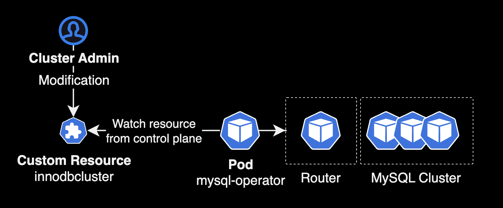
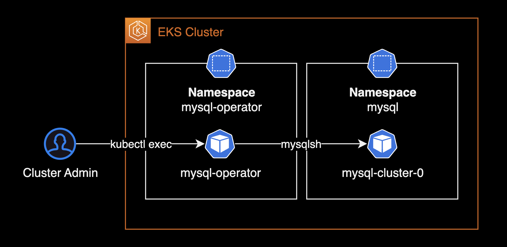



&nbsp;

## 개요

MySQL Operator를 설치한 후 사용하는 가이드입니다.

&nbsp;

## 환경

### 클러스터

- **EKS** : v1.28
- **워크로드** : EC2 Instance 기반 클러스터

&nbsp;

### 헬름 차트

- Helm v3.13.3
- `mysql-operator` : 8.2.0-2.1.1
- `mysql-innodbcluster` : 8.2.0

&nbsp;

## 준비사항

작업자의 로컬 환경에 아래 CLI 툴들이 설치되어 있어야 합니다.

- **helm** : 헬름 차트 설치할 때 필요합니다.
- **git** : 차트 레포 다운로드에 필요한 CLI 툴 입니다.
- **kubectl** : 쿠버네티스 클러스터를 운영, 관리할 때 필요한 CLI 툴 입니다.

&nbsp;

## MySQL Operator

### 차트 다운로드

`mysql-operator` 프로젝트는 Github Cloud에 오픈소스로 제공됩니다.

로컬 환경에 mysql-operator 레포지터리를 다운로드 받습니다.

```bash
git clone https://github.com/mysql/mysql-operator.git
cd mysql-operator/helm/mysql-operator
```

&nbsp;

MySQL Operator 차트 구조는 다음과 같이 2개로 구성되어 있습니다.

```bash
$ tree mysql-operator/helm/ -L 2
mysql-operator/helm/
├── mysql-innodbcluster
│   ├── Chart.yaml
│   ├── README.md
│   ├── charts
│   ├── crds
│   ├── templates
│   └── values.yaml
└── mysql-operator
    ├── Chart.yaml
    ├── README.md
    ├── charts
    ├── crds
    ├── templates
    └── values.yaml

9 directories, 6 files
```

1. [**mysql-operator**](https://github.com/mysql/mysql-operator/tree/trunk/helm/mysql-operator) : MySQL Operator 설치에 필요한 헬름 차트
2. [**mysql-innodbcluster**](https://github.com/mysql/mysql-operator/tree/trunk/helm/mysql-innodbcluster) : MySQL 클러스터 생성에 필요한 헬름 차트

&nbsp;

설치 순서는 MySQL Operator를 가장 먼저 설치한 후, 커스텀 리소스인 mysql-innodbcluster를 설치하면 됩니다.

&nbsp;

### mysql-operator 차트 설치

`mysql-operator` 차트를 `mysql-operator` 네임스페이스에 먼저 설치합니다.

```bash
helm upgrade \
  mysql-operator . \
  --install \
  --namespace mysql-operator \
  --create-namespace \
  --values values.yaml \
  --wait
```

&nbsp;

mysql-operator 차트를 설치하면 MySQL Operator 파드가 새로 생성됩니다.

```bash
$ kubectl get all -n mysql-operator
NAME                                  READY   STATUS    RESTARTS   AGE
pod/mysql-operator-64d8b6dd5b-zlpqm   1/1     Running   0          3d15h

NAME                     TYPE        CLUSTER-IP      EXTERNAL-IP   PORT(S)    AGE
service/mysql-operator   ClusterIP   172.20.39.138   <none>        9443/TCP   3d15h

NAME                             READY   UP-TO-DATE   AVAILABLE   AGE
deployment.apps/mysql-operator   1/1     1            1           3d15h

NAME                                        DESIRED   CURRENT   READY   AGE
replicaset.apps/mysql-operator-64d8b6dd5b   1         1         1       3d15h
```

&nbsp;

MySQL Operator에서 사용하는 커스텀 리소스 목록입니다.

```bash
$ kubectl api-resources --api-group mysql.oracle.com
NAME             SHORTNAMES   APIVERSION            NAMESPACED   KIND
innodbclusters   ic,ics       mysql.oracle.com/v2   true         InnoDBCluster
mysqlbackups     mbk          mysql.oracle.com/v2   true         MySQLBackup
```

클러스터 관리자가 `innodbclusters` 리소스를 생성하면 MySQL Operator는 이를 감지한 후 쿠버네티스 클러스터 상에 MySQL Cluster를 파드 형태로 구성하는 동작 방식입니다.

&nbsp;

### 클러스터 상세 설정

로컬에 다운로드 받은 mysql-operator 레포지터리에서 아래 경로로 이동합니다.

```bash
cd mysql-operator/helm/mysql-innodbcluster
```

&nbsp;

mysql-innodblucster의 `values.yaml` 파일을 수정합니다.

```yaml
# helm/mysql-innodbcluster/values.yaml
image:
  pullPolicy: IfNotPresent
  pullSecrets:
    enabled: false
    secretName:

credentials:
  root:
    user: root
    password: mysqlpassword
    host: "%"

tls:
  useSelfSigned: true
#  caSecretName:
#  serverCertAndPKsecretName:
#  routerCertAndPKsecretName: # our use router.certAndPKsecretName

#serverVersion: 8.0.31
serverInstances: 3
routerInstances: 1 # or use router.instances
baseServerId: 1000

router:
  instances: 1
  podSpec:
    containers:
    - name: router
      resources:
        requests:
          memory: "300Mi"  # adapt to your needs
          cpu: "100m"      # adapt to your needs
        limits:
          memory: "1024Mi"  # adapt to your needs
          cpu: "1000m"      # adapt to your needs

podSpec:
 containers:
 - name: mysql
   resources:
     requests:
       memory: "1024Mi"  # adapt to your needs
       cpu: "1800m"      # adapt to your needs
     limits:
       memory: "2048Mi"  # adapt to your needs
       cpu: "2000m"      # adapt to your needs
```

&nbsp;

### mysql-innodbcluster 차트 설치

`mysql-innodbcluster` 차트를 설치하면 동시에 MySQL 클러스터가 생성됩니다.

```bash
helm upgrade \
  mysql-cluster . \
  --install \
  --namespace mysql \
  --create-namespace \
  --values values.yaml \
  --wait
```

&nbsp;

이 시나리오에서 각 헬름 차트는 다음 네임스페이스를 사용합니다.

```bash
$ helm list --all-namespaces --filter 'mysql'
NAME          	NAMESPACE     	REVISION	UPDATED                             	STATUS  	CHART                    	APP VERSION
mysql-cluster 	mysql         	1       	2024-01-09 14:41:17.942536 +0900 KST	deployed	mysql-innodbcluster-2.1.1	8.2.0
mysql-operator	mysql-operator	1       	2024-01-09 14:39:22.884685 +0900 KST	deployed	mysql-operator-2.1.1     	8.2.0-2.1.1
```

| No. | 헬름 차트 이름          | 네임스페이스      | 차트 설명           |
|-----|---------------------|----------------|-------------------|
| 1   | mysql-operator      | mysql-operator | MySQL 오퍼레이터 파드 |
| 2   | mysql-innodbcluster | mysql          | MySQL 클러스터      |

&nbsp;

MySQL Cluster 클러스터의 상태를 확인합니다.

```bash
$ kubectl get pod -n mysql
NAME                                    READY   STATUS    RESTARTS   AGE
mysql-cluster-0                         2/2     Running   0          10m
mysql-cluster-1                         2/2     Running   0          10m
mysql-cluster-2                         2/2     Running   0          10m
mysql-cluster-router-7b795dcbf7-xvshs   1/1     Running   0          9m10s
```

클러스터를 구성하는 모든 MySQL 서버 및 라우터는 실제로 파드입니다.

&nbsp;

설치한 `mysql-cluster` 차트의 세부 설정 값을 조회합니다.

```bash
helm get values mysql-cluster -n mysql
```

&nbsp;

MySQL Operator에서 사용하는 커스텀 리소스인 `innodbcluster`는 파드처럼 네임스페이스 영역에 속하는<sup>Namespaced</sup> 리소스입니다.

헬름 차트로 설치한 innodbcluster 리소스를 조회합니다.

```bash
# Use fullname
kubectl get innodbcluster -n mysql

# Use shortname
kubectl get ic -n mysql
```

> `innodbcluster` 리소스의 축약형 이름(Shortname)인 `ic`를 사용해서 조회할 수도 있습니다.

&nbsp;

3개의 MySQL DB로 구성된 클러스터이며 온라인 상태가 되면 정상 접속이 가능합니다.

```bash
NAME            STATUS   ONLINE   INSTANCES   ROUTERS   AGE
mysql-cluster   ONLINE   3        3           1         22m
```

&nbsp;

MySQL Operator는 innodbcluster 리소스를 감지한 후 MySQL 클러스터와 앞단에 Router를 자동 구성합니다.

```bash
$ kubectl get pod -n mysql
NAME                                   READY   STATUS    RESTARTS   AGE
mysql-cluster-0                        2/2     Running   0          22m
mysql-cluster-1                        2/2     Running   0          22m
mysql-cluster-2                        2/2     Running   0          22m
mysql-cluster-router-9f9bd9b99-kmdl2   1/1     Running   0          21m
```

MySQL Cluster의 실체는 파드이며 Statefulset에 의해 MySQL 파드가 배포됩니다.

&nbsp;

MySQL Operator에 의해 쿠버네티스 시크릿도 같이 자동 생성됩니다.

```bash
$ kubectl get secret -n mysql
NAME                                  TYPE                 DATA   AGE
mysql-cluster-backup                  Opaque               2      42h
mysql-cluster-cluster-secret          Opaque               3      42h
mysql-cluster-privsecrets             Opaque               2      42h
mysql-cluster-router                  Opaque               2      42h
sh.helm.release.v1.mysql-cluster.v1   helm.sh/release.v1   1      42h
```

`mysql-cluster-cluster-secret` 시크릿이 MySQL DB 파드에 비밀번호로 주입됩니다.

&nbsp;

MySQL DB 파드의 상세 설정을 확인합니다.

```bash
kubectl get pod -n mysql mysql-cluster-0 -o yaml
```

```yaml
...
    env:
    - name: MYSQL_INITIALIZE_ONLY
      value: "1"
    - name: MYSQL_ROOT_PASSWORD
      valueFrom:
        secretKeyRef:
          key: rootPassword
          name: mysql-cluster-cluster-secret
```

`MYSQL_ROOT_PASSWORD` 환경변수가 `mysql-cluster-cluster-secret` 시크릿을 참조하고 있습니다.

&nbsp;

### MySQL DB 접속

운영 관리의 목적으로 생성한 MySQL DB 클러스터에 접속해야할 경우, 먼저 MySQL Operator 파드에 접속합니다.



대부분의 MySQL DB 운영 업무는 MySQL Shell을 사용해서 수행하게 됩니다.

[MySQL Shell 8.0 공식문서](https://dev.mysql.com/doc/mysql-shell/8.0/en/)에서도 MySQL Shell로 MySQL Server `5.7`, `8.0`를 관리하도록 권장하고 있습니다.

&nbsp;

`kubectl`을 사용해서 mysql-operator 파드에 접속합니다.

```bash
kubectl exec -it \
  -n mysql-operator \
  mysql-operator-64d8b6dd5b-zlpqm \
  -- mysqlsh
```

&nbsp;

MySQL Operator 파드에는 기본적으로 `mysqlsh` 8.x 버전이 설치되어 있습니다.

```bash
MySQL Shell 8.2.0

Copyright (c) 2016, 2023, Oracle and/or its affiliates.
Oracle is a registered trademark of Oracle Corporation and/or its affiliates.
Other names may be trademarks of their respective owners.

Type '\help' or '\?' for help; '\quit' to exit.
 MySQL  JS >
```

&nbsp;

`mysqlsh`의 `\connect` 명령어를 사용해서 생성한 innodbcluster DB에 접속합니다.

```bash
 MySQL  JS > \connect root@mysql-cluster.mysql.svc.cluster.local:3306
```

```bash
Creating a session to 'root@mysql-cluster.mysql.svc.cluster.local:3306'
Please provide the password for 'root@mysql-cluster.mysql.svc.cluster.local:3306': **********
Fetching schema names for auto-completion... Press ^C to stop.
Your MySQL connection id is 183
Server version: 8.2.0 MySQL Community Server - GPL
No default schema selected; type \use <schema> to set one.
```

root 계정의 password를 입력해야 로그인이 가능합니다.

root 계정의 패스워드는 `mysql-innodbcluster` 헬름 차트의 `credentials.root.password` 값을 입력합니다.

&nbsp;

MySQL Shell에서는 `\sql`, `\py` 및 `\js` 명령어를 사용해서 모드를 변경할 수 있습니다.

`\sql` 명령어를 실행해서 MySQL Shell을 기본값 JavaScript 모드에서 SQL 모드로 변경합니다.

```bash
 MySQL  JS > \sql
Switching to SQL mode... Commands end with ;
Fetching global names for auto-completion... Press ^C to stop.
```

MySQL Shell에서 사용 가능한 명령어 리스트를 확인하려면 `\help` 또는 `\?`를 입력합니다.

&nbsp;

현재 접속한 MySQL DB의 호스트네임 및 버전을 확인합니다.

```sql
-- Hostname 및 DB 버전 확인
SELECT @@hostname AS 'Hostname', VERSION() AS 'MySQL Version';
```

```sql
+-----------------+---------------+
| Hostname        | MySQL Version |
+-----------------+---------------+
| mysql-cluster-0 | 8.2.0         |
+-----------------+---------------+
1 row in set (0.0004 sec)
```

현재 `mysql-cluster-0` 파드에 접속한 상태이며, MySQL 버전은 `8.2.0` 입니다.

&nbsp;

MySQL 클러스터를 생성하면 기본적으로 Group Replication 형태로 HA 구성이 되어 있습니다.

클러스터 생성 및 초기화 과정에서 MySQL 클러스터 이중화 상태가 정상적으로 구성되었는지 확인합니다.

```sql
-- Group Replication 상태 확인
SELECT member_host, member_state, member_role, member_version
FROM performance_schema.replication_group_members;
```

```sql
+-----------------------------------------------------------------+--------------+-------------+----------------+
| member_host                                                     | member_state | member_role | member_version |
+-----------------------------------------------------------------+--------------+-------------+----------------+
| mysql-cluster-1.mysql-cluster-instances.mysql.svc.cluster.local | ONLINE       | SECONDARY   | 8.2.0          |
| mysql-cluster-0.mysql-cluster-instances.mysql.svc.cluster.local | ONLINE       | PRIMARY     | 8.2.0          |
| mysql-cluster-2.mysql-cluster-instances.mysql.svc.cluster.local | ONLINE       | SECONDARY   | 8.2.0          |
+-----------------------------------------------------------------+--------------+-------------+----------------+
3 rows in set (0.0005 sec)
```

클러스터를 구성하는 3개 MySQL DB가 모두 온라인 상태이며 Primary - Secondary 구성임을 확인할 수 있습니다. 현재 저희가 접속한 DB는 Primary DB인 `mysql-cluster-0` 입니다.

&nbsp;

MySQL Operator와 InnoDB Cluster의 아키텍처입니다.



&nbsp;

## 참고자료

**MySQL Operator**  
[MySQL Operator 공식문서](https://dev.mysql.com/doc/mysql-operator/en/)  
[mysql-operator Github](https://github.com/mysql/mysql-operator)  
[mysql-operator Github chart](https://github.com/mysql/mysql-operator/tree/trunk/helm)  

**MySQL Shell**  
[MySQL Shell 8.0 공식문서](https://dev.mysql.com/doc/mysql-shell/8.0/en/)
