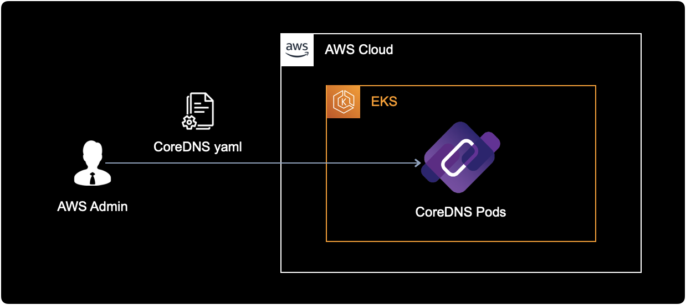
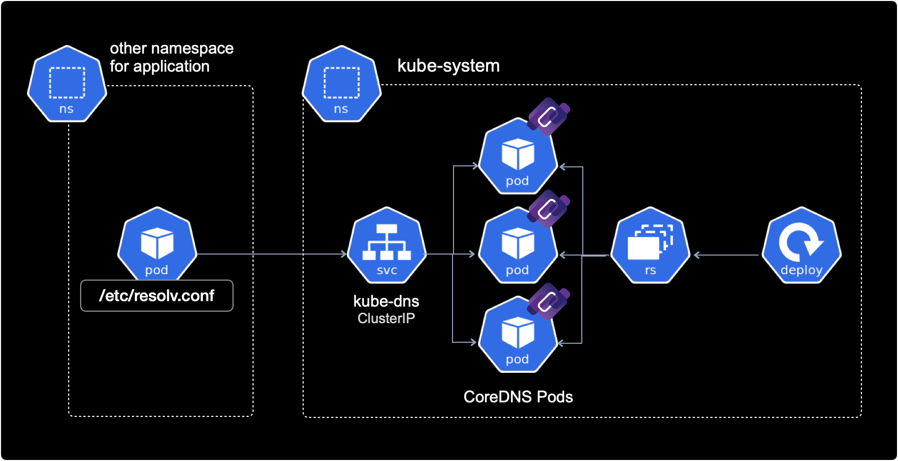



&nbsp;

## 개요

알람 푸시 서비스와 같은 배포된 어플리케이션들에서 불필요한 coredns 리퀘스트를 줄이기 위해 deployment 또는 pod에 직접 `ndots` 설정을 추가합니다.

CI/CD 파이프라인에서 ArgoCD를 사용하는 경우, ArgoCD의 커스텀 리소스 중 하나인 Rollout에도 CoreDNS `ndots` 설정은 동일하게 적용할 수 있습니다.

&nbsp;

## 배경지식

### CoreDNS

[CoreDNS](https://coredns.io/)는 쿠버네티스 클러스터 내에서 DNS 이름을 해결하는 도구입니다. CoreDNS는 서비스나 파드 등 쿠버네티스에서 사용되는 모든 리소스에 대한 DNS 서비스를 제공하며, 쿠버네티스 클러스터의 확장성과 가용성 면에서도 우수한 성능을 보입니다. 현재 CoreDNS 프로젝트는 [CNCF](https://www.cncf.io/)<sup>Cloud Native Computing Foundation</sup>에 의해 관리 운영되고 있습니다.

쿠버네티스 클러스터에서 구동중인 파드들은 CoreDNS에게 DNS 주소를 질의하여 다른 서비스나 파드 리소스를 찾을 수 있습니다.

&nbsp;

### kube-dns와 CoreDNS

kube-dns는 CoreDNS가 나오기 전까지 사용되던 구버전 DNS 에드온입니다. CoreDNS는 kube-dns보다 유연성과 확장성이 높으며, 다양한 백엔드 데이터 소스와 플러그인을 지원합니다.

쿠버네티스는 [공식적으로](https://kubernetes.io/ko/docs/tasks/administer-cluster/dns-custom-nameservers/) kube-dns보다 CoreDNS 사용을 권장하고 있으며, 쿠버네티스 1.13 버전부터 기본 DNS 에드온으로 CoreDNS가 사용되고 있습니다.

&nbsp;

### CoreDNS 주소 포맷

쿠버네티스 클러스터에서 CoreDNS를 사용하는 경우 Service와 Pod에는 각각 아래와 같은 형식의 DNS A 레코드가 자동 할당됩니다.

&nbsp;

#### Service의 A Record

```bash
SERVICE-NAME.NAMESPACE.svc.cluster.local
```

```bash
server-mysql.mysql.svc.cluster.local
------------ -----
    |          |
    |          +—–> Namespace
    +—–—–—–—–—–—––> Service Name
```

```bash
server-redis.redis.svc.cluster.local
------------ -----
    |          |
    |          +—–> Namespace
    +—–—–—–—–—–—––> Service Name
```

&nbsp;

#### Pod의 A Record

```bash
POD-IP-ADDRESS.NAMESPACE.pod.cluster.local
```

예시로 default 네임스페이스에 `172.12.3.4` IP를 가진 파드의 경우 아래와 같은 A 레코드로 해석됩니다.

```bash
172–12–3–4.default.pod.cluster.local
---------- -------
    |         |
    |         +—–> Namespace
    +—–—–—–—–—–—–> Pod IP address
```

&nbsp;

## 환경

### EKS 클러스터

EKS 클러스터는 v1.21 버전이며, EC2 Managed Node를 사용하고 있습니다.

```bash
$ kubectl get node | awk '{print $5}'
VERSION
v1.21.5-eks-9017834
v1.21.5-eks-9017834
...
```

&nbsp;

### CoreDNS

EKS 클러스터에 CoreDNS deployment를 manifest로 배포해서 사용하는 환경입니다.



&nbsp;

CoreDNS의 모든 리소스는 `kube-system` 네임스페이스에 위치합니다.  
다른 네임스페이스들의 Pod들은 CoreDNS를 참조하기 위해 `ClusterIP` 타입의 CoreDNS 서비스로 접근합니다.



CoreDNS와 다른 파드간의 통신은 클러스터 내부간 통신으로 이루어집니다.  
클러스터 내부 통신이기 때문에 CoreDNS 서비스 타입은 `ClusterIP`를 사용합니다.

&nbsp;

CoreDNS의 동작방식도 결국 CoreDNS pod에 의해 DNS 서비스를 제공합니다.  
`kubectl get` 명령어로 실제 CoreDNS의 deployment와 pod 환경을 확인합니다.

```bash
$ kubectl get deploy,pod \
    -n kube-system \
    -l k8s-app=kube-dns
```

결과값은 다음과 같습니다.

```bash
NAME                      READY   UP-TO-DATE   AVAILABLE   AGE
deployment.apps/coredns   18/18   18           18          15d

NAME                           READY   STATUS    RESTARTS   AGE
pod/coredns-86dfdb55fc-687dx   1/1     Running   0          15d
pod/coredns-86dfdb55fc-695t7   1/1     Running   0          15d
pod/coredns-86dfdb55fc-7x9mn   1/1     Running   0          15d
pod/coredns-86dfdb55fc-bqxw8   1/1     Running   0          15d
pod/coredns-86dfdb55fc-cq5rd   1/1     Running   0          15d
pod/coredns-86dfdb55fc-dhfch   1/1     Running   0          15d
pod/coredns-86dfdb55fc-f2v8z   1/1     Running   0          15d
pod/coredns-86dfdb55fc-gr46t   1/1     Running   0          15d
pod/coredns-86dfdb55fc-l562c   1/1     Running   0          15d
pod/coredns-86dfdb55fc-m6qm4   1/1     Running   0          15d
pod/coredns-86dfdb55fc-rscmz   1/1     Running   0          15d
pod/coredns-86dfdb55fc-t2tt5   1/1     Running   0          15d
pod/coredns-86dfdb55fc-td8pw   1/1     Running   0          15d
pod/coredns-86dfdb55fc-tn5gv   1/1     Running   0          15d
pod/coredns-86dfdb55fc-w7n86   1/1     Running   0          15d
pod/coredns-86dfdb55fc-zjqpv   1/1     Running   0          15d
pod/coredns-86dfdb55fc-zk68t   1/1     Running   0          15d
pod/coredns-86dfdb55fc-zmjmb   1/1     Running   0          15d
```

위의 경우 18개의 CoreDNS 파드가 여러 워커 노드에 걸쳐 분산 배포된 형태입니다.

일반적으로 일부 노드에 장애가 발생하더라도 CoreDNS 서비스의 고가용성<sup><abbr title="High Availability">HA</abbr></sup>을 유지하기 위한 목적으로 위와 같이 구성합니다.

&nbsp;

CoreDNS는 외부(다른 네임스페이스)로부터 요청을 받기 위해 `ClusterIP` 타입의 Service 오브젝트가 존재합니다.

```bash
$ kubectl get service \
    -n kube-system \
    -l k8s-app=kube-dns
```

결과값은 다음과 같습니다.

```bash
NAME                      TYPE        CLUSTER-IP      EXTERNAL-IP   PORT(S)         AGE
kube-dns                  ClusterIP   11.200.0.10     <none>        53/UDP,53/TCP   129d
```

&nbsp;

## ndots 설정방법

### 1. spec 수정

ArgoCD의 커스텀 리소스인 Rollout에 `ndots` 설정을 추가하는 상황입니다.

```yaml
apiVersion: argoproj.io/v1alpha1
kind: Rollout
metadata:
  ...
spec:
  template:
    spec:
      containers:
        ...
      dnsConfig:       # ndots configuration
        options:       # ndots configuration
        - name: ndots  # ndots configuration
          value: "1"   # ndots configuration
```

`ndots` 값은 <abbr title="Fully Qualified Domain Name">FQDN</abbr>으로 취급될 도메인에 포함될 <kbd>.</kbd><sup>dot</sup>의 최소 개수를 의미합니다.  
`ndots` 기본값은 `5`입니다.

`ndots`를 `1`로 조정해서 불필요한 CoreDNS 리퀘스트를 줄일 수 있습니다.

&nbsp;

### 2. 설정 적용

`ndots` 설정을 추가한 다음 적용하기 위해 `kubectl apply` 또는 (파이프라인에서 ArgoCD를 사용하는 경우) 소스 레포지터리에 코드를 push 합니다.

`kubectl edit` 명령어로 yaml을 직접 수정했을 경우에는 즉시 적용되므로 다시 deployment나 application을 배포할 필요가 없습니다.

&nbsp;

### 3. ndots 설정 확인

deployment 또는 ArgoCD의 rollout에서 `spec.template.spec.dnsConfig` 설정을 확인합니다.

```bash
$ kubectl get deploy -n hello-greeter hello-greeter
...
spec:
  template:
    spec:
      containers:
        ...
      dnsConfig:        # ndots configuration
        options:        # ndots configuration
        - name: ndots   # ndots configuration
          value: "1"    # ndots configuration
```

`ndots` 값이 추가되었고, 값은 `"1"`로 설정된 걸 확인했습니다.

&nbsp;

이제 deployment 또는 ArgoCD의 rollout에 의해 생성된 파드에서도 `ndots` 설정을 확인합니다.

특정 파드에 접속해서 `/etc/resolv.conf` 파일 내용을 조회하는 명령어입니다.

```bash
$ kubectl exec -it hello-greeter-77f6db78d-4m6rw \
    -n hello-greeter \
    -- cat /etc/resolv.conf
```

위 명령어에서 파드 네임 `hello-greeter-77f6db78d-4m6rw`는 자신의 환경에 맞게 변경해서 명령어를 실행합니다.

&nbsp;

아래는 파드에 들어있는 `/etc/resolv.conf` 설정파일 내용입니다.

```bash
search hello-greeter.svc.cluster.local svc.cluster.local cluster.local ap-northeast-2.compute.internal
nameserver 11.200.0.10
options ndots:1
```

**nameserver**  
`nameserver`의 IP가 CoreDNS의 ClusterIP를 가져온 점을 확인할 수 있습니다.  
클러스터의 모든 파드들은 이런 방식으로 CoreDNS 서비스에 질의하고 응답을 받습니다.

**resolv.conf가 생성되는 원리**  
각 노드마다 동작하고 있는 [kubelet](https://kubernetes.io/ko/docs/concepts/overview/components/#kubelet)은 pod를 실행할 때, `/etc/resolv.conf` 파일 안에 CoreDNS의 `ClusterIP`주소를 `nameserver`로 등록합니다.  
`/etc/resolv.conf` 설정 파일은 DNS를 질의하는 클라이언트가 어디로 요청을 보낼지 판단하기 위한 용도로 사용합니다.

**options**  
`options`는 기본값 `ndots:5` 대신 `ndots:1` 옵션으로 변경된 것을 확인할 수 있습니다.

&nbsp;

## 참고자료

**DNS Config**  
[How to change ndots option default value of dns in Kubernetes](https://stackoverflow.com/questions/70264378/how-to-change-ndots-option-default-value-of-dns-in-kubernetes)  
ndots 설정 방법

[Pod's DNS Config](https://kubernetes.io/docs/concepts/services-networking/dns-pod-service/#pod-dns-config)  
Kubernetes 공식문서에 언급된 Pod 에서 DNS 설정 추가하기

**CoreDNS**  
[Kubernetes의 DNS, CoreDNS를 알아보자](https://jonnung.dev/kubernetes/2020/05/11/kubernetes-dns-about-coredns/)  
CoreDNS를 쉽고 명확하게 설명한 좋은 글입니다.
