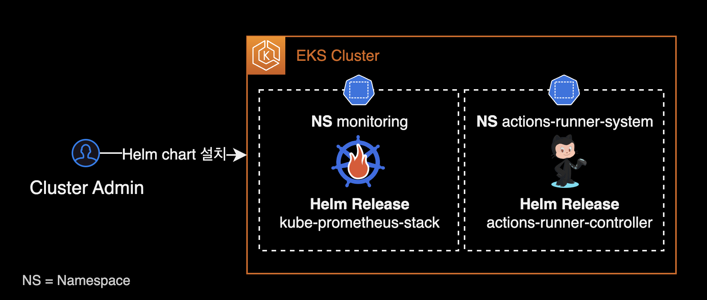
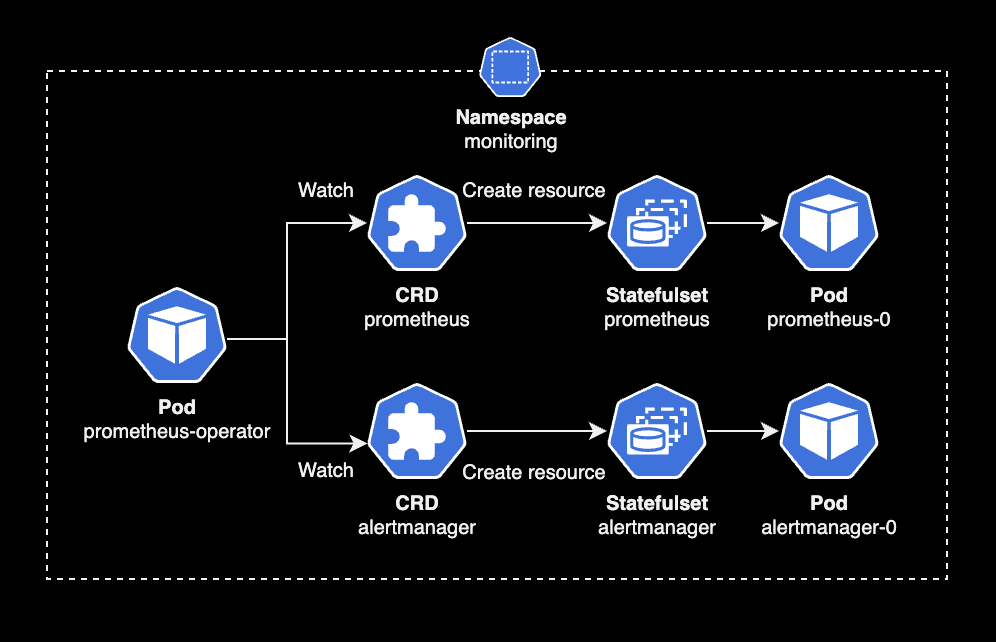
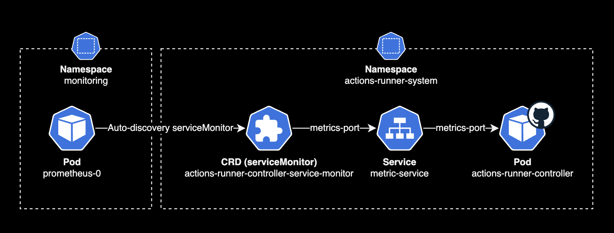
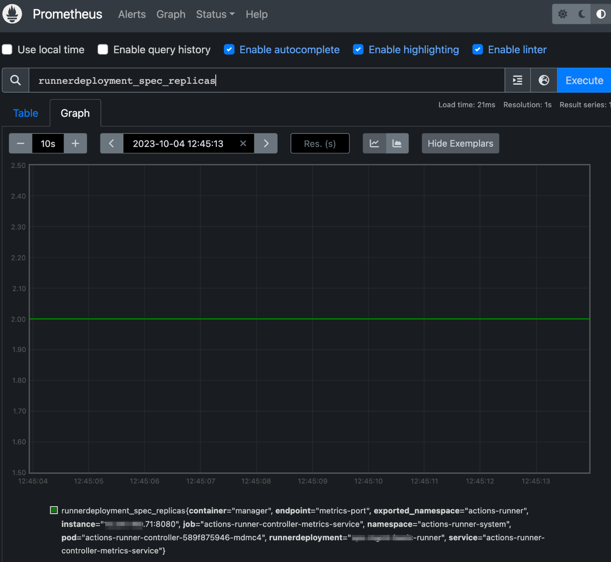
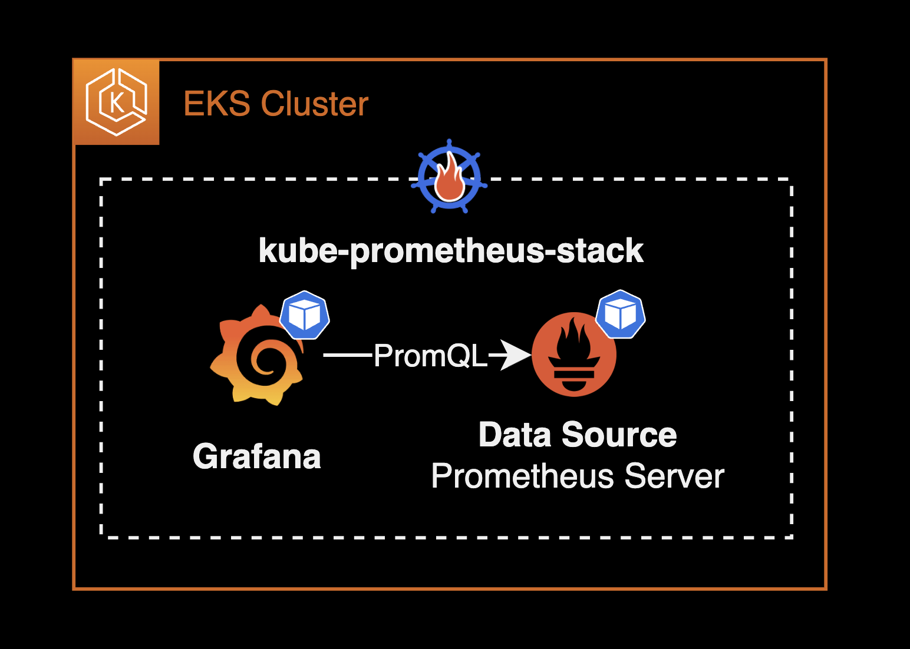
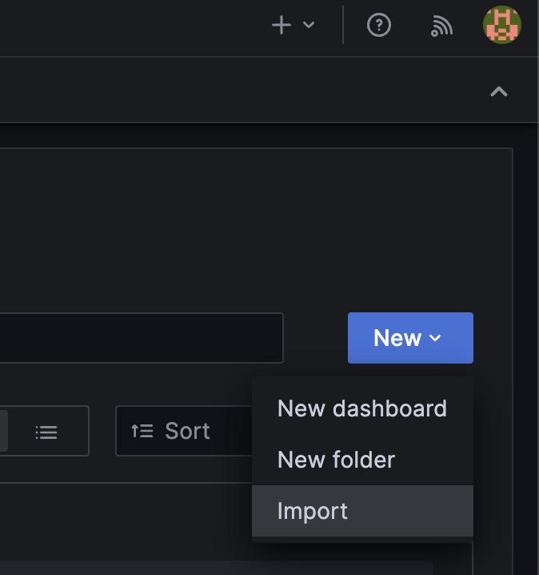
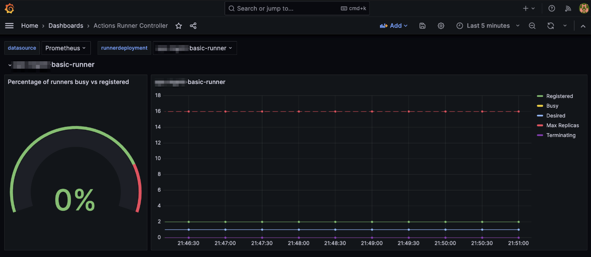



&nbsp;

## 개요

Prometheus Operator로 다른 Application Pod의 메트릭을 수집하고, Grafana의 대시보드로 출력하는 방법을 소개합니다.

쿠버네티스 클러스터 관리와 모니터링을 담당하는 DevOps Engineer를 대상으로 작성된 가이드입니다.

&nbsp;

## 배경지식

### Prometheus Operator

Prometheus Operator는 Kubernetes Kubernetes 위에서 Prometheus 클러스터를 생성, 구성, 관리합니다.


Prometheus Operator의 가장 큰 목적은 Kubernetes 클러스터에 대한 Prometheus 기반 모니터링 스택 구성을 단순화하고 자동화하는 것입니다.

Prometheus Operator는 크게 3가지 기능을 가지고 있지만 이에 국한되지는 않습니다.

1. **Kubernetes 사용자 정의 리소스** : Kubernetes 사용자 정의 리소스(Custom Resource Definition)를 사용하여 Prometheus, Alertmanager, Thanos Ruler 및 관련 구성 요소를 배포하고 관리합니다.
2. **단순한 배포 설정** : 기본 Kubernetes 리소스의 버전, 데이터 보존을 위한 persistentVolume 구성, metric 보존기간(Retention) 설정 및 고가용성과 같은 Prometheus의 기본 사항을 구성합니다.
3. **메트릭 수집대상에 대한 설정** : 익숙한 Kubernetes의 label 필터링을 기반으로 모니터링 대상 설정을 자동으로 생성합니다. Prometheus 관련 설정 언어를 배울 필요가 없습니다.

Prometheus Operator에 대한 소개는 공식문서의 [시작하기](https://prometheus-operator.dev/docs/prologue/introduction/) 페이지를 참조하세요.

[kube-prometheus-stack](https://github.com/prometheus-community/helm-charts/tree/kube-prometheus-stack-51.2.0/charts/kube-prometheus-stack) 헬름 차트를 사용해서 Prometheus Operator를 설치하고 관리할 수 있습니다.

&nbsp;

## 환경

### 작업자 로컬 환경

- **OS** : macOS Sonoma 14.0
- **CPU** : M1 Pro Max (arm64)
- **kubectl** : v1.28.2 ([brew](https://brew.sh)로 설치함)

&nbsp;

### 클러스터

- **EKS** : v1.28
- **CPU 아키텍처** : x86_64

&nbsp;

### 모니터링 관련 에드온



[kube-prometheus-stack](https://github.com/prometheus-community/helm-charts/tree/kube-prometheus-stack-51.2.0/charts/kube-prometheus-stack) `v51.2.0` 헬름 차트를 설치하면 아래 에드온들이 함께 설치됩니다.

- **Prometheus Operator** : v0.68.0
- **Prometheus** : v2.47.0
- **Prometheus Alert Manager** : v0.26.0
- **Grafana** : v10.1.2

&nbsp;

## 구성하기

### kube-prometheus-stack 헬름 차트 설치

작업 환경은 EKS v1.28 버전의 클러스터입니다. 2023년 9월 5일 기준으로 가장 최신 버전의 EKS입니다.

```bash
$ kubectl get node
NAME                                                STATUS   ROLES    AGE   VERSION
ip-10-xxx-xxx-xxx.ap-northeast-2.compute.internal   Ready    <none>   8d    v1.28.1-eks-43840fb
ip-10-xxx-xxx-xx.ap-northeast-2.compute.internal    Ready    <none>   8d    v1.28.1-eks-43840fb
ip-10-xxx-xxx-xx.ap-northeast-2.compute.internal    Ready    <none>   8d    v1.28.1-eks-43840fb
```

이 EKS 클러스터는 3대의 워커노드로 구성됩니다.

&nbsp;

`kube-prometheus-stack` 차트에 의해 미리 설치되어 있는 모니터링 관련 리소스(파드)는 다음과 같습니다.

- **prometheus-operator** (pod) : Deployment에 의해 관리되는 파드입니다.
- **prometheus** (pod) : Statefulset에 의해 관리되는 파드입니다.
- **alertmanager** : Statefulset에 의해 관리되는 파드입니다.
- **grafana** (pod) : Deployment에 의해 관리되는 파드입니다.

모니터링을 구성할 때 되도록이면 여러 헬름 차트를 조합하는 방식 대신, `kube-prometheus-stack` 차트 하나로 모니터링 에드온 전체를 한번에 관리하는 걸 추천합니다.

만약 kube-prometheus-stack 차트를 사용 안한다면 쿠버네티스 클러스터 관리자는 각각의 Prometheus 차트, Alert Manager 구성, Grafana 차트, Thanos 차트를 설치해서 모든 복잡한 모니터링 구성해주어야 합니다. 결정적으로 `kube-prometheus-stack`을 사용하지 않을 이유가 없습니다.

&nbsp;

`kube-prometheus-stack` 차트를 클러스터의 `monitoring` 네임스페이스에 설치합니다.

`kube-prometheus-stack` 차트를 설치하는 `helm` 명령어는 다음과 같습니다.

```bash
# Download kube-prometheus-stack chart
git clone https://github.com/prometheus-community/helm-charts.git
cd ./helm-charts/kube-prometheus-stack/
```

```bash
#  Install the kube-prometheus-stack chart on your EKS cluster
helm upgrade \
  --install \
  --create-namespace monitoring \
  -f values.yaml \
  -n monitoring \
  kube-prometheus-stack . \
  --wait
```

&nbsp;

쿠버네티스 클러스터에 배포된 `kube-prometheus-stack` 헬름 차트 정보를 확인합니다.

```bash
$ helm list -n monitoring
NAME                   NAMESPACE   REVISION  UPDATED                               STATUS    CHART                         APP VERSION
kube-prometheus-stack  monitoring  1         2023-09-27 14:58:32.286992 +0900 KST  deployed  kube-prometheus-stack-51.2.0  v0.68.0
```

`kube-prometheus-stack`이 `monitoring` 네임스페이스에 정상적으로 설치된 상태입니다.

&nbsp;

`kube-prometheus-stack` 차트에는 Prometheus Operator가 포함되어 있습니다. `kube-prometheus-stack` 차트를 설치하면 Prometheus Operator Pod가 생성됩니다.

Prometheus Operator Pod 상태를 확인합니다.

```bash
$ kubectl get pod \
    -n monitoring \
    -l app=kube-prometheus-stack-operator
```

```bash
NAME                                              READY   STATUS    RESTARTS   AGE
kube-prometheus-stack-operator-8449959549-865vh   1/1     Running   0          8d
```

EKS v1.28 클러스터의 `monitoring` 네임스페이스에 [Prometheus Operator v0.68.0](https://github.com/prometheus-operator/prometheus-operator/releases/tag/v0.68.0) 파드가 설치되어 있습니다.

&nbsp;

Prometheus Operator는 Prometheus Server, Grafana, Thanos, Prometheus의 메트릭 수집(Scrape) 설정, 메트릭 제공 서비스를 노출하는 ServiceMonitor 등을 모두를 CRD로 추상화해서 관리합니다.

예를 들어 클러스터 관리자가 prometheus, alertmanager CRD를 생성하면, Prometheus Operator(Pod)가 이 CRD를 감지한 다음 Prometheus Server Pod와 Alert Manager Pod를 자동 생성합니다.



결과적으로 Prometheus Operator에 의해 모든 모니터링 관련 에드온들을 쿠버네티스 영역에서 CRD로 관리할 수 있습니다.

&nbsp;

아래 명령어로 Prometheus Operator에서 사용할 수 있는 CRD를 확인할 수 있습니다.

Prometheus Operator가 사용할 모니터링 관련 CRD는 `kube-prometheus-stack` 차트를 설치할 때 기본적으로 같이 설치됩니다.

```bash
kubectl api-resources --api-group monitoring.coreos.com
```

```bash
NAME                  SHORTNAMES   APIVERSION                       NAMESPACED   KIND
alertmanagerconfigs   amcfg        monitoring.coreos.com/v1alpha1   true         AlertmanagerConfig
alertmanagers         am           monitoring.coreos.com/v1         true         Alertmanager
podmonitors           pmon         monitoring.coreos.com/v1         true         PodMonitor
probes                prb          monitoring.coreos.com/v1         true         Probe
prometheusagents      promagent    monitoring.coreos.com/v1alpha1   true         PrometheusAgent
prometheuses          prom         monitoring.coreos.com/v1         true         Prometheus
prometheusrules       promrule     monitoring.coreos.com/v1         true         PrometheusRule
scrapeconfigs         scfg         monitoring.coreos.com/v1alpha1   true         ScrapeConfig
servicemonitors       smon         monitoring.coreos.com/v1         true         ServiceMonitor
thanosrulers          ruler        monitoring.coreos.com/v1         true         ThanosRuler
```

Prometheus Operator와 관련된 CRD(Custom Resource Definition)는 10개입니다.

kube-prometheus-stack의 [Github](https://github.com/prometheus-community/helm-charts/tree/kube-prometheus-stack-51.2.0/charts/kube-prometheus-stack/charts/crds/crds)에서도 확인할 수 있습니다.

&nbsp;

`kube-prometheus-stack` 차트에서 CRD 생성 여부는 `crds.enabled` 값으로 설정할 수 있습니다.

```yaml
# values.yaml for kube-prometheus-stack
## Install Prometheus Operator CRDs
##
crds:
  enabled: true
```

`crds.enabled`의 기본값은 `true` 입니다.

&nbsp;

Prometheus CRD 정보를 확인합니다.

```bash
$ kubectl get prometheus \
    -n monitoring \
    -o wide
```

```bash
NAME                               VERSION   DESIRED   READY   RECONCILED   AVAILABLE   AGE   PAUSED
kube-prometheus-stack-prometheus   v2.47.0   1         1       True         True        10d   false
```

Prometheus Operator는 prometheus, alertmanager CRD를 감지합니다. 그 후 CRD에 선언된 설정을 토대로 Prometheus Server Pod와 Alert Manager Pod를 생성합니다.

&nbsp;

Prometheus Server Pod와 Alert Manager Pod는 Statefulset에 의해 라이프사이클이 관리됩니다.

```bash
$ kubectl get statefulset \
    -n monitoring \
    -o wide
```

```bash
NAME                                              READY   AGE    CONTAINERS                     IMAGES
alertmanager-kube-prometheus-stack-alertmanager   1/1     9d     alertmanager,config-reloader   quay.io/prometheus/alertmanager:v0.26.0,quay.io/prometheus-operator/prometheus-config-reloader:v0.68.0
prometheus-kube-prometheus-stack-prometheus       1/1     7d7h   prometheus,config-reloader     quay.io/prometheus/prometheus:v2.47.0,quay.io/prometheus-operator/prometheus-config-reloader:v0.68.0
```

Statefulset에서 각 컴포넌트의 실제 버전을 확인할 수 있습니다.

Prometheus Operator에 의해 구성된 Prometheus와 Alert Manager 파드의 버전은 다음과 같습니다.

- **Prometheus** : `v2.47.0`
- **Prometheus Alert Manager** : `v0.26.0`

&nbsp;

참고로 `kube-prometheus-stack`을 구성할 때 차트를 다음과 같이 수정해야 합니다.

```diff
  # valeus.yaml for kube-prometheus-stack
  prometheusOperator:
    ...
    prometheusSpec:
-     serviceMonitorSelectorNilUsesHelmValues: true
+     serviceMonitorSelectorNilUsesHelmValues: false
```

`serviceMonitorSelectorNilUsesHelmValue` 값이 `true`인 경우, `prometheus-operator`는 헬름 차트를 통해서만 생성된 serviceMonitor를 감지합니다.

이 설정 변경은 메트릭 수집 대상인 Actions Runner Controller의 메트릭을 문제없이 수집하기 위한 사전 작업입니다.

&nbsp;

Prometheus Operator의 바뀐 설정을 반영하기 위해 `kube-prometheus-stack` 헬름 차트를 업그레이드합니다.

`kube-prometheus-stack` 차트를 업그레이드하는 `helm` 명령어는 다음과 같습니다.

```bash
helm upgrade \
  kube-prometheus-stack . \
  -n monitoring \
  -f values.yaml \
  --wait
```

&nbsp;

### 타겟의 메트릭 노출 설정

이 시나리오에서 메트릭 수집 대상(Target)은 Actions Runner Controller 입니다.

[Actions Runner Controller](/blog/k8s/actions-runner-admin-guide/)는 Github Actions의 Workflow들을 수행하는 서버 자원인 Actions Runner Pod를 중앙 관리하는 컨트롤러입니다.

&nbsp;

Prometheus와 동일한 EKS 클러스터에 Actions Runner Controller가 미리 설치되어 있습니다.

```bash
$ helm list -n actions-runner-system
NAME                       NAMESPACE              REVISION  UPDATED                               STATUS    CHART                             APP VERSION
actions-runner-controller  actions-runner-system  26        2023-10-04 20:07:28.715411 +0900 KST  deployed  actions-runner-controller-0.23.3  0.27.4
```

설치 방식은 공식 [actions-runner-controller](https://github.com/actions/actions-runner-controller/tree/master/charts/actions-runner-controller) 헬름 차트를 사용했습니다.

&nbsp;

Actions Runner Controller가 사용하는 CRD 목록을 확인합니다.

```bash
$ kubectl api-resources --api-group actions.summerwind.dev
NAME                          SHORTNAMES   APIVERSION                        NAMESPACED   KIND
horizontalrunnerautoscalers   hra          actions.summerwind.dev/v1alpha1   true         HorizontalRunnerAutoscaler
runnerdeployments             rdeploy      actions.summerwind.dev/v1alpha1   true         RunnerDeployment
runnerreplicasets             rrs          actions.summerwind.dev/v1alpha1   true         RunnerReplicaSet
runners                                    actions.summerwind.dev/v1alpha1   true         Runner
runnersets                                 actions.summerwind.dev/v1alpha1   true         RunnerSet
```

&nbsp;

Runner Deployment 리소스에 의해 Actions Runner Pod들이 배포되어 동작하고 있는 환경입니다.

```bash
$ kubectl get pod -n actions-runner
NAME                                READY   STATUS    RESTARTS   AGE
github-actions-runner-ph5xr-2sp9k   2/2     Running   0          3h32m
github-actions-runner-ph5xr-z4r7n   2/2     Running   0          3h32m
```

Actions Runner Controller는 Runner Deployment 리소스를 감지하고 이를 통해 Runner Pod가 생성됩니다.

&nbsp;

Actions Runner Controller가 사용하는 runnerdeployment라는 CRD에 의해 runner CRD가 생성되고 runner CRD는 Pod를 생성합니다.

```bash
$ kubectl get rdeploy -n actions-runner
NAME                    ENTERPRISE   ORGANIZATION   REPOSITORY   GROUP   LABELS                                                                DESIRED   CURRENT   UP-TO-DATE   AVAILABLE   AGE
github-actions-runner   spacex                                           ["support-horizontal-runner-autoscaling","ubuntu-22.04","v2.307.1"]   2         2         2            2           62d
```

&nbsp;

기본적으로 Actions Runner Controller Pod는 `/metrics` 엔드포인트로 Runner 관련 메트릭을 노출하고 있습니다.

Actions Runner Controller 헬름 차트에서 메트릭 관련 설정을 변경합니다.

```diff
# values.yaml for actions-runner-controller
...
# Metrics service resource
metrics:
  serviceAnnotations: {}
- serviceMonitor: false
+ serviceMonitor: true
  serviceMonitorLabels: {}
- port: 8443
+ port: 8080
  proxy:
-   enabled: true
+   enabled: false  
    image:
      repository: quay.io/brancz/kube-rbac-proxy
      tag: v0.13.1
...
```

[Actions Runner Controller 공식문서](https://github.com/actions/actions-runner-controller/blob/master/docs/monitoring-and-troubleshooting.md#metrics)를 참고해서 `metrics` 설정 3개를 변경했습니다.

1. Actions Runner Controller를 설치할 때, Prometheus Server Pod가 자동으로 감지할 수 있도록 `serviceMonitor` CRD도 같이 생성하도록 변경 : `metrics.serviceMonitor`
2. 메트릭 제공을 위한 전용 Port 변경 : `metrics.port`
3. Actions Runner Controller의 RBAC Proxy 비활성화 : `metrics.enabled`

&nbsp;

여기서 1번 변경사항의 의미를 이해하는 게 중요합니다. 일반적으로는 Prometheus Server Pod가 다른 Pod나 Application의 메트릭 수집을 하기 위해서는 복잡한 메트릭 수집(Scrape) 구성 과정이 필요합니다.

하지만 Prometheus Operator 덕분에 serviceMonitor라는 CRD만 있으면, 알아서 Prometheus Pod가 serviceMonitor를 감지한 다음 Prometheus Server Pod에 메트릭 수집 설정까지 반영합니다.

Prometheus Server의 메트릭 수집 설정까지 쿠버네티스 리소스 형태(CRD)로 관리한다는 걸 이해할 수 있는 부분입니다.

> **serviceMonitor 제공여부**  
> 위 Actions Runenr Controller 차트에서 보는 것과 같이, 대부분의 쿠버네티스 어플리케이션들은 기본적으로 메트릭 전용 포트와 엔드포인트를 제공하며 serviceMonitor CRD 생성과 세부 설정을 할 수 있도록 헬름 차트로 설정값들을 제공하고 있습니다.
>
> **`/metrics` 엔드포인트**  
> [nginx](https://docs.nginx.com/nginx-management-suite/nim/previous-versions/v1/guides/metrics/#access-metrics)와 [Node Exporter](https://prometheus.io/docs/guides/node-exporter/#node-exporter-metrics)를 포함한 대부분의 경우, Prometheus와 연동하기 위한 엔드포인트로 `/metrics`를 제공하는 것이 일반적인 방법입니다. Prometheus는 이 엔드포인트로부터 메트릭 데이터를 주기적으로 수집하여 저장하고, 사용자가 정의한 규칙에 따라 경고 및 모니터링을 수행합니다.

&nbsp;

Actions Runner Controller 차트에서 `metrics` 설정을 변경한 후 헬름 차트를 다시 배포합니다.

```bash
helm upgrade \
  --namespace actions-runner-system \
  --create-namespace \
  actions-runner-controller . \
  -f values.yaml \
  --wait
```

&nbsp;

### 메트릭 수집결과 확인

이제 다시 Prometheus Operator 영역으로 돌아갑니다.

Actions Runner Controller의 메트릭을 노출시키는 Service Monitor CRD와 Service 리소스 정보를 확인합니다.

```bash
kubectl get svc,servicemonitor \
  -n actions-runner-system \
  -o wide
```

```bash
NAME                                                TYPE        CLUSTER-IP       EXTERNAL-IP   PORT(S)    AGE   SELECTOR
service/actions-runner-controller-metrics-service   ClusterIP   xxx.xx.xxx.212   <none>        8080/TCP   99d   app.kubernetes.io/instance=actions-runner-controller,app.kubernetes.io/name=actions-runner-controller
service/actions-runner-controller-webhook           ClusterIP   xxx.xx.xx.83     <none>        443/TCP    99d   app.kubernetes.io/instance=actions-runner-controller,app.kubernetes.io/name=actions-runner-controller

NAME                                                                             AGE
servicemonitor.monitoring.coreos.com/actions-runner-controller-service-monitor   100m
```

Actions Runner Controller에서 크게 2가지 변경사항을 확인할 수 있습니다.

1. **serviceMonitor** : Actions Runner Controller에 대한 메트릭을 제공하는 serviceMonitor 리소스가 새롭게 생성됩니다. 이 때 serviceMonitor의 네임스페이스는 Actions Runner Controller 차트가 배포된 네임스페이스와 동일한 곳으로 자동 설정됩니다.
2. **메트릭 서비스용 포트**: Actions Runner Controller에 대한 metrics-service 포트 기본값 8443이 8080으로 변경됩니다.

&nbsp;

이제 Prometheus Server Pod의 로그를 모니터링합니다.

```bash
kubectl logs \
  -f prometheus-kube-prometheus-stack-prometheus-0 \
  -n monitoring \
  | grep discovery
```

```bash
...
ts=2023-10-04T12:40:42.618Z caller=kubernetes.go:329 level=info component="discovery manager scrape" discovery=kubernetes config=serviceMonitor/actions-runner-system/actions-runner-controller-service-monitor/0 msg="Using pod service account via in-cluster config"
```

위 Pod 로그 내용을 해석해보면, Prometheus Server는 Actions Runner metric 제공하기 위해 존재하는 CRD인 serviceMonitor를 자동으로 감지한 후, Prometheus의 Scrape 설정에 알아서 해당 Service를 추가합니다.

&nbsp;

실제 Prometheus Server Pod 안에 들어가서 `/etc/prometheus/config_out/prometheus.env.yaml` 파일 내용을 확인해보면 scrape_configs에 자동으로 추가된 걸 확인할 수 있습니다.

```yaml
...
scrape_configs:
- job_name: serviceMonitor/actions-runner-system/actions-runner-controller-service-monitor/0
  honor_labels: false
  kubernetes_sd_configs:
  - role: endpoints
    namespaces:
      names:
      - actions-runner-system
  metrics_path: /metrics
  relabel_configs:
...
```

&nbsp;

쿠버네티스 구성도로 표현하면 다음과 같은 플로우로 메트릭 수집이 진행됩니다.



&nbsp;

이제 정말로 메트릭이 수집되었는지 직접 확인할 차례입니다. 그러기 위해서는 Prometheus Server 웹페이지에 접근해야 합니다.

Prometheus Server Pod의 Service 정보를 확인합니다.

```bash
$ kubectl get svc -n monitoring kube-prometheus-stack-prometheus
NAME                               TYPE        CLUSTER-IP       EXTERNAL-IP   PORT(S)             AGE
kube-prometheus-stack-prometheus   ClusterIP   xxx.xx.xxx.131   <none>        9090/TCP,8080/TCP   10d
```

`kube-prometheus-stack` 차트를 설치하면 Prometheus Web UI 포트는 `9090/TCP`를 사용합니다. 제 경우도 기본값 그대로 사용하고 있습니다.

그러나 Service Type이 ClusterIP이기 때문에 클러스터 내부의 다른 파드들만이 접근 가능한 상황입니다.

&nbsp;

쿠버네티스 클러스터 안에 있는 Prometheus Server Pod에 접속하기 위해 `kubectl`을 사용해서 로컬 포트포워딩을 활성화합니다.

```bash
kubectl port-forward service/kube-prometheus-stack-prometheus \
  9090:9090 \
  -n monitoring
```

Port Forwarding을 활성화한 상태에서는 로컬호스트 9090 포트로 접근하면 Prometheus Service 9090으로 접근하게 됩니다.

위 터미널을 유지한 상태에서 추가 탭 또는 다른 터미널 창을 엽니다.

&nbsp;

Chrome Browser로 `http://localhost:9090`으로 접속합니다.

```bash
open http://localhost:9090
```



Actions Runner Controller 전용 serviceMonitor에 의해 수집되는 Prometheus 메트릭 리스트는 다음과 같습니다.

#### Actions Runner Controller 관련 메트릭 리스트

Actions Runner 관련 메트릭

- horizontalrunnerautoscaler_replicas_desired
- horizontalrunnerautoscaler_runners
- horizontalrunnerautoscaler_runners_busy
- horizontalrunnerautoscaler_runners_registered
- horizontalrunnerautoscaler_spec_max_replicas
- horizontalrunnerautoscaler_spec_min_replicas
- horizontalrunnerautoscaler_terminating_busy
- runnerdeployment_spec_replicas

Actions Runner Controller 관련 메트릭

- controller_runtime_active_workers
- controller_runtime_max_concurrent_reconciles
- controller_runtime_reconcile_errors_total
- controller_runtime_reconcile_time_seconds_bucket
- controller_runtime_reconcile_time_seconds_count
- controller_runtime_reconcile_time_seconds_sum
- controller_runtime_reconcile_total
- controller_runtime_webhook_requests_in_flight
- controller_runtime_webhook_requests_total

&nbsp;

### Grafana 대시보드 설정

일반적으로 Prometheus와 타겟 간의 메트릭 수집(Scrape) 설정을 끝낸 후 Grafana 대시보드를 생성하면 구성이 끝납니다.

이 때 `kube-prometheus-stack` 헬름 차트로 설치하는 경우 이점이 하나 더 발견됩니다. Prometheus Server와 Grafana가 한 번에 설치되며 심지어 Grafana의 설정 중 데이터 소스에 Prometheus Server가 자동 등록되어 있습니다.



위와 같이 EKS 클러스터에 Grafana가 바로 사용 가능한 상태로 설치됩니다.

&nbsp;

Actions Runner Controller와 Actions Runner 메트릭들을 기반으로 미리 구성된 대시보드가 존재합니다. [Actions Runner Controller 대시보드](https://grafana.com/grafana/dashboards/19382-horizontalrunnerautoscalers/)입니다. 만약 Grafana 대시보드가 없었다면 Grafana에서 PromQL이라는 언어로 일일히 작성해가면서 만들어야 했을텐데 그나마 다행입니다.

이제 대시보드 등록을 위해서 Grafana 웹페이지에 접속합니다. 제 경우 AWS Load Balancer Controller와 Ingress를 사용해서 ALB를 생성한 후, Grafana의 서비스를 노출시켰습니다.

&nbsp;

`kube-prometheus-stack` 헬름 차트로 설치한 경우, Grafana의 관리자 ID는 `admin`이며, 기본 패스워드는 `grafana.adminPassword`에서 확인 가능합니다.

아래는 `kube-prometheus-stack` 차트의 `values.yaml` 파일에서 Grafana 관련 설정 부분입니다.

```yaml
# values.yaml for kube-prometheus-stack
## Using default values from https://github.com/grafana/helm-charts/blob/main/charts/grafana/values.yaml
##
grafana:
  enabled: true
  namespaceOverride: ""

  ...

  ## Timezone for the default dashboards
  ## Other options are: browser or a specific timezone, i.e. Europe/Luxembourg
  ##
  defaultDashboardsTimezone: Asia/Seoul

  adminPassword: example-password
```

관리자 계정의 로그인 정보를 사용해서 Grafana에 로그인합니다.

> **보안 주의사항**  
> 이 시나리오의 경우 예제이므로 만약 프로덕션 환경의 Grafana를 사용한다면 반드시 IP 기반의 접근제어를 적용하고 별도의 관리자 ID, Password를 사용하거나 OAuth2 기반의 Google 로그인을 연동하여 인증 구성을 하도록 합니다.

&nbsp;

Home → Dashboards → 우측의 New 버튼 → Import 버튼을 클릭합니다.



&nbsp;

Actions Runner Controller 대시보드 ID인 `19382`를 입력한 다음 Load 버튼을 클릭하면 대시보드가 생성됩니다.


&nbsp;

생성 완료된 Actions Runner Controller 전용 대시보드는 다음과 같습니다.



Actions Runner Controller 대시보드에서 크게 2가지 정보가 제공됩니다.

- **배포된 전체 Runner Pod 개수 중 Workflow를 처리 중인 비율** [`%`]
- **시간대별 Actions Runner Pod의 개수 변화** : Actions Runner Pod는 Horizontal Runner Autoscaler에 의해 유동적으로 개수를 늘렸다 줄였다 할 수 있습니다.

&nbsp;

## 결론

### Prometheus Operator의 이점

쿠버네티스 클러스터에 올려서 쓰는 모니터링 솔루션은 너무 복잡해서 초보자가 처음 배울 때 가장 많이 힘들어하는 부분입니다. 이런 높은 난이도와 복잡도 때문에 많은 유명 기업들이 `kube-prometheus-stack` 차트를 사용해서 Prometheus Operator를 설치하고, 복잡한 모니터링 에드온들을 한 번에 관리하는 추세입니다.

&nbsp;

Prometheus Operator를 사용하면 다음과 같은 장점이 있습니다.

- `kube-prometheus-stack` 차트 하나만으로 CRD, Prometheus, Grafana, Thanos Sidecar, Thanos Ruler 등의 모든 모니터링 리소스가 관리되기 때문에, 모니터링 시스템 관리에 드는 운영 오버헤드를 절약할 수 있습니다.
  - 여러분들이 만약 Prometheus 헬름 차트로만 설치한 Prometheus Server에 Grafana를 붙이고 HA 구성과 장기 보관 스토리지를 위해 Thanos까지 붙여야 한다고 상상해보세요.
- 모든 모니터링 관련 리소스가 CRD로 관리, 운영되므로 DevOps Engineer와 SRE 관점에서 운영 접근성이 높습니다.
- 물론 Prometheus의 기본 컨셉, Scrape, 모니터링 에드온들에 대한 기본 이해가 필요하며, Prometheus Operator 관련 CRD의 YAML 스펙과 사용법이 처음에는 헷갈릴 수 있습니다.

&nbsp;

## 참고자료

[Prometheus Operator 공식문서](https://prometheus-operator.dev)

[Actions Runner Controller 대시보드](https://grafana.com/grafana/dashboards/19382-horizontalrunnerautoscalers/)

[Actions Runner Controller 구성](/blog/k8s/actions-runner-admin-guide/)  
쿠버네티스 클러스터에 ARC<sup>Actions Runner Controller</sup>를 설치하는 가이드입니다.
