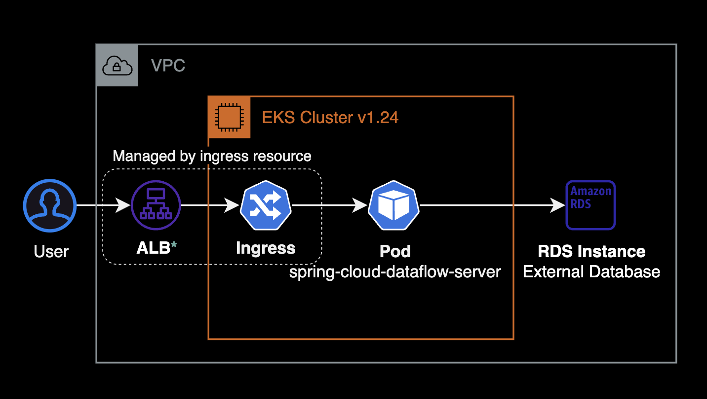
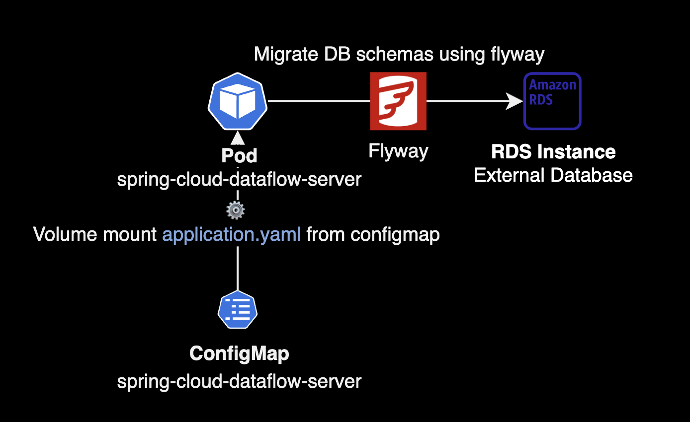
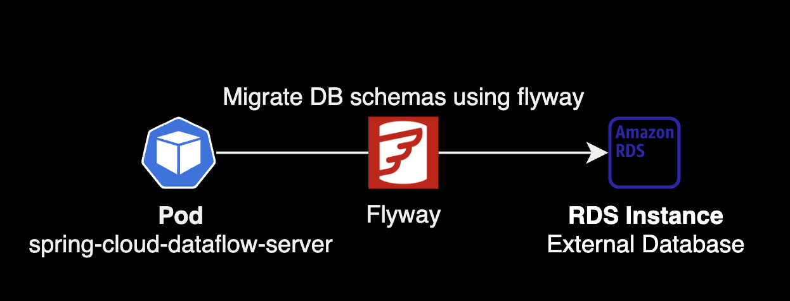
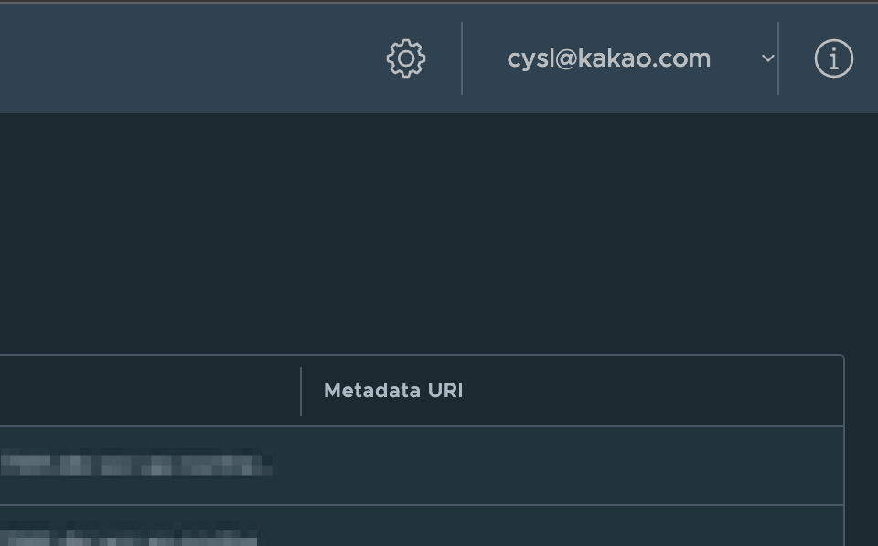



&nbsp;

## 개요

SCDF<sup>Spring Cloud Dataflow</sup>를 도입하고 운영하면서 쌓은 지식들을 정리한 페이지입니다.

쿠버네티스 클러스터에 SCDF를 설치하고 운영하는 DevOps Engineer를 대상으로 작성된 페이지입니다.

&nbsp;

## 배경지식

### Spring Cloud Data Flow

Spring Cloud Data Flow<sup>SCDF</sup>는 스트림 처리 및 Batch 작업을 위한 마이크로 서비스 기반의 데이터 플로우 관리 플랫폼입니다.

&nbsp;

### Task

Spring Cloud Data Flow에서 "Task"는 배치 작업을 나타내는 개념입니다. Task를 지원하는 플랫폼으로는 대표적으로 Kubernetes가 있습니다.


SCDF의 Task 실행은 Argo Workflows의 동작방식과 비슷합니다.

SCDF 사용자가 Kubernetes 환경에서 Task를 실행하게 되면 SCDF Deployer가 Task 실행을 위한 파드(Task pod)가 생성합니다.

이후 Task pod는 SCDF 사용자가 짜놓은 Workflow를 따라서 Batch 작업을 처리합니다. 작업이 종료되면 Task Pod는 자동으로 종료됩니다.

&nbsp;

## 환경

### EKS Cluster

- **EKS v1.24**
- **EC2 워커노드**
- **CPU 아키텍처** : AMD64 (x86_64)

&nbsp;

### Spring Cloud Data Flow

Spring Cloud Data Flow 서버는 Kubernetes에 헬름차트로 설치했습니다.

제 경우 SCDF에서 스트리밍 애플리케이션을 처리할 필요가 없어서 Skipper는 기본값 그대로 `enabled: false`로 꺼둔 상태입니다.



- **SCDF Version** : v2.11.0
  - [bitnami 공식 helm chart](https://github.com/bitnami/charts/tree/main/bitnami/spring-cloud-dataflow/)를 사용해서 설치했습니다.

기본적으로 SCDF Server는 In-memory DB인 H2를 사용하도록 설정되어 있습니다. 그러나 제 경우 별도로 RDS MySQL을 생성한 후 External Database로 사용했습니다.

> **External Database**  
> SCDF Server 전용으로 RDS와 같은 External Database를 사용하는 경우, DB 인프라 구성 작업이 추가로 필요합니다.

&nbsp;

## 가이드

### Flyway

`spring-cloud-dataflow-server` pod는 External Database에 스키마 자동 적용을 위해 Flyway를 내부적으로 사용합니다.

RDS MySQL과 같은 External Database에 DB Schema를 적용(Migrate)하고 싶은 경우 SCDF 헬름 차트에서 `flyway.enabled`를 `true` (기본값)로 설정합니다.

```yaml
# values.yaml
## Flyway Configuration
## @param flyway.enabled Enable/disable flyway running Dataflow and Skipper Database creation scripts on startup
## All database creation scripts are ignored on startup when flyway.enabled is set to false
## This feature can be used in scenario, where Database tables are already present in Mariadb or ExternalDatabase.
##
flyway:
  enabled: true
```

&nbsp;

헬름차트에서 Flyway를 활성화한 후, Spring Cloud Data Flow 헬름 차트를 `helm install` 하거나 `spring-cloud-dataflow-server` 파드를 재시작합니다.

SCDF Server의 `flyway` 설정은 ConfigMap을 통해 파드에 주입됩니다.

```bash
kubectl get configmap -l app.kubernetes.io/instance=spring-cloud-dataflow
```

```bash
NAME                            DATA   AGE
spring-cloud-dataflow-server    1      7s
spring-cloud-dataflow-skipper   1      7s
```

&nbsp;

`spring-cloud-dataflow-server` ConfigMap에서 `flyway` 적용 여부를 확인할 수 있습니다.

```bash
kubectl describe configmap spring-cloud-dataflow-server
```

```bash
...
Data
====
application.yaml:
----
spring:
  cloud:
    dataflow:
      ...
  flyway:
    enabled: true
...
```

&nbsp;

`spring-cloud-dataflow-server` ConfigMap은 쿠버네티스 플랫폼에 대한 상세 설정, 데이터 소스(External Database)에 대한 정보, Flyway 활성화 여부 등의 설정 정보를 보관하고 있습니다.



ConfigMap이 Pod에 적용되면서 Flyway 기능이 활성화됩니다.

&nbsp;

SCDF Server Pod가 생성되면서 초기화될 때 Flyway를 사용하여, 동작에 필요한 DB Schema를 External Database에 적용하게 됩니다.



DB Schema가 `V1`부터 `V9`까지 총 9개 있다면, Flyway는 External Database에 `V1`부터 순차적으로 적용합니다.

&nbsp;

`spring-cloud-dataflow-server` 파드가 생성될 때 로그를 보면 다음과 같은 정보를 확인할 수 있습니다.

- SCDF Server 파드가 External Database를 정상적으로 인식하고 연결되었는지 여부
- 현재 적용된 DB Schema 버전 (Flyway 관련)
- 새롭게 적용된 DB Schema 마이그레이션 진행사항과 결과

&nbsp;

다음은 SCDF Server 파드에서 Flyway 관련 로그 예시입니다.

```bash
kubectl get logs -f spring-cloud-dataflow-server-57575d5f4b-6jq7k
```

```bash
2023-09-28 05:02:16.026  INFO 1 --- [           main] o.f.c.i.database.base.BaseDatabaseType   : Database: jdbc:mariadb://scdf.dogecompany.com/dataflow (MySQL 5.7)
...
2023-09-28 05:02:16.103  INFO 1 --- [           main] o.f.core.internal.command.DbMigrate      : Current version of schema `dataflow`: 5
2023-09-28 05:02:16.109  INFO 1 --- [           main] o.f.core.internal.command.DbMigrate      : Migrating schema `dataflow` to version "6 - Boot3 Boot Version"
2023-09-28 05:02:16.299  INFO 1 --- [           main] o.f.core.internal.command.DbMigrate      : Migrating schema `dataflow` to version "7 - Boot3 Add Task3 Batch5 Schema"
2023-09-28 05:02:16.841  INFO 1 --- [           main] o.f.core.internal.command.DbMigrate      : Migrating schema `dataflow` to version "8 - RenameLowerCaseTables"
2023-09-28 05:02:16.935  INFO 1 --- [           main] o.f.core.internal.command.DbMigrate      : Migrating schema `dataflow` to version "9 - AddAggregateViews"
2023-09-28 05:02:17.038  INFO 1 --- [           main] o.f.core.internal.command.DbMigrate      : Successfully applied 4 migrations to schema `dataflow`, now at version v9 (execution time 00:00.941s)
...
```

기존 DB Schema 버전은 `v5`였으나, 새롭게 `v6`부터 `v9`까지 DB Schema 마이그레이션이 적용되었습니다. 현재 DB Schema 버전은 `v9`으로 Flyway의 모든 설정이 적용되었습니다.

Flyway에 의해 적용될 DB Migration Schema 전체 목록은 [SCDF Server Core 공식 코드](https://github.com/spring-cloud/spring-cloud-dataflow/tree/main/spring-cloud-dataflow-server-core/src/main/java/org/springframework/cloud/dataflow/server/db/migration/mysql)에서 확인할 수 있습니다.

&nbsp;

### Task Pod를 위한 공통 환경변수

SCDF Task에 의해 생성되는 모든 파드들에 특정 환경변수를 넣고 싶은 경우, SCDF 헬름 차트에서 `deployer.environemntVariables`에 선언합니다.

아래는 공통 환경변수의 설정 예시입니다.

```yaml
# values.yaml
## @section Deployer parameters

## Spring Cloud Deployer for Kubernetes parameters.
##
deployer:
  environmentVariables:
    - ENVIRONMENT_PROFILE=dev
    - JAVA_TOOL_OPTIONS=-Xmx1024m
```

위와 같이 설정된 경우 2개의 환경변수가 Task pod 생성시 자동으로 주입됩니다.

&nbsp;

Task pod 생성시 글로벌하게 주입되는 환경변수인 `environmentVariables`도 마찬가지로 ConfigMap에 의해 관리됩니다.

```bash
kubectl describe configmap spring-cloud-dataflow-server -n default
```

```bash
...
Data
====
application.yaml:
----
spring:
  cloud:
    dataflow:
      task:
        platform:
          kubernetes:
            accounts:
              default:
                environmentVariables:
                  - ENVIRONMENT_PROFILE=dev
                  - JAVA_TOOL_OPTIONS=-Xmx1024m
```

&nbsp;

### 이미지 가져오기 정책

Task 실행시 항상 최신 버전의 컨테이너 이미지를 가져오고 싶은 경우, 헬름 차트에서 `deployer.imagePullPolicy`를 `IfNotPresent`를 `Always`로 변경한 후 적용합니다.

```yaml
# values.yaml
## @section Deployer parameters

## Spring Cloud Deployer for Kubernetes parameters.
##
deployer:
  imagePullPolicy: Always
```

`imagePullPolicy`에 사용 가능한 값은 `IfNotPresent` (기본값), `Always`, `Never`이 있습니다.

&nbsp;

### Google OAuth 연동

SCDF는 기본 설치하면 전혀 로그인 방식 없이 URL로 바로 접근 가능한 상태입니다.

편하게 유저 관리 및 사용자가 로그인할 수 있도록 Google OAuth를 연동했습니다.

&nbsp;

SCDF Server의 ConfigMap에서는 다음과 같이 설정해주면 됩니다.

[Bitnami의 SCDF 차트](https://github.com/bitnami/charts/tree/main/bitnami/spring-cloud-dataflow)에서 OAuth 관련 설정의 경우 `values.yaml`로 제어할 수 없습니다. 따라서 SCDF Server의 ConfigMap 템플릿 파일에 직접 OAuth 관련 설정값을 넣어두는 방식을 채택했습니다.

아래는 로컬에 clone 받은 `spring-cloud-dataflow` 차트 내부 구조입니다.

```bash
$ tree spring-cloud-dataflow
spring-cloud-dataflow
├── Chart.lock
├── Chart.yaml
├── README.md
├── charts
│   ├── common-2.13.3.tgz
│   ├── kafka-26.3.0.tgz
│   ├── mariadb-14.1.0.tgz
│   └── rabbitmq-12.4.0.tgz
├── templates
│   ├── ...
│   ├── server
│   │   └── configmap.yaml   # 여기에 OAuth 연동 설정 추가
│   ├── serviceaccount.yaml
│   ├── skipper
│   │   └── ...
│   └── spc.yaml
├── values.schema.json
└── values.yaml
```

&nbsp;

GCP OAuth 연동에 성공한 SCDF Server의 ConfigMap의 설정 정보 예시입니다.

```bash
kubectl describe configmap spring-cloud-dataflow-server \
  -n <YOUR_NAMESPACE>
```

```yaml
Data
====
application.yaml:
----
spring:
  security:
    oauth2:
      client:
        registration:
          google:
            client-id: <REDACTED>.apps.googleusercontent.com
            client-secret: <REDACTED>-<REDACTED>
            scope:
            - profile
            - email
            redirect-uri: https://scdf.example.com/login/oauth2/code/google
            authorization-grant-type: authorization_code
        provider:
          google:
            user-info-uri: https://www.googleapis.com/oauth2/v3/userinfo
            user-name-attribute: email
  cloud:
    dataflow:
      security:
        authorization:
          provider-role-mappings:
            google:
              map-oauth-scopes: false
```

위 `application.yaml`의 설정들 중 `client-id`, `client-secret`, `redirect-uri` 값을 입력하려면 GCP에서 OAuth API 토큰을 생성해야 합니다.  
OAuth 생성 후에 발급된 값들을 ConfigMap 데이터에 입력하면 됩니다.

OAuth 연동은 SCDF 공식문서의 [Configuration examples](https://docs.spring.io/spring-cloud-dataflow/docs/current/reference/htmlsingle/#_configuration_examples)를 참고해서 진행했습니다.

&nbsp;

`user-name-attribute` 값에는 `email`, `name`을 사용할 수 있습니다.

| user-name-attribute | 로그인시 표시되는 값      |
|---------------------|----------------------|
| `email`             | `younsl@example.com` |
| `name`              | `이윤성` |

`user-name-attribute`를 설정하지 않은 경우, 로그인된 사용자의 우측 상단에 표시되는 자신의 이름이 고유한 숫자 고유넘버로 표시됩니다.

`user-name-attribute`을 `email`로 설정하게 되면 SCDF 웹 화면의 우측 상단에 다음과 같이 사용자의 이메일 정보가 표시됩니다.



&nbsp;

## 참고자료

[Spring Cloud Data Flow Reference Guide](https://docs.spring.io/spring-cloud-dataflow/docs/current/reference/htmlsingle/)  
SCDF 운영과 관리에 대한 전반적인 내용이 담긴 SCDF 공식문서입니다. 그렇게 문서가 친절한 편은 아닌게 아쉽습니다.
