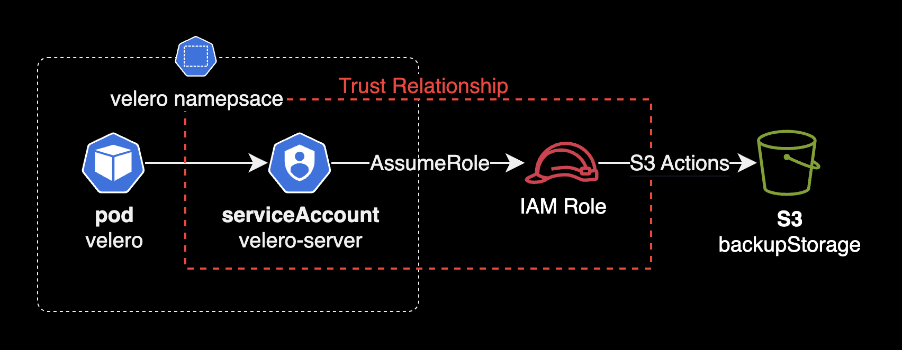
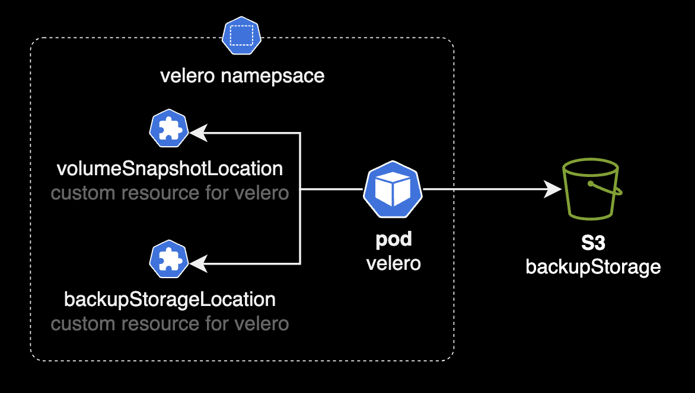



&nbsp;

## 개요

Velero 설치시 IAM Role for Service Accounts를 구성하는 방법을 정리한 가이드입니다.



Velero 시스템을 운영하는 DevOps Engineer, SRE를 대상으로 작성되었습니다.

&nbsp;

이 게시물이 게시되는 시점에는 service account에 대한 IRSA 또는 IAM 역할을 사용하여 Velero를 설정하는 방법에 대한 공식 문서가 없어서 직접 작성하게 되었습니다.

&nbsp;

## 배경지식

### Velero 설치 방식

Velero를 설치하는 방법에는 두 가지가 있습니다.

1. **velero CLI**: velero install 명령어를 사용해 Velero 파드와 관련 리소스를 쿠버네티스 클러스터에 설치하는 방식입니다.
2. **Helm 설치**: Velero Helm 차트를 사용해 설치하는 방식입니다.

이 시나리오에서는 [Helm 차트](https://github.com/vmware-tanzu/helm-charts)를 사용한 velero 설치 방법을 소개합니다.

&nbsp;

### 파드에 IAM 권한부여

- 쿠버네티스 환경에서 IRSA<sup>IAM Role for Service Account</sup>나 EKS Pod Identity를 사용하여 Pod 리소스에 IAM 권한을 부여하는 패턴은 일반적으로 권장하는 모범사례입니다.
- 최근에는 IRSA 대신 [EKS Pod Identity](https://docs.aws.amazon.com/ko_kr/eks/latest/userguide/pod-identities.html)를 사용하는 걸 권장하는 추세입니다.
- 최악의 안티패턴인 파드에 권한을 부여하기 위해 EC2 Worker node role에 직접 권한을 부여하는 행위는 절대하지 않도록 합니다.

&nbsp;

## 환경

- **EKS** v1.28 (EKS v1.30에서도 동일한 절차로 테스트 완료되었습니다.)
- **Velero** v1.14.0 (헬름차트로 배포됨)
  - **Velero 플러그인**: velero-plugin-for-aws:v1.10.0

&nbsp;

## IRSA 설정 가이드

### 환경변수 설정

로컬 환경에 환경변수를 설정합니다.

```bash
BUCKET_NAME=<YOUR_S3_BUCKET_NAME>
CLUSTER_NAME=<YOUR_CLUSTER_NAME>
OIDC_ENDPOINT="$(aws eks describe-cluster --name "${CLUSTER_NAME}" \
    --query "cluster.identity.oidc.issuer" --output text)"
AWS_ACCOUNT_ID=$(aws sts get-caller-identity --query 'Account' \
    --output text)
NAMESPACE=velero
```

OIDC Endpoint, Account ID, Namespace 정보가 담긴 환경변수들은 모두 IAM Role, IAM Policy 리소스를 생성할 때 사용됩니다.

&nbsp;

로컬 환경변수가 잘 설정되어 있는지 검증합니다.

```bash
echo $BUCKET_NAME $CLUSTER_NAME $OIDC_ENDPOINT $AWS_ACCOUNT_ID $NAMESPACE
```

&nbsp;

### IAM json 작성

2개의 IAM 설정파일을 생성합니다.

- `velero-policy.json` : IAM Policy의 설정이 담긴 파일입니다.
- `velero-trust-policy.json` : IAM Role의 Trust Relationship 설정이 담긴 파일입니다.

```bash
cat > velero-policy.json <<EOF
{
    "Version": "2012-10-17",
    "Statement": [
        {
            "Effect": "Allow",
            "Action": [
                "ec2:DescribeVolumes",
                "ec2:DescribeSnapshots",
                "ec2:CreateTags",
                "ec2:CreateVolume",
                "ec2:CreateSnapshot",
                "ec2:DeleteSnapshot"
            ],
            "Resource": "*"
        },
        {
            "Effect": "Allow",
            "Action": [
                "s3:GetObject",
                "s3:DeleteObject",
                "s3:PutObject",
                "s3:AbortMultipartUpload",
                "s3:ListMultipartUploadParts"
            ],
            "Resource": [
                "arn:aws:s3:::${BUCKET_NAME}/*"
            ]
        },
        {
            "Effect": "Allow",
            "Action": [
                "s3:ListBucket"
            ],
            "Resource": [
                "arn:aws:s3:::${BUCKET_NAME}"
            ]
        }
    ]
}
EOF
```

스냅샷 백업, 쿠버네티스 리소스 백업을 수행하기 위한 EBS, S3 권한들입니다.

&nbsp;

### IAM Role 생성

IAM Role을 생성합니다. 이 IAM Role을 velero-server 서비스 어카운트가 사용하게 됩니다.

먼저 `velero` 파드가 IRSA<sup>IAM Role for Service Account</sup>를 통해 IAM Role에 접근할 수 있게 신뢰관계부터 생성합니다.

```yaml
cat > velero-trust-policy.json <<EOF
{
  "Version": "2012-10-17",
  "Statement": [
    {
      "Sid": "IRSAforVeleroServerPod",
      "Effect": "Allow",
      "Principal": {
        "Federated": "arn:aws:iam::${AWS_ACCOUNT_ID}:oidc-provider/${OIDC_ENDPOINT#*//}"
      },
      "Action": "sts:AssumeRoleWithWebIdentity",
      "Condition": {
        "StringEquals": {
          "${OIDC_ENDPOINT#*//}:aud": "sts.amazonaws.com",
          "${OIDC_ENDPOINT#*//}:sub": "system:serviceaccount:${NAMESPACE}:velero-server"
        }
      }
    }
  ]
}
EOF
```

&nbsp;

IAM Role을 생성하고 이전 과정에서 작성한 신뢰관계를 적용합니다.

```bash
ROLE_NAME=${CLUSTER_NAME}-velero-server-irsa-role
aws iam create-role \
  --role-name ${ROLE_NAME} \
  --assume-role-policy-document file://./velero-trust-policy.json
```

&nbsp;

`aws iam create-role` 명령어를 실행 결과가 다음과 같이 출력되면 IAM Role이 정상적으로 생성되었다고 판단할 수 있습니다.

```bash
{
    "Role": {
        "Path": "/",
        "RoleName": "<YOUR_CLUSTER_NAME>-velero-server-irsa-role",
        "RoleId": "ARO...REDACTED...LSP",
        "Arn": "arn:aws:iam::<AWS_ACCOUNT_ID>:role/<YOUR_CLUSTER_NAME>-velero-server-irsa-role",
        "CreateDate": "2024-07-29T02:43:44+00:00",
        "AssumeRolePolicyDocument": {
            "Version": "2012-10-17",
            "Statement": [
                {
                    "Sid": "IRSAforVeleroServerPod",
                    "Effect": "Allow",
                    "Principal": {
                        "Federated": "arn:aws:iam::<AWS_ACCOUNT_ID>:oidc-provider/oidc.eks.ap-northeast-2.amazonaws.com/id/<OIDC_ENDPOINT>"
                    },
                    "Action": "sts:AssumeRoleWithWebIdentity",
                    "Condition": {
                        "StringEquals": {
                            "oidc.eks.ap-northeast-2.amazonaws.com/id/<OIDC_ENDPOINT>:aud": "sts.amazonaws.com",
                            "oidc.eks.ap-northeast-2.amazonaws.com/id/<OIDC_ENDPOINT>:sub": "system:serviceaccount:velero:velero-server"
                        }
                    }
                }
            ]
        }
    }
}
```

&nbsp;

Customer inline policy를 IAM Role에 붙입니다.

```bash
aws iam put-role-policy \
  --role-name "${ROLE_NAME}" \
  --policy-name "${CLUSTER_NAME}-velero-server-s3-backup-irsa-policy" \
  --policy-document file://./velero-policy.json
```

&nbsp;

### velero 헬름 차트 설정

IRSA를 사용하려면 [velero의 AWS 플러그인](https://github.com/vmware-tanzu/velero-plugin-for-aws)<sup>velero-plugin-for-aws</sup>을 사용해야 합니다. Velero에서 이러한 플러그인들은 initContainers 형태로 적용, 관리됩니다.

```yaml
# charts/velero/values.yaml
# Init containers to add to the Velero deployment's pod spec. At least one plugin provider image is required.
# If the value is a string then it is evaluated as a template.
initContainers:
  # - name: velero-plugin-for-aws
  #   image: velero/velero-plugin-for-aws:v1.10.0
  #   imagePullPolicy: IfNotPresent
  #   volumeMounts:
  #     - mountPath: /target
  #       name: plugins
```

&nbsp;

아래와 같이 `initContainers`에 AWS plugin을 새롭게 추가합니다.

```yaml
# charts/velero/values.yaml
initContainers:
  - name: velero-plugin-for-aws
    image: velero/velero-plugin-for-aws:v1.10.0
    imagePullPolicy: IfNotPresent
    volumeMounts:
      - mountPath: /target
        name: plugins
```

`serviceAccount`에 다음과 같이 eks.amazonaws.com/role-arn Annotation을 추가합니다.

```yaml
# charts/velero/values.yaml
serviceAccount:
  server:
    create: true
    name:
    annotations:
      eks.amazonaws.com/role-arn: arn:aws:iam::<AWS_ACCOUNT_ID>:role/<YOUR_CLUSTER_NAME>-velero-server-irsa-role
    labels:
    imagePullSecrets: []
```

&nbsp;

`credentials.useSecret`을 `true`에서 `false`로 변경해서, IAM Key가 아닌 IRSA를 assumeRole 해서 S3 버킷에 접근하도록 차트 설정을 변경합니다.

```diff
# charts/velero/values.yaml
credentials:
  # Whether a secret should be used. Set to false if, for examples:
  # - using kube2iam or kiam to provide AWS IAM credentials instead of providing the key file. (AWS only)
  # - using workload identity instead of providing the key file. (Azure/GCP only)
- useSecret: true
+ useSecret: false
```

&nbsp;

velero 헬름 차트에서 사용하는 쿠버네티스 커스텀 리소스인 `backupStorageLocation`, `volumeSnapshotLocation`을 설정합니다.

- `bucket`에는 자신이 백업 저장소로 사용할 S3 버킷 이름을 선언해주세요.
- `region`에는 S3 버킷이 위치한 리전을 선언합니다. 이 시나리오에서는 서울 리전을 사용합니다. 

```yaml
# charts/velero/values.yaml
configuration:
  # Parameters for the BackupStorageLocation(s). Configure multiple by adding other element(s) to the backupStorageLocation slice.
  # See https://velero.io/docs/v1.6/api-types/backupstoragelocation/
  backupStorageLocation:
    # name is the name of the backup storage location where backups should be stored. If a name is not provided,
    # a backup storage location will be created with the name "default". Optional.
  - name: velero-s3-bsl
    # provider is the name for the backup storage location provider.
    provider: velero.io/aws
    # bucket is the name of the bucket to store backups in. Required.
    bucket: <YOUR_BUCKET_NAME>
    # caCert defines a base64 encoded CA bundle to use when verifying TLS connections to the provider. Optional.
    caCert:
    # prefix is the directory under which all Velero data should be stored within the bucket. Optional.
    prefix:
    # default indicates this location is the default backup storage location. Optional.
    default: true
    # validationFrequency defines how frequently Velero should validate the object storage. Optional.
    validationFrequency:
    # accessMode determines if velero can write to this backup storage location. Optional.
    # default to ReadWrite, ReadOnly is used during migrations and restores.
    accessMode: ReadWrite
    credential:
      # name of the secret used by this backupStorageLocation.
      name:
      # name of key that contains the secret data to be used.
      key:
    # Additional provider-specific configuration. See link above
    # for details of required/optional fields for your provider.
    config:
      region: ap-northeast-2
    #  s3ForcePathStyle:
    #  s3Url:
    #  kmsKeyId:
    #  resourceGroup:
    #  The ID of the subscription containing the storage account, if different from the cluster’s subscription. (Azure only)
    #  subscriptionId:
    #  storageAccount:
    #  publicUrl:
    #  Name of the GCP service account to use for this backup storage location. Specify the
    #  service account here if you want to use workload identity instead of providing the key file.(GCP only)
    #  serviceAccount:
    #  Option to skip certificate validation or not if insecureSkipTLSVerify is set to be true, the client side should set the
    #  flag. For Velero client Command like velero backup describe, velero backup logs needs to add the flag --insecure-skip-tls-verify
    #  insecureSkipTLSVerify:

    # annotations allows adding arbitrary annotations to this BackupStorageLocation resource. Optional.
    annotations: {}

  # Parameters for the VolumeSnapshotLocation(s). Configure multiple by adding other element(s) to the volumeSnapshotLocation slice.
  # See https://velero.io/docs/v1.6/api-types/volumesnapshotlocation/
  volumeSnapshotLocation:
    # name is the name of the volume snapshot location where snapshots are being taken. Required.
  - name: velero-s3-dsl
    # provider is the name for the volume snapshot provider.
    provider: velero.io/aws
    credential:
      # name of the secret used by this volumeSnapshotLocation.
      name:
      # name of key that contains the secret data to be used.
      key:
    # Additional provider-specific configuration. See link above
    # for details of required/optional fields for your provider.
    config:
      region: ap-northeast-2
  #    region:
  #    apiTimeout:
  #    resourceGroup:
  #    The ID of the subscription where volume snapshots should be stored, if different from the cluster’s subscription. If specified, also requires `configuration.volumeSnapshotLocation.config.resourceGroup`to be set. (Azure only)
  #    subscriptionId:
  #    incremental:
  #    snapshotLocation:
  #    project:
```

&nbsp;

이후 새로운 설정을 적용하기 위해 velero 차트를 업그레이드합니다. 아래 명령어는 최초 설치 시에도 사용할 수 있습니다. `helm upgrade --install` 명령어는 차트가 설치되어 있지 않을 경우 새로운 설치를 진행하며, 이미 설치되어 있는 경우에는 차트를 업그레이드합니다. 따라서 초기 설치와 차트 업그레이드를 동일한 명령어로 처리할 수 있습니다.

```bash
helm upgrade \
  --install \
  --namespace velero \
  --create-namespace \
  velero . \
  --values <your-values-file.yaml> \
  --wait
```

&nbsp;

`velero-server`라는 이름의 serviceAccount가 새로 생성됩니다. velero 파드는 `velero-server` serviceAccount 리소스를 통해 IAM Role에 연결됩니다.

```bash
kubectl get serviceaccount velero-server -n velero -o yaml
```

```yaml
apiVersion: v1
kind: ServiceAccount
metadata:
  annotations:
    eks.amazonaws.com/role-arn: arn:aws:iam::<REDACTED>:role/<REDACTED>
  labels:
    app.kubernetes.io/instance: velero
    app.kubernetes.io/managed-by: Helm
    app.kubernetes.io/name: velero
    argocd.argoproj.io/instance: velero
    helm.sh/chart: velero-7.1.3
  name: velero-server
  namespace: velero
```

&nbsp;

### S3 연결상태 확인

Velero 서버는 백업 스토리지로 S3를 사용합니다. 이 때 `backupStorageLocation`<sup>bsl</sup> 리소스를 사용해서 S3에 연결됩니다.



bsl의 Phase가 Available로 변경되면 정상적으로 S3로부터 백업, 복구를 수행할 수 있게 연결된 상태라는 의미입니다.

```bash
# In short `kubectl get bsl -n velero`
$ kubectl get backupstoragelocation -n velero
NAME            PHASE       LAST VALIDATED   AGE   DEFAULT
velero-s3-bsl   Available   54s              23d   true
```

&nbsp;

velero 파드가 IAM Role for Service Account 구성에서 정상적으로 백업을 하는지 테스트하기 위해, 테스트 백업을 수행합니다.

```bash
$ velero backup-location get
NAME            PROVIDER        BUCKET/PREFIX            PHASE       LAST VALIDATED                  ACCESS MODE   DEFAULT
velero-s3-bsl   velero.io/aws   velero-backup-s3   Available   2024-08-27 09:34:02 +0900 KST   ReadWrite     true
```

```bash
$ velero create backup test-backup
Backup request "test-backup" submitted successfully.
Run `velero backup describe test-backup` or `velero backup logs test-backup` for more details
```

```bash
$ velero backup get
NAME          STATUS      ERRORS   WARNINGS   CREATED                         EXPIRES   STORAGE LOCATION   SELECTOR
test-backup   Completed   0        0          2024-08-27 09:33:16 +0900 KST   29d       velero-s3-bsl      <none>
```

잠시 기다리면 백업 상태가 완료<sup>Completed</sup>로 바뀝니다.

&nbsp;

이후 `backup` 리소스를 삭제합니다. `backup` 리소스를 삭제하면 S3에 저장된 데이터와 PV를 백업해서 생성된 EBS Snapshot이 모두 삭제됩니다.

```bash
velero delete backup test-backup
```

&nbsp;

이제 Access Key를 직접 Velero 차트에 넣는 대신, IAM Role for Service Account 방식을 사용해서 좀 더 안전한 파드 권한을 구성했습니다.

&nbsp;

## 관련자료

**Velero**  
[How to Setup Velero Backups On EKS Using IAM Roles for Service Accounts (IRSA)](https://cloudcasa.io/blog/how-to-setup-velero-backups-on-eks-using-iam-roles-for-service-accounts-irsa/)

**IRSA**  
[IAM roles for service accounts](https://docs.aws.amazon.com/eks/latest/userguide/iam-roles-for-service-accounts.html)

**EKS Pod Identity**  
[Amazon EKS Pod Identity, Amazon EKS 클러스터앱의 IAM 권한 단순화](https://aws.amazon.com/ko/blogs/korea/amazon-eks-pod-identity-simplifies-iam-permissions-for-applications-on-amazon-eks-clusters/)  
[EKS Pod Identity](https://docs.aws.amazon.com/ko_kr/eks/latest/userguide/pod-identities.html)
