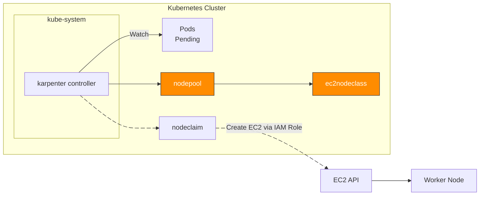
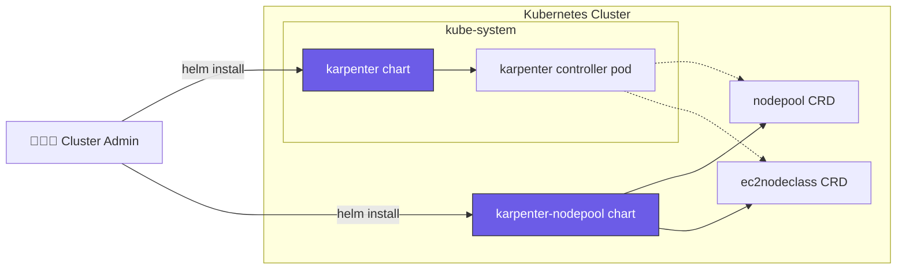
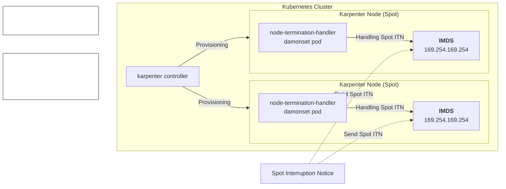
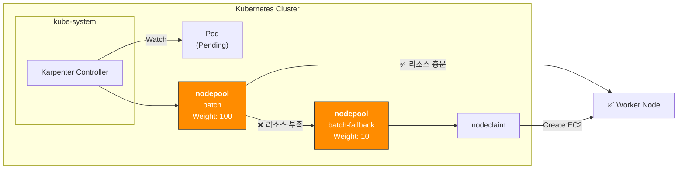
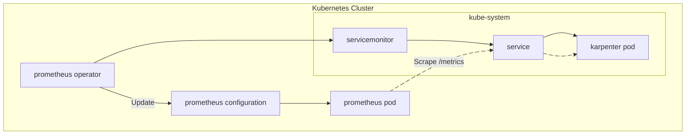

## 개요

컴퓨팅 비용 절감의 가장 확실한 방법은 적절한 리소스 최적화(right-sizing)와 스팟 인스턴스 활용입니다.

Karpenter와 Karpenter의 [Fallback 기능](https://karpenter.sh/docs/concepts/scheduling/#fallback)을 사용하면 스팟 인스턴스를 중단 없이 사용할 수 있습니다.

&nbsp;

## 환경

헬름 차트:

- **Karpenter** 1.5.0
- **Node Termination Handler** 1.25.0
  - NTH 동작 모드는 IMDS(Instance Metadata Service) 모드로 설정했으며, 데몬셋으로 배포됨

&nbsp;

## 설정 가이드

### 노드 프로비저닝

Karpenter가 노드 프로비저닝하는 과정의 트리거는 Pending 상태의 파드가 있는 시점



&nbsp;

### Karpenter 헬름차트 구조

Karpenter 설치는 [공식 헬름 차트](https://github.com/aws/karpenter-provider-aws/tree/main/charts)로 쉽게 진행할 수 있습니다.



Karpenter의 커스텀 리소스를 담고있는 [karpenter-nodepool 차트](https://github.com/younsl/blog/tree/main/content/charts/karpenter-nodepool)는 공식 제공되는 차트가 아니라 직접 개발해서 운영중입니다.

&nbsp;

헬름차트로 Karpenter를 관리하는 이유는 복잡한 Kubernetes 리소스들을 템플릿화하여 환경별 설정값(dev/stage/prod)을 values.yaml 파일로 분리 관리할 수 있고, 차트 버전 기반의 원자적 배포와 즉시 롤백이 가능하기 때문입니다. 특히 Karpenter는 NodePool, EC2NodeClass 등 여러 CRD와 RBAC 설정이 복합적으로 연결되어 있어 헬름의 의존성 관리와 훅(hook) 기능을 활용하면 배포 순서 제어와 설정 일관성을 보장할 수 있으며, GitOps 워크플로우와 결합하여 인프라 변경사항을 코드로 추적하고 검토할 수 있어 운영 안정성이 크게 향상됩니다.

&nbsp;

### 스팟 중단 핸들링 방법

Karpenter가 스팟 중단신호(Spot Interruption Notice)를 안전하게 처리하는 핸들링 방식은 크게 2가지입니다.

1. Karpenter + Node Termination Handler
2. EventBridge Rules + SQS + Karpenter

Karpenter 공식문서의 [FAQ 페이지](https://karpenter.sh/docs/faq/#interruption-handling)에서는 SQS를 사용하는 방식을 권장하고 있지만, NTH를 사용하는 방식이 운영 편의성이 더 좋습니다.

&nbsp;

Karpenter가 노드 프로비저닝하며 NTH(Node Termination Handler)가 Spot 중단신호 감지 및 파드 Eviction 담당



1: https://karpenter.sh/docs/faq/#interruption-handling

&nbsp;

### Spot Nodepool Fallback

[Fallback](https://karpenter.sh/docs/concepts/scheduling/#fallback) 기능을 사용하여 [가중치(Weight)](https://karpenter.sh/docs/concepts/scheduling/#weighted-nodepools) 기반 spot, on-demand 노드풀 선정

#### 노드풀의 가중치(Weight) 설정

nodepool 리소스에 `spec.weight` 필드를 사용하여 가중치(Weight)를 설정하면 됩니다.

```yaml
apiVersion: karpenter.sh/v1
kind: NodePool
metadata:
  name: batch
spec:
  template:
    spec:
      requirements:
      - key: karpenter.sh/capacity-type
        operator: In
        values:
        - spot
  weight: 100 # Set 10 for fallback on-demand nodepool
```

Karpenter는 같은 할당 조건을 가진 노드풀 중에서 가중치가 높은 노드풀을 우선 선택합니다. 높은 가중치의 노드에 할당이 실패하면 가중치가 낮은 노드에 할당을 시도합니다.

&nbsp;

시스템 아키텍처:



노드 프로비저닝 과정이 시작되면 Karpenter Controller는 노드풀의 가중치(Weight)를 참고하여 가중치가 높은 스팟 노드풀을 우선 선택합니다. 만약 스팟 노드풀의 리소스가 부족하면 Fallback 노드풀이 선택됩니다.

&nbsp;

AWS Summit Seoul 2025에서 샌드버드가 발표한 'Amazon EKS 기반 클라우드 최적화와 생성형 AI 혁신 전략' 세션에서 많은 부분을 참고했습니다.

&nbsp;

### 메트릭 수집 설정

Karpenter는 노드풀 및 클러스터 수준의 거시적인 메트릭을 제공합니다.

[prometheus-operator](https://github.com/prometheus-operator/prometheus-operator)를 사용하는 경우, 서비스 모니터링을 위해 노드풀 레벨의 메트릭을 수집하기 위해 servicemontior 리소스 생성합니다.

아래는 Karpenter 헬름 차트의 설정 예시입니다.

```yaml
# charts/karpenter/values_your.yaml
serviceMonitor:
  # -- Specifies whether a ServiceMonitor should be created.
  enabled: true
```

&nbsp;

메트릭 수집 과정



Prometheus Server가 Karpenter 서비스의 `/metrics` 엔드포인트에 접근하여 메트릭을 수집합니다.

&nbsp;

### Grafana 대시보드

Grafana 대시보드 [ID 20398](https://grafana.com/grafana/dashboards/20398-karpenter/)를 통해 노드풀, 스팟 현황 및 비중, 노드 레벨의 리소스 사용률을 확인할 수 있습니다.


&nbsp;

## TLDR

Karpenter를 써본 결과 72시간 동안 전체 클러스터의 40~50% 스팟 노드를 문제 없이 운영할 수 있었습니다.

아래는 kubectl 명령어로 스팟 노드 목록을 조회한 예시입니다.

```bash
# Retrieve all spot nodes provisioned by karpenter
$ kubectl get node -l karpenter.sh/capacity-type=spot
NAME                                               STATUS   ROLES    AGE     VERSION
ip-10-xxx-xx-xxx.ap-northeast-2.compute.internal   Ready    <none>   2d22h   v1.32.3-eks-473151a
ip-10-xxx-xx-xxx.ap-northeast-2.compute.internal   Ready    <none>   42h     v1.32.3-eks-473151a
ip-10-xxx-xx-xx.ap-northeast-2.compute.internal    Ready    <none>   37h     v1.32.3-eks-473151a
ip-10-xxx-xx-xx.ap-northeast-2.compute.internal    Ready    <none>   25h     v1.32.3-eks-473151a
ip-10-xxx-xx-xx.ap-northeast-2.compute.internal    Ready    <none>   25h     v1.32.3-eks-473151a
```