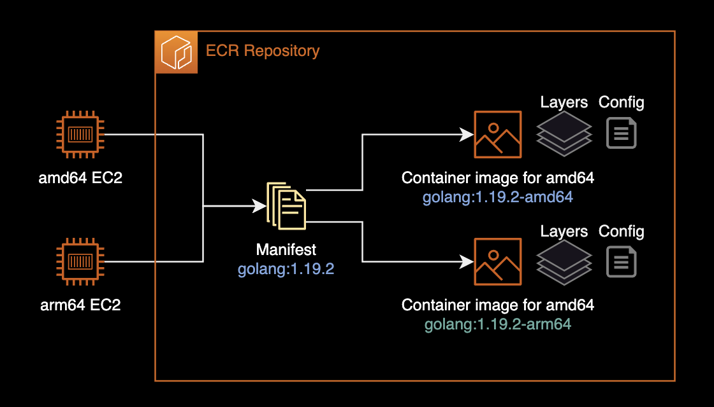
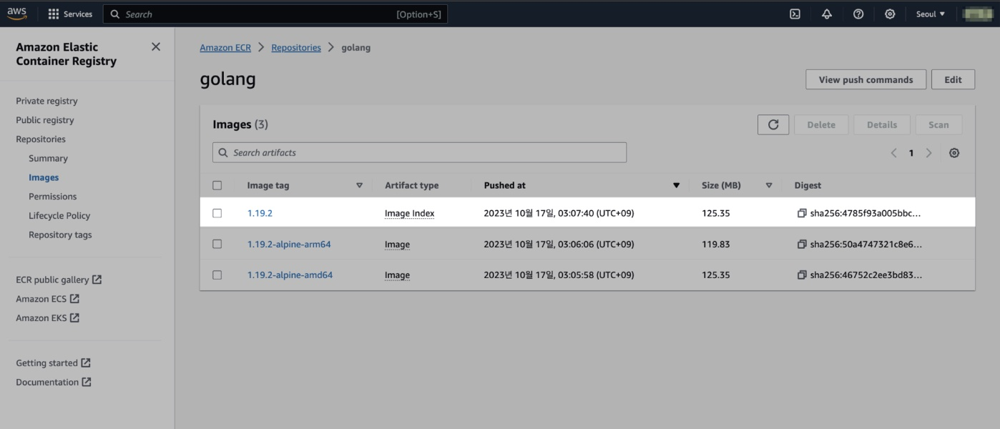



&nbsp;

## 개요

도커허브처럼 ECR Repository도 이미지의 멀티 아키텍처를 지원합니다.

Amazon ECR의 멀티 아키텍처 이미지 지원을 통해 이제 동일한 소스의 여러 아키텍처 또는 운영 체제를 지원하는 다양한 이미지를 쉽게 구축하고 동일한 추상 매니페스트 이름으로 모두 참조할 수 있습니다.

&nbsp;

## 배경지식

### 멀티 아키텍처 이미지 저장소

컨테이너 이미지는 **레이어**와 **매니페스트**라는 두 가지 주요 부분으로 구성됩니다.

도커 허브에서 이미지를 받아올 때 기본적으로 CPU 아키텍처가 arm64인지, amd64인지에 따라 동일한 버전의 다른 아키텍처를 가진 컨테이너 이미지를 가져오도록 동작합니다.
이를 멀티 아키텍처 이미지라고 합니다.

&nbsp;

Manifest 목록(또는 이미지 인덱스)을 사용하면 다른 이미지 Manifest를 중첩하여 하나로 묶을 수 있습니다. 여기서 포함된 각 이미지는 CPU 아키텍처, 운영 체제 및 기타 플랫폼 속성에 따라 지정됩니다.

이를 통해 플랫폼별 컨테이너 이미지를 포함하는 이미지 저장소를 보다 추상적인 이름으로 사용자에게 제공할 수 있습니다. 예를 들어 다음과 같습니다.

```bash
111122223333.dkr.ecr.ap-northeast-2.amazonaws.com/golang:1.21.2
```

참고로 manifest list 구성은 ECR 사용을 위한 필수 요구사항은 아니며 관리자의 필요에 따라 구성할지 말지를 결정하면 됩니다.

&nbsp;



위와 같이 Repository에는 Manifest List와 Image가 존재합니다. 여기서 멀티 아키텍처, 즉 CPU 아키텍처에 따라 동일한 버전의 다른 이미지를 구분해주는 역할을 하는 일종의 전화번호부가 Manifest List입니다.

&nbsp;

두 플랫폼의 이미지 매니페스트를 가리키는 간단한 Manifest 목록을 보여주는 예시입니다. Manifest는 json 형태로 작성됩니다.

```json
{
  "schemaVersion": 2,
  "mediaType": "application/vnd.docker.distribution.manifest.list.v2+json",
  "manifests": [
    {
      "mediaType": "application/vnd.docker.distribution.manifest.v2+json",
      "size": 7143,
      "digest": "sha256:e692418e4cbaf90ca69d05a66403747baa33ee08806650b51fab815ad7fc331f",
      "platform": {
        "architecture": "ppc64le",
        "os": "linux",
      }
    },
    {
      "mediaType": "application/vnd.docker.distribution.manifest.v2+json",
      "size": 7682,
      "digest": "sha256:5b0bcabd1ed22e9fb1310cf6c2dec7cdef19f0ad69efa1f392e94a4333501270",
      "platform": {
        "architecture": "amd64",
        "os": "linux",
        "features": [
          "sse4"
        ]
      }
    }
  ]
}
```

정리하자면 2017년 9월 12일 기준으로 이러한 여러 아키텍처 이미지들은 ["manifest lists"](https://docs.docker.com/registry/spec/manifest-v2-2/#manifest-list)(OCI 이미지 Spec에서는 [Index](https://github.com/opencontainers/image-spec/blob/v1.0.0/image-index.md)라고도 함)을 통해 별도의 `-arm64` `-amd64`와 같이 태그 끝에 CPU 아키텍처 문자열을 붙이지 않더라도 동일한 태그로 여러 플랫폼 이미지 버전을 제공할 수 있습니다.

&nbsp;

## 환경

### 로컬 환경

- **OS** : macOS Ventura 13.6 (M1 Pro Max)
- **Docker Client** : Docker Desktop 24.0.6
- **AWS CLI** : aws-cli/2.13.26

&nbsp;

## 멀티 아키텍처 ECR 만들기

이 시나리오에서는 arm64와 amd64 버전 공식 golang 이미지를 하나의 매니페스트로 묶는 걸 진행합니다.
이를 통해 arm64 서버와 amd64 서버 모두 복잡하게 이미지 태그 끝에 `-amd64`, `-arm64` 키워드를 지정할 필요 없이 단순히 `golang:1.19.2`로도 여러 플랫폼 버전의 이미지를 받을 수 있게 됩니다.

&nbsp;

### ECR 로그인

사용자는 일반적으로 Access Key 기반의 AWS IAM User 또는 IAM Role을 사용해서 ECR Repository에 로그인하게 됩니다.


ECR에 로그인합니다. 로그인 후 발급되는 인증 토큰은 사용되는 레지스트리마다 필요하며, 12시간 동안 유효합니다. 자세한 정보는 AWS 공식문서 [프라이빗 레지스트리 인증](https://docs.aws.amazon.com/ko_kr/AmazonECR/latest/userguide/registry_auth.html)을 참조하세요.

```bash
export AWS_PROFILE=test
aws ecr get-login-password --region ap-northeast-2 | docker login --username AWS --password-stdin 111122223333.dkr.ecr.ap-northeast-2.amazonaws.com
```

```bash
Login Succeeded
```

이 시나리오에서는 `111122223333` Account ID와 `ap-northeast-2` 서울 리전에 위치한 ECR을 작업 대상으로 가정합니다.

&nbsp;

### 멀티 플랫폼 이미지 업로드

`amd64`와 `arm64` 버전의 golang-1.19.2 이미지를 로컬에 받은 후, 태그를 변경하여 golang 제공을 위한 ECR로 올립니다.

```bash
docker pull golang:1.19.2-alpine --platform linux/amd64
docker tag golang:1.19.2-alpine 111122223333.dkr.ecr.ap-northeast-2.amazonaws.com/golang:1.19.2-alpine-amd64

docker pull golang:1.19.2-alpine --platform linux/arm64
docker tag golang:1.19.2-alpine 111122223333.dkr.ecr.ap-northeast-2.amazonaws.com/golang:1.19.2-alpine-arm64
```

```bash
$ docker push 111122223333.dkr.ecr.ap-northeast-2.amazonaws.com/golang:1.19.2-alpine-amd64
The push refers to repository [111122223333.dkr.ecr.ap-northeast-2.amazonaws.com/golang]
905865d72e45: Layer already exists
...
994393dc58e7: Layer already exists
1.19.2-alpine-amd64: digest: sha256:46752c2ee3bd8388608e41362964c84f7a6dffe99d86faeddc82d917740c5968 size: 1365
```

```bash
$ docker push 111122223333.dkr.ecr.ap-northeast-2.amazonaws.com/golang:1.19.2-alpine-arm64
The push refers to repository [111122223333.dkr.ecr.ap-northeast-2.amazonaws.com/golang]
1195e8734a62: Pushed
...
5d3e392a13a0: Pushed
1.19.2-alpine-arm64: digest: sha256:50a4747321c8e606fda821c7ca4280b6e19bc1558fbce37a1d510007c290b130 size: 1365
```

2개의 golang 이미지는 `v1.19.2`로 버전은 동일하지만 지원하는 CPU 아키텍처가 다릅니다.

&nbsp;

이 2개의 이미지를 하나의 동일 태그로 묶기 위해 manifest를 생성합니다. `manifest`도 컨테이너 이미지를 생성할 때와 마찬가지로 뒤에 태그가 붙습니다.

```bash
docker manifest create \
  111122223333.dkr.ecr.ap-northeast-2.amazonaws.com/golang \
  111122223333.dkr.ecr.ap-northeast-2.amazonaws.com/golang:1.19.2-alpine-arm64 \
  111122223333.dkr.ecr.ap-northeast-2.amazonaws.com/golang:1.19.2-alpine-amd64
```

```bash
Created manifest list 111122223333.dkr.ecr.ap-northeast-2.amazonaws.com/golang:latest
```

container image와 동일하게 manifest도 만들 때 태그를 선언하지 않으면 `latest` 태그가 붙습니다.

&nbsp;

이 시나리오에서는 `golang:1.19.2-arm64`와 `golang:1.19.2-amd64` 2개의 CPU 아키텍처별 이미지를 하나로 통합해 사용자에게 제공하려고 합니다.

다음과 같이 CPU 아키텍처를 제외한 태그로 manifest를 로컬에 생성합니다.

> **Note**  
> `manifest create` 명령은 참조된 이미지가 **이미 ECR 리포지토리에 있는지 확인**하고 로컬로 매니페스트를 생성합니다. 따라서 대상 ECR Repository에 관련 이미지들이 올라가 있어야 명령어가 정상 실행됩니다.

```bash
docker manifest create 111122223333.dkr.ecr.ap-northeast-2.amazonaws.com/golang:1.19.2 \
  111122223333.dkr.ecr.ap-northeast-2.amazonaws.com/golang:1.19.2-alpine-arm64 \
  111122223333.dkr.ecr.ap-northeast-2.amazonaws.com/golang:1.19.2-alpine-amd64
```

```bash
Created manifest list 111122223333.dkr.ecr.ap-northeast-2.amazonaws.com/golang:1.19.2
```

명령어를 실행하면 `1.19.2` 태그를 가진 `golang` manifest가 로컬에 생성됩니다.

&nbsp;

이제 로컬에 생성된 manifest의 정보를 확인합니다.

```bash
docker manifest inspect 111122223333.dkr.ecr.ap-northeast-2.amazonaws.com/golang:1.19.2
```

```json
{
   "schemaVersion": 2,
   "mediaType": "application/vnd.docker.distribution.manifest.list.v2+json",
   "manifests": [
      {
         "mediaType": "application/vnd.docker.distribution.manifest.v2+json",
         "size": 1365,
         "digest": "sha256:46752c2ee3bd8388608e41362964c84f7a6dffe99d86faeddc82d917740c5968",
         "platform": {
            "architecture": "amd64",
            "os": "linux"
         }
      },
      {
         "mediaType": "application/vnd.docker.distribution.manifest.v2+json",
         "size": 1365,
         "digest": "sha256:50a4747321c8e606fda821c7ca4280b6e19bc1558fbce37a1d510007c290b130",
         "platform": {
            "architecture": "arm64",
            "os": "linux",
            "variant": "v8"
         }
      }
   ]
}
```

manifest에는 운영체제, CPU 아키텍처 정보에 따라 어느 Image digest를 바라볼 것인지에 대한 정보가 들어있는 걸 확인할 수 있습니다.

&nbsp;

이제 ECR Repository에 Manifest를 push 합니다.

```bash
docker manifest push 111122223333.dkr.ecr.ap-northeast-2.amazonaws.com/golang:1.19.2
```

```bash
sha256:4785f93a005bbca8f24b174b68eabce38ab8664d3286cdf9464529cedc616ce7
```



이후 AWS Management Console에서 ECR로 이동합니다. 위와 같이 Manifest의 경우는 Artifact type이 Image Index로 표시되는 걸 확인할 수 있습니다.

&nbsp;

### 테스트

manifest가 제대로 정상 동작하는지(CPU 아키텍처, OS에 따라 이미지를 맞게 구분해주는지) 테스트하기 위해 로컬에서 이미지를 정리한 후 다시 이미지를 다운로드 받아봅니다.

```bash
docker pull 111122223333.dkr.ecr.ap-northeast-2.amazonaws.com/golang:1.19.2
```

```bash
$ docker images
REPOSITORY                                                 TAG       IMAGE ID       CREATED         SIZE
111122223333.dkr.ecr.ap-northeast-2.amazonaws.com/golang   1.19.2    bfff29ce9795   11 months ago   348MB
```

또는 ECR에 접근이 가능한 amd64 or arm64 서버에서 테스트를 진행하셔도 무관합니다.

&nbsp;

현재 제 로컬 맥북은 M1 기반의 `arm64` 아키텍처입니다.

```bash
$ arch
arm64
```

&nbsp;

manifest에 의해 amd64와 arm64 이미지 중에 arm64 이미지를 로컬로 받아온 걸 확인할 수 있습니다.

```bash
docker inspect 111122223333.dkr.ecr.ap-northeast-2.amazonaws.com/golang:1.19.2 --format='{{.Architecture}}'
```

```bash
arm64
```

manifest에 의해 이미지를 요청한 대상 OS, Architecture에 맞는 이미지를 자동으로 받아온 걸 확인할 수 있습니다.

&nbsp;

## 참고자료

[다중 아키텍처 이미지 푸시](https://docs.aws.amazon.com/ko_kr/AmazonECR/latest/userguide/docker-push-multi-architecture-image.html)  
AWS 공식문서

[Introducing multi-architecture container images for Amazon ECR](https://aws.amazon.com/ko/blogs/containers/introducing-multi-architecture-container-images-for-amazon-ecr/)  
AWS Blog (영문)

[프라이빗 레지스트리 인증](https://docs.aws.amazon.com/ko_kr/AmazonECR/latest/userguide/registry_auth.html)  
AWS 공식문서
