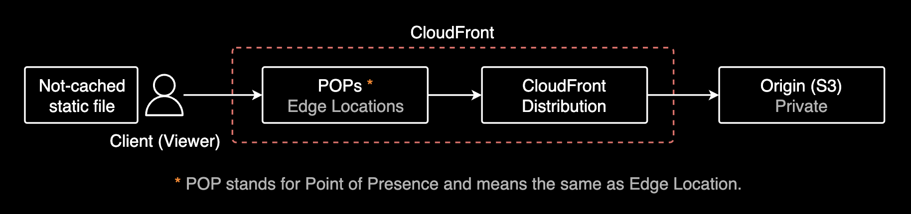
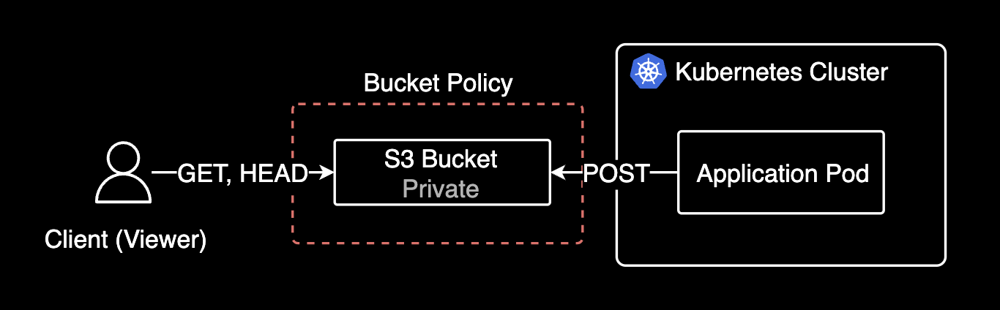

## 개요

S3에 저장된 JSON 파일들을 CloudFront를 통해 캐싱 없이 서빙하는 구성을 다룹니다. 백엔드는 S3에 Write 권한을, 클라이언트는 GET 메서드로 실시간 데이터를 조회할 수 있도록 설정하는 방법을 설명합니다.

&nbsp;

## 실시간 데이터 서빙 구현

요구사항은 S3에 json 파일 4개를 업로드 하고, 클라이언트에게 캐싱 없이 서빙해야 하는 것이었다.



결론부터 말하자면 CloudFront는 캐싱 비활성화가 가능합니다.

&nbsp;

디테일하게는 뒷단의 백엔드 파드는 정적 데이터에 대해 Write 할 수 있어야 하고, 클라이언트는 GET 메서드로 조회만 가능해야 했습니다.



&nbsp;

Static file을 안전하게 서빙하려면 CloudFront를 S3 버킷 앞에 배치하는 것이 좋습니다. 왜냐하면 S3를 비공개(Private)로 설정할 수 있기 때문입니다.


다행히 CloudFront는 캐싱 정책을 설정할 수 있고, AWS 관리형 정책으로 캐싱 비활성화 정책인 [Managed-CachingDisabled](https://docs.aws.amazon.com/ko_kr/AmazonCloudFront/latest/DeveloperGuide/using-managed-cache-policies.html#managed-cache-policy-caching-disabled)를 사용할 수 있습니다.

&nbsp;

실제로 클라이언트가 요청할 때 캐시 데이터가 없음을 확인할 수 있습니다.

```bash
x-amz-cf-pop: ICN57-P3
x-cache: Miss from cloudfront
```

&nbsp;

`curl`을 통해 CloudFront 호출시 반환되는 헤더를 보면 생각보다 자세한 정보를 확인할 수 있습니다.

아래는 제가 CloudFront의 캐싱 비활성화 여부를 확인하기 위해 작성한 호출 테스트용 스크립트입니다. 당연히 URL과 같은 민감한 정보는 제거한 버전입니다.

```bash
export CDN_URL="https://<REDACTED>/<REDACTED>.json"
```

스크립트를 생성함과 동시에 실행 권한을 부여하고 실행합니다.
```bash
cat << 'EOF' > check-cache.sh && chmod +x check-cache.sh && ./check-cache.sh
#!/bin/bash
[[ -z "${CDN_URL}" ]] && echo "CDN_URL is required" && exit 1
COUNT=5

for i in $(seq 1 $COUNT); do 
    echo "=== [${i}/${COUNT}] $(date '+%Y-%m-%d %H:%M:%S') ==="
    curl -s -I "${CDN_URL}" | egrep '^x-cache|^x-amz-cf-pop'
    [ $i -lt $COUNT ] && sleep 2
done
EOF
```

```bash
=== [1/5] 2025-03-18 21:56:35 ===
x-cache: Miss from cloudfront
x-amz-cf-pop: ICN57-P3
=== [2/5] 2025-03-18 21:56:37 ===
x-cache: Miss from cloudfront
x-amz-cf-pop: ICN57-P3
=== [3/5] 2025-03-18 21:56:39 ===
x-cache: Miss from cloudfront
x-amz-cf-pop: ICN57-P3
=== [4/5] 2025-03-18 21:56:41 ===
x-cache: Miss from cloudfront
x-amz-cf-pop: ICN57-P3
=== [5/5] 2025-03-18 21:56:44 ===
x-cache: Miss from cloudfront
x-amz-cf-pop: ICN57-P3
```

1. `x-amz-cf-pop` 헤더를 통해 클라이언트는 엣지 로케이션(ICN57-P3)를 처음에 도달합니다. 엣지 로케이션의 물리적인 위치가 인천국제공항 근처인 것을 확인할 수 있습니다.

> `x-amz-cf-pop` 헤더의 ICN 코드는 IATA Code로 IATA(국제 항공 운송 협회)를 의미하고 해당 IATA 값으로 조회해보면 CloudFront로 어느 지역에서 서비스를 제공하는지 알 수 있는데요. (3자로 된 IATA 코드는 일반적으로 엣지 로케이션 근처의 공항 이름을 나타냅니다.)

2. `x-cache` 헤더를 통해 엣지 로케이션에 캐싱된 데이터가 없음을 확인합니다.
3. 엣지 로케이션에 데이터가 존재하지 않으므로 CloudFront에서 원본 S3에서 정적 파일을 가져옵니다.
4. 클라이언트가 텀을 두고 여러번 시도해도 모두 동일하게 원본 Origin S3에서 가져오고 있습니다. 결과적으로 실시간 데이터를 서빙할 수 있습니다.

&nbsp;

## 결론

CloudFront에 캐싱 정책을 비활성화하면 정적 데이터를 실시간으로 더 안전하게 서빙할 수 있습니다.

&nbsp;

## 관련자료

CloudFront:

- [관리형 캐시 정책 사용](https://docs.aws.amazon.com/ko_kr/AmazonCloudFront/latest/DeveloperGuide/using-managed-cache-policies.html)
- [CloudFront 엣지 서버의 위치 및 IP 주소 범위](https://docs.aws.amazon.com/ko_kr/AmazonCloudFront/latest/DeveloperGuide/LocationsOfEdgeServers.html)